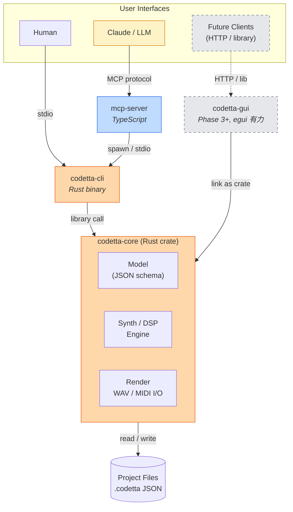
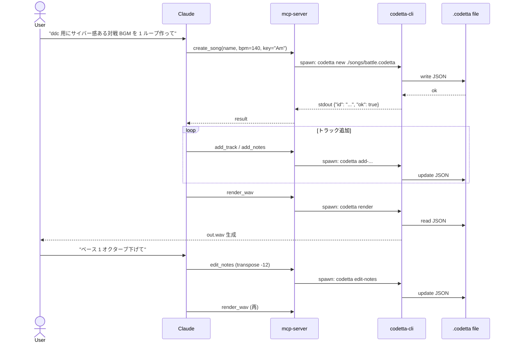
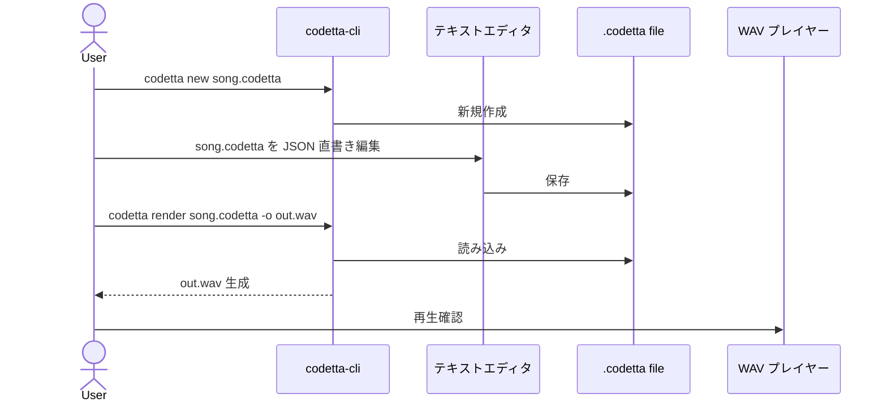
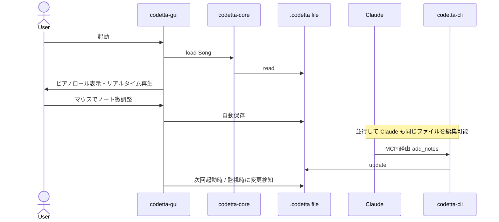
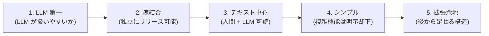

# Codetta — アーキテクチャ

> CLI ファースト + GUI ラッパー方式。 コアは Rust ライブラリとして実装し、
> CLI / MCP / GUI をその上の薄い層として並列に提供する。
> 各層は疎結合に保ち、 独立にビルド・テスト・リリース可能とする。

## 全体構成



## コンポーネント

### 1. `codetta-core` (Rust crate, library only)

すべての音楽ロジックの中核。 他のコンポーネントから library として呼ばれる。

**責務:**
- プロジェクトファイル (JSON) の読み書き / バリデーション
- シンセ / エフェクト / ドラム音源の DSP 実装
- WAV レンダリング (オフライン)
- MIDI import / export
- 楽曲モデル (Song / Track / Note / Pattern) の定義

**非責務:**
- ファイル I/O 以外の副作用 (再生 / ネットワーク / UI)
- リアルタイム再生 (これは GUI 側の責務)
- プロセス起動 / stdio 処理

**主要依存:**

| crate | 用途 |
|---|---|
| `serde` / `serde_json` | JSON シリアライズ |
| `hound` | WAV ファイル I/O |
| `fundsp` (検討中) | 宣言的 DSP DAG。 合わなければ自前実装 |
| `midly` | MIDI ファイル I/O |
| `thiserror` | エラー型 |

### 2. `codetta-cli` (Rust binary)

`codetta-core` を呼び出す CLI。 エンドユーザー (人間) と MCP server の両方が呼ぶ。

**責務:**
- コマンドラインパース (`clap` 利用)
- core ライブラリへの呼び出し
- エラーを終了コード + JSON で出力
- 進捗 / ログを `stderr` へ出力 (`stdout` は機械可読)

**設計原則:**
- すべての標準出力 (`stdout`) は **JSON で機械可読**
- 人間向けメッセージ / 進捗ログは `stderr` へ
- 終了コード: `0` 成功 / 非ゼロ失敗
- LLM / MCP server から呼ぶことを第一に設計

詳細は [03-cli.md](03-cli.md) 参照。

### 3. `mcp-server` (TypeScript / Node)

Claude Code / Claude Desktop / Cursor 等の MCP クライアントから呼ばれる server。

**責務:**
- MCP プロトコル対応 (`@modelcontextprotocol/sdk` 利用)
- `codetta-cli` バイナリを子プロセスとして spawn
- tool 呼び出しを CLI コマンドに変換
- `stdout` の JSON をパースして MCP レスポンスへ

**配置:**
- `~/.mcp-servers/codetta/` (既存 MCP server 群と同じ場所)
- ユーザー scope で `claude mcp add` 登録

**なぜ Rust ではなく TypeScript:**
- 既存 MCP server 群 (`~/.mcp-servers/`) と統一
- MCP SDK が TypeScript で公式提供
- ロジックは CLI に委譲するので server 自体は薄い (~300 行想定)

詳細は [04-mcp.md](04-mcp.md) 参照。

### 4. `codetta-gui` (Phase 3 以降)

Phase 3 で着手。 詳細は Phase 3 開始時に最終決定。

**現時点の有力候補:**

| | 中身 | 特徴 |
|---|---|---|
| **egui** (有力) | 純 Rust (Immediate mode) | `codetta-core` を直接 link、 ピアノロール描画◎、 軽量、 ネイティブ感 |
| Tauri | WebView + Rust | フロント自由 (React 等)、 軽量 |
| Dioxus | 純 Rust (React-like) | React 経験者向け |

選定基準は Phase 3 開始時に以下を再評価して決定:

1. ピアノロール UI の実装難易度
2. ネイティブ感
3. クロスプラットフォーム配布の楽さ
4. その時点での成熟度

## データフロー

### ケース 1: Claude が曲を生成する



### ケース 2: 人間が CLI で直接編集



### ケース 3: GUI で再生 / 微調整 (Phase 3+)



## リポジトリ構成 (cargo workspace)

```
~/dev/codetta/
├── Cargo.toml                  # workspace root
├── README.md
├── LICENSE                     # Apache 2.0
├── .gitignore
├── crates/
│   ├── codetta-core/           # Rust library (DSP / モデル / I/O)
│   │   ├── Cargo.toml
│   │   └── src/
│   │       ├── lib.rs
│   │       ├── model/          # Song / Track / Note / Pattern
│   │       ├── synth/          # シンセ / エフェクト / ドラム
│   │       ├── render/         # WAV レンダリング
│   │       └── midi/           # MIDI I/O
│   ├── codetta-cli/            # Rust binary
│   │   ├── Cargo.toml
│   │   └── src/main.rs
│   └── codetta-gui/            # Phase 3 で追加 (現時点ではディレクトリのみ)
├── mcp-server/                 # TypeScript MCP server
│   ├── package.json
│   ├── tsconfig.json
│   └── src/
│       └── index.ts
├── docs/
│   ├── design/                 # 本ドキュメント群
│   ├── usage/                  # ユーザー向けドキュメント (Phase 4 で整備)
│   └── examples/               # サンプルプロジェクトファイル
└── examples/                   # サンプル .codetta ファイル
    ├── cyber-battle.codetta
    └── menu-loop.codetta
```

## 技術スタック (Phase 0-2)

| 層 | 技術 | バージョン目安 |
|---|---|---|
| Core | Rust | 1.75+ (Edition 2021) |
| CLI | `clap` (derive) | 4.x |
| Audio I/O | `hound` (WAV) / `midly` (MIDI) | latest |
| DSP | `fundsp` 検討中、 合わなければ自前 | — |
| シリアライズ | `serde` / `serde_json` | 1.x |
| エラー | `thiserror` (lib) / `anyhow` (bin) | latest |
| テスト | 標準 + `insta` (snapshot) | — |
| MCP server | TypeScript / Node | Node 20+ |
| MCP SDK | `@modelcontextprotocol/sdk` | latest |

## 設計原則 (この順で優先)



1. **LLM 第一** — すべての設計判断において「LLM が扱いやすいか」を最優先
2. **疎結合** — Core / CLI / MCP / GUI は独立にビルド・テスト・リリース可能
3. **テキスト中心** — ファイル形式・コマンド出力すべて人間 + LLM 可読
4. **シンプル** — 「素人でも触れる」は最低ライン、 複雑な機能は明示的に却下
5. **拡張余地は残す** — 機能追加では捨てるが、 後から足せる構造は維持

## 非機能要件

| 項目 | 目標 |
|---|---|
| 起動時間 (CLI) | < 0.1 秒 |
| 起動時間 (GUI) | < 1 秒 |
| 配布バイナリサイズ | < 50 MB |
| メモリ使用量 (CLI 単発) | < 100 MB |
| メモリ使用量 (GUI アイドル) | < 200 MB |
| WAV レンダリング速度 | リアルタイムの 10 倍以上 (3 分曲を 18 秒未満) |
| 対応 OS | Mac (Apple Silicon + Intel) / Windows / Linux |

## オープンクエスチョン

設計を進める中で決定するもの。 各個別ドキュメントで詰める。

- [ ] プロジェクトファイル拡張子: `.codetta` か `.song.json` か → [02-project-format.md](02-project-format.md)
- [ ] BPM / 拍子の表現 (固定 vs テンポトラック) → [02-project-format.md](02-project-format.md)
- [ ] CLI のサブコマンド命名規則 (動詞 vs 名詞) → [03-cli.md](03-cli.md)
- [ ] MCP tool の粒度 (細かく多数 vs 粗く少数) → [04-mcp.md](04-mcp.md)
- [ ] `fundsp` 採用可否 (実装時にプロトタイプで判断) → [05-sound.md](05-sound.md)
- [ ] ドラム音源を合成 (TR-808 風) のみとするか、 サンプル併用とするか → [05-sound.md](05-sound.md)
