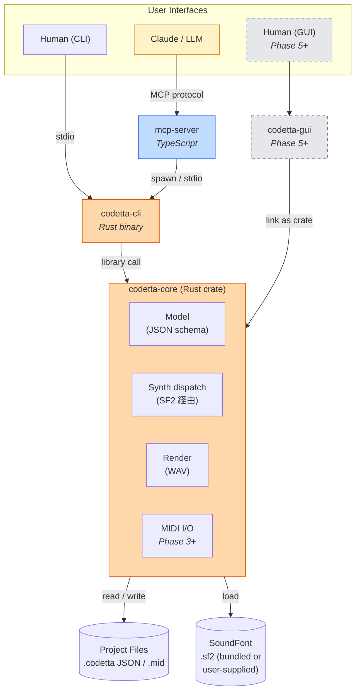
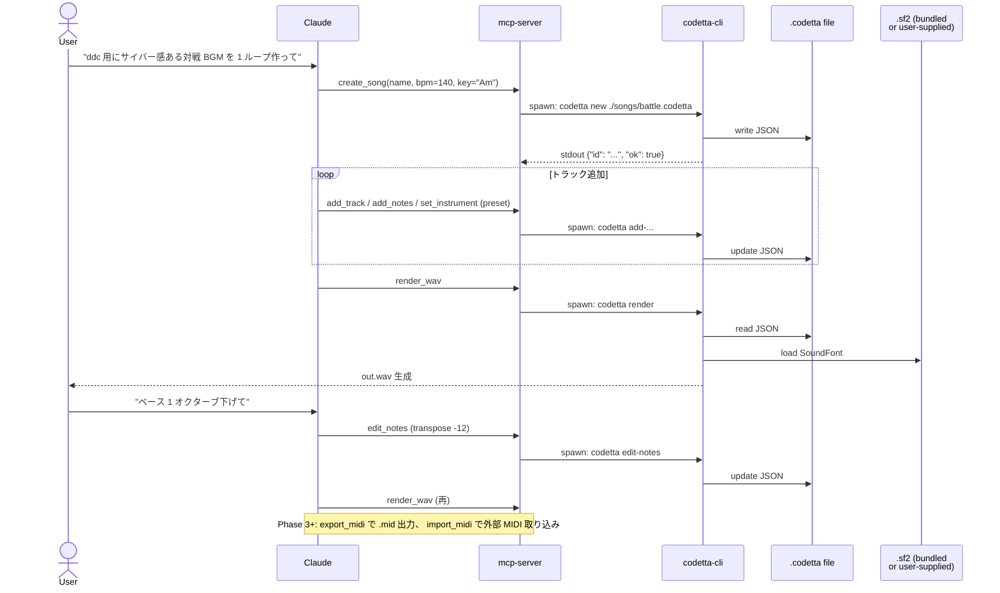
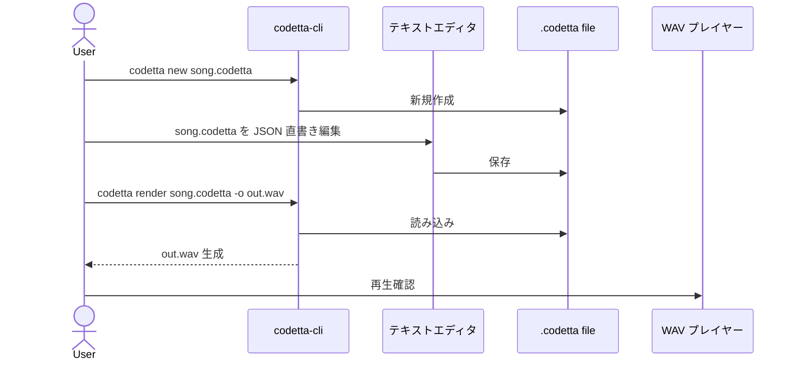
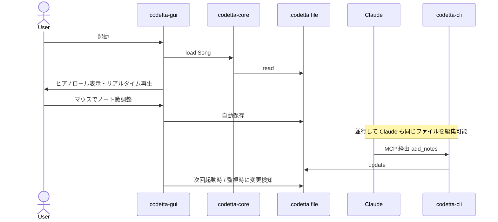
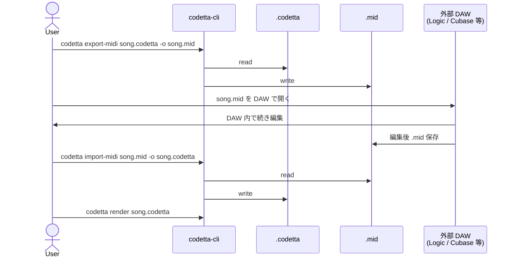
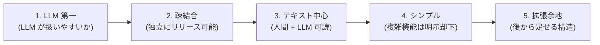

# Codetta — アーキテクチャ

> CLI ファースト + GUI ラッパー方式 (GUI は Phase 5 で必須実装)。 コアは Rust ライブラリとして実装し、
> CLI / MCP / GUI をその上の薄い層として並列に提供する。
> 各層は疎結合に保ち、 独立にビルド・テスト・リリース可能とする。
> 音源は外付け SoundFont (SF2) で統一、 自前 synth は持たない (= 0.2 化で削除予定)。

## 全体構成



## コンポーネント

### 1. `codetta-core` (Rust crate, library only)

すべての音楽ロジックの中核。 他のコンポーネントから library として呼ばれる。

**責務:**

- プロジェクトファイル (`.codetta` JSON) の読み書き / バリデーション
- 楽曲モデル (Song / Track / Note) の定義
- SoundFont (SF2) のロードと voice render dispatch
- WAV レンダリング (オフライン)
- MIDI import / export (Phase 3 で追加)
- master_gain / 簡易エフェクト (Reverb / Delay / Filter / Distortion) の DSP

**非責務:**

- 自前 synth voicing (= 内蔵 synth は持たない、 SF2 経由のみ)
- ファイル I/O 以外の副作用 (再生 / ネットワーク / UI)
- リアルタイム再生 (これは GUI 側の責務)
- プロセス起動 / stdio 処理

**主要依存:**

| crate | 用途 | 状態 |
|---|---|---|
| `serde` / `serde_json` | JSON シリアライズ | ✅ |
| `hound` | WAV ファイル I/O | ✅ |
| `rustysynth` | SoundFont (SF2) 再生エンジン | ✅ |
| `midly` | MIDI ファイル I/O | Phase 3 で採用予定 |
| `thiserror` | エラー型 | ✅ |

**不採用となった依存:**

- `fundsp` — Phase 0 first cut でプロトタイプ比較した結果、 自前ループ実装に明確な優位があり不採用。 詳細は本 doc 末尾の「Audio engine の判断履歴」 参照

### 2. `codetta-cli` (Rust binary)

`codetta-core` を呼び出す CLI。 エンドユーザー (人間) と MCP server の両方が呼ぶ。

**責務:**

- コマンドラインパース (`clap` 利用)
- core ライブラリへの呼び出し
- エラーを終了コード + JSON で出力
- 進捗 / ログを `stderr` へ出力 (`stdout` は機械可読)

**設計原則:**

- すべての標準出力 (`stdout`) は **JSON で機械可読**
- 人間向けメッセージ / 進捗ログは `stderr` へ
- 終了コード: `0` 成功 / 非ゼロ失敗
- LLM / MCP server から呼ぶことを第一に設計

詳細は [03-cli.md](03-cli.md) 参照。

### 3. `mcp-server` (TypeScript / Node)

Claude Code / Claude Desktop / Cursor 等の MCP クライアントから呼ばれる server。

**責務:**

- MCP プロトコル対応 (`@modelcontextprotocol/sdk` 利用)
- `codetta-cli` バイナリを子プロセスとして spawn
- tool 呼び出しを CLI コマンドに変換
- `stdout` の JSON をパースして MCP レスポンスへ

**配置:**

- `~/.mcp-servers/codetta/` (既存 MCP server 群と同じ場所)
- ユーザー scope で `claude mcp add` 登録

**なぜ Rust ではなく TypeScript:**

- 既存 MCP server 群 (`~/.mcp-servers/`) と統一
- MCP SDK が TypeScript で公式提供
- ロジックは CLI に委譲するので server 自体は薄い (~300 行想定、 現状そのレンジ)

詳細は [04-mcp.md](04-mcp.md) 参照。

### 4. `codetta-gui` (Phase 5 — 必須マイルストーン)

人間が直接 piano roll を触る GUI。 「LLM 経由の編集だけでは人間ユーザーの体験が完結しない」 という方針で必須化。

**着手タイミング:** MIDI import/export + 配布整備 (= Phase 3-4) 完了後。

**現時点の有力候補:**

| | 中身 | 特徴 |
|---|---|---|
| **egui** (有力) | 純 Rust (Immediate mode) | `codetta-core` を直接 link、 ピアノロール描画◎、 軽量、 ネイティブ感 |
| Tauri | WebView + Rust | フロント自由 (React 等)、 軽量、 Web 知見活用 |
| Dioxus | 純 Rust (React-like) | React 経験者向け |

選定基準は Phase 5 開始時に以下を再評価して決定:

1. ピアノロール UI の実装難易度
2. ネイティブ感
3. クロスプラットフォーム配布の楽さ
4. その時点での成熟度

それまでに CLI で piano roll 操作の使い勝手を詰める方針 (= 「まず CLI で作り込んで、 そこから GUI に落とし込む」)。

## データフロー

### ケース 1: Claude が曲を生成する



### ケース 2: 人間が CLI で直接編集



### ケース 3: GUI で piano roll を操作 (Phase 5+)



### ケース 4: 外部 DAW との往復 (Phase 3+)



## リポジトリ構成 (cargo workspace)

```
~/dev/codetta/
├── Cargo.toml                  # workspace root
├── README.md
├── LICENSE                     # Apache 2.0 (codetta 本体)
├── LICENSE-GeneralUser-GS.txt  # bundle SF2 のライセンス (Phase 4 で追加)
├── .gitignore
├── assets/                     # Phase 4 で追加
│   └── GeneralUser-GS.sf2      # bundle 用 SF2 (約 30MB、 リポジトリ管理 or LFS)
├── crates/
│   ├── codetta-core/           # Rust library (モデル / SF2 / render / MIDI)
│   │   ├── Cargo.toml
│   │   └── src/
│   │       ├── lib.rs
│   │       ├── model.rs        # Song / Track / Note / Instrument
│   │       ├── synth/
│   │       │   └── soundfont.rs # SF2 ロードと voice render
│   │       ├── render/         # ミックスバス + WAV レンダリング
│   │       ├── midi/           # MIDI I/O (Phase 3 で追加)
│   │       ├── validate.rs
│   │       └── edit.rs
│   ├── codetta-cli/            # Rust binary
│   │   ├── Cargo.toml
│   │   └── src/main.rs
│   └── codetta-gui/            # Phase 5 で追加 (現時点ではディレクトリのみ)
├── mcp-server/                 # TypeScript MCP server
│   ├── package.json
│   ├── tsconfig.json
│   └── src/
│       └── index.ts
├── docs/
│   ├── design/                 # 本ドキュメント群
│   ├── usage/                  # ユーザー向けドキュメント (Phase 4 で整備)
│   └── examples/               # サンプルプロジェクトファイル
└── examples/                   # サンプル .codetta ファイル
```

## 技術スタック (Phase 0-3)

| 層 | 技術 | バージョン目安 | 状態 |
|---|---|---|---|
| Core | Rust | 1.75+ (Edition 2021) | ✅ |
| CLI | `clap` (derive) | 4.x | ✅ |
| Audio I/O (WAV) | `hound` | latest | ✅ |
| SoundFont | `rustysynth` | latest | ✅ |
| MIDI I/O | `midly` | latest | Phase 3 で採用予定 |
| DSP | 自前実装 (`fundsp` 不採用) | — | 決着済 |
| シリアライズ | `serde` / `serde_json` | 1.x | ✅ |
| エラー | `thiserror` (lib) / `anyhow` (bin) | latest | ✅ |
| テスト | 標準 + `insta` (snapshot) | — | ✅ |
| MCP server | TypeScript / Node | Node 20+ | ✅ |
| MCP SDK | `@modelcontextprotocol/sdk` | latest | ✅ |
| GUI | (Phase 5 で選定: egui / Tauri / Dioxus 等) | — | Phase 5 |

## 設計原則 (この順で優先)



1. **LLM 第一** — すべての設計判断において「LLM が扱いやすいか」 を最優先
2. **疎結合** — Core / CLI / MCP / GUI は独立にビルド・テスト・リリース可能
3. **テキスト中心** — ファイル形式・コマンド出力すべて人間 + LLM 可読
4. **シンプル** — 「素人でも触れる」 は最低ライン、 複雑な機能は明示的に却下
5. **拡張余地は残す** — 機能追加では捨てるが、 後から足せる構造は維持

## 非機能要件

| 項目 | 目標 |
|---|---|
| 起動時間 (CLI) | < 0.1 秒 |
| 起動時間 (GUI) | < 1 秒 (Phase 5+) |
| 配布バイナリサイズ (本体のみ) | < 25 MB |
| 配布バイナリサイズ (bundle SF2 込み) | < 60 MB (= 本体 + GeneralUser GS 約 30MB) |
| メモリ使用量 (CLI 単発、 SF2 ロード含む) | < 200 MB |
| メモリ使用量 (GUI アイドル) | < 300 MB (Phase 5+) |
| WAV レンダリング速度 | リアルタイムの 10 倍以上 (3 分曲を 18 秒未満) |
| 対応 OS | Mac (Apple Silicon + Intel) / Windows / Linux |
| サンプルレート | 44100 Hz (48000 / 96000 は将来検討) |
| ビット深度 | 16-bit signed PCM (24-bit は将来検討) |
| チャンネル | Stereo (2ch) |

## Audio engine の内部仕様

### ミックスバス信号フロー

各 track の出力をマスターバスで合算し、 master_gain → soft limiter → WAV 出力。

```mermaid
flowchart LR
    T1[track 1<br/>(SF2 voice render)] --> Bus["master bus<br/>(simple sum)"]
    T2[track 2] --> Bus
    Tn[track N] --> Bus
    Bus --> Mg["× metadata.master_gain<br/>(default 1.0、 範囲 0..4)"]
    Mg --> Lim["soft limiter<br/>(tanh 系、 clipping 防止)"]
    Lim --> Wav["WAV 出力<br/>(44.1kHz / 16bit Stereo)"]
```

### track 内信号フロー


エフェクト (Reverb / Delay / Filter / Distortion) は track ごとに任意個チェーン可能。
詳細パラメータは [07-soundfont.md](07-soundfont.md) 参照。

### パフォーマンス上の工夫

- **lock-free**: オーディオ処理スレッドで mutex 取らない (オフラインでは不要、 GUI Phase 5 で必要)
- **ブロック処理**: サンプル単位ではなくバッファ単位 (例: 256 sample / block) で処理
- **早期終了**: release 完了後の voice は計算スキップ
- **SIMD (将来)**: `wide` crate 等で voice ループを SIMD 化 (Phase 5+ の GUI リアルタイム化で必要なら検討)
- **SoundFont キャッシュ**: 同じ SF2 ファイルを `Arc<SoundFont>` で共有 (= load 重複回避)

## Audio engine の判断履歴

### `fundsp` 不採用 (Phase 0 first cut で決着)

DSP ライブラリ `fundsp` を採用するかプロトタイプ比較した結果、 **自前ループ実装に統一** と決定。

#### 比較結果 (sin + ADSR / 1 voice, 1000 回生成, release build)

| 項目 | 自前 (`synth::manual`) | `fundsp` 版 |
|---|---|---|
| コード行数 | 約 55 行 | 約 45 行 (ADSR ロジック自体は同一) |
| 性能 (M samples/s) | 247 | 200 |
| 依存 crate 数 | 0 追加 | +12 (ahash / hashbrown / funutd / thingbuf 等) |
| LLM 拡張容易性 | 素の Rust ループ、 patch しやすい | ノード合成のため部分書き換えが効きにくい |

#### 判断理由

1. **性能**: 自前のほうが 24% 高速。 `fundsp` は per-note のノード構築オーバーヘッドが大きく、 「ノートごとにグラフ生成」 という Codetta 想定の使い方と相性が悪い (`fundsp` は本来 長時間 stream 想定)
2. **コード量は互角**: 単純な信号フロー (sin + ADSR) レベルでは演算子合成の旨味がほぼ出ない
3. **LLM 第一原則**: Codetta の DSP は LLM が読んで patch する対象。 素の Rust ループは全体方針と整合
4. **依存最小化**: 配布バイナリサイズと依存ツリー深さの両面で有利

#### 補足

- 本判断は Phase 0 時点 (= 内蔵 synth 主体だった頃) のもの
- 0.2 化で内蔵 synth は削除されるため、 `fundsp` の比較自体が将来的に意味を失うが、 エフェクト DSP (Reverb / Delay 等) は引き続き自前実装で進める方針
- 将来 SIMD 化等で複雑な DSP プリミティブを増やす場合は再評価の余地あり

## オープンクエスチョン

新規 (= 次以降のマイルストーンで決定):

- [ ] **bundle SF2 の配布手段**: binary 埋め込み (`include_bytes!`) / `cargo install` 時 DL / homebrew formula 経由 / GitHub Release `.tar.gz` 同梱、 のどれにするか → Phase 4 (= 09-distribution.md で詰める)
- [ ] **MIDI 拡張属性の往復維持戦略**: codetta 拡張属性 (`master_gain` / fx / SF2 preset/bank 詳細) を MIDI 経由でどう保持するか。 MIDI Text Meta Event 埋め込み案 vs sidecar JSON 案 → Phase 3 (= 08-midi.md で詰める)
- [ ] **import 時の GM program → SF2 preset 自動マッピング**: SF2 必須前提でも program 番号と preset 番号は完全一致しないケースがある → 08-midi.md で詰める
- [ ] **GUI フレームワーク選定**: egui / Tauri / Dioxus → Phase 5 開始時に再評価

決着済 (履歴として):

- [x] プロジェクトファイル拡張子 → `.codetta` で決定
- [x] BPM / 拍子の表現 → metadata の `bpm` / `time_signature` 固定で決定 (テンポトラックは持たない)
- [x] CLI のサブコマンド命名規則 → 動詞 + 名詞 (例: `add-track` / `edit-notes`)、 詳細 [03-cli.md](03-cli.md)
- [x] MCP tool の粒度 → 16 tools + 5 resource endpoints で運用中、 詳細 [04-mcp.md](04-mcp.md)
- [x] `fundsp` 採用可否 → 不採用 (本 doc「Audio engine の判断履歴」 参照)
- [x] ドラム音源を合成 (TR-808 風) のみとするか、 サンプル併用とするか → SF2 経由 (= GM Drum Map、 ch10 / bank 128 を SF2 のドラムキットで解決) で決定、 0.2 化で確定

## 関連ドキュメント

- [00-vision.md](00-vision.md) — ビジョン / ターゲット / Phase 計画
- [02-project-format.md](02-project-format.md) — `.codetta` JSON スキーマ
- [03-cli.md](03-cli.md) — CLI サブコマンド仕様
- [04-mcp.md](04-mcp.md) — MCP tool 仕様
- [06-examples.md](06-examples.md) — サンプル `.codetta`
- [07-soundfont.md](07-soundfont.md) — SoundFont 経路の詳細
- 08-midi.md — MIDI import/export (Phase 3 で起こす)
- 09-distribution.md — 配布戦略 (Phase 4 で起こす)
