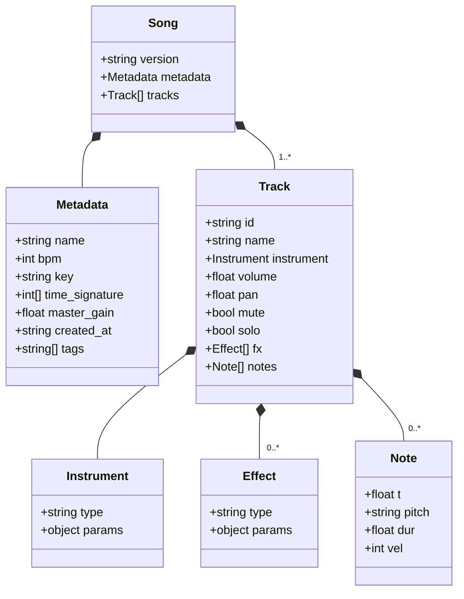

# Codetta — プロジェクトファイル形式

> JSON ベースのテキスト形式。 人間と LLM の双方が読み・書き・編集できることを最優先。
> バイナリブロブなし、 `git diff` が意味を持つ構造とする。
> 音源は外付け SoundFont (SF2) に統一 (= schema 0.2)。 内蔵 synth は持たない。

## 設計原則

1. **LLM が直接読み書きできる** — JSON のみ、 拡張子で機械判別可
2. **Git フレンドリー** — 1 行 1 ノートを基本に diff を意味のあるものに
3. **明示的 > 暗黙的** — デフォルト値も書く (LLM が読んだ時に混乱しない)
4. **拡張余地** — `version` フィールドでスキーマ進化に対応
5. **音源は外付け** — `instrument.type` は `"soundfont"` のみ。 内蔵 synth のスキーマ多様性は持たない
6. **エディタ補完が効く** — JSON Schema を公開し VSCode 等で補完可能に

## ファイル拡張子と命名

| 拡張子 | 用途 |
|---|---|
| `.codetta` | プロジェクトファイル (推奨。 拡張子で Codetta ファイルと判別) |
| `.codetta.json` | 同上の別表記 (JSON エディタが正しく扱えるよう `.json` を末尾に) |

CLI は両方を受け付ける。 内部処理は完全に同一。

`mime_type`: `application/vnd.codetta+json` (Phase 4 で登録検討)

## トップレベル構造



## スキーマバージョニング

- `version` フィールドはセマンティックバージョニング (`"0.1"`, `"0.2"`, `"1.0"`) を string で記述
- `0.x` 系: **破壊的変更を許容**。 マイグレーション CLI (`codetta migrate`) で対応
- `1.0` 以降: **後方互換性を維持**。 メジャー番号変更時のみ破壊的変更
- 未知のバージョンを読んだ場合は明示的にエラー (推測しない)

### 0.1 と 0.2 の違い

| 観点 | `"0.1"` (legacy) | `"0.2"` (現行方針) |
|---|---|---|
| 音源 | 内蔵 synth (`sin` / `saw` / `saw_lead` / `square` / `square_bass` / `triangle` / `saw_pad` / `drum_kit`) + `soundfont` 並列 | **`soundfont` 一本** |
| ドラム | `instrument.type = "drum_kit"` + 要素名キー (`kick` 等) | SF2 GM Drum (`bank: 128`) + 要素名キーは LLM フレンドリーのため維持、 内部で MIDI 番号に正規化 |
| `metadata.master_gain` | 任意 | 任意 (互換) |
| migrate | — | `codetta migrate` (CDT-6 実装済) が 0.1 → 0.2 を自動変換 (instrument → 該当 GM preset への置換) |

新規プロジェクトは必ず `"0.2"` で書く。 0.1 ファイルは `io::load` で **`UnknownVersion` error として reject** される (= `SUPPORTED_VERSIONS = ["0.2"]`)。 0.1 を読みたい場合は事前に `codetta migrate <input.codetta> -o <output.codetta>` で 0.2 化する (CDT-6 / CDT-7)。 「load 時に warning」 案は CDT-7 で不採用に確定 (= migrate 経路と矛盾するため reject 一本化)。

## メタデータ (`metadata`)

| フィールド | 型 | 必須 | 説明 |
|---|---|---|---|
| `name` | string | ✓ | 楽曲名 (ファイル名と独立) |
| `bpm` | int | ✓ | 1 分間の拍数。 全曲固定 (Phase 0 はテンポトラック非対応) |
| `key` | string | — | "Am", "C", "F#m" 等の調性表記。 LLM の参考用 (再生には影響しない) |
| `time_signature` | `[int, int]` | — | 拍子。 Phase 0 では `[4, 4]` のみサポート |
| `master_gain` | float (0.0-4.0) | — | 全 track 合算後 (`soft_clip` 前) に乗算する master gain。 デフォルト `1.0`。 SF2 楽器のように内部音量が小さい音源で全体音圧を稼ぎたい時に上げる |
| `created_at` | ISO 8601 string | — | 作成日時 (UTC) |
| `tags` | string[] | — | 自由タグ。 検索用 (例: `["ddc", "battle", "cyber"]`) |

## トラック (`tracks[]`)

トラック = 「1 つの楽器が鳴らす音符の系列」。 順序は描画順 (上から並ぶ)。

| フィールド | 型 | 必須 | デフォルト | 説明 |
|---|---|---|---|---|
| `id` | string | ✓ | — | トラック一意 ID (kebab-case 推奨)。 Effect の send 等で参照に使う |
| `name` | string | ✓ | — | 表示名 (重複可) |
| `instrument` | Instrument | ✓ | — | 楽器定義 (= 必ず `type: "soundfont"`) |
| `volume` | float (0.0-1.0) | — | `0.8` | 音量 |
| `pan` | float (-1.0-1.0) | — | `0.0` | パン (-1=左、 +1=右) |
| `mute` | bool | — | `false` | ミュート |
| `solo` | bool | — | `false` | ソロ (true なら他トラックを無音化) |
| `fx` | Effect[] | — | `[]` | エフェクトチェーン (順次適用) |
| `notes` | Note[] | — | `[]` | ノート列 |

## ノート (`notes[]`)

ノート = 「いつ・どの音を・どれだけの長さ・どれだけの強さで鳴らすか」。

| フィールド | 型 | 必須 | 説明 |
|---|---|---|---|
| `t` | float | ✓ | 開始時刻 (ビート単位、 `1.0` = 4 分音符 1 つ分) |
| `pitch` | string \| int | ✓ | 音程 (後述) |
| `dur` | float | ✓ | 長さ (ビート単位) |
| `vel` | int (0-127) | — | ベロシティ (省略時 `100`) |

### 時間表現

- 単位: **ビート** (BPM に依存しない)
- `1.0` = 4 分音符 1 つ
- `0.25` = 16 分音符
- `0.5` = 8 分音符
- `2.0` = 2 分音符
- 4/4 拍子なら `4.0` = 1 小節

時間を秒で表さない理由: BPM を変えてもノートを書き直さなくて済む。

### ピッチ表現

2 つの記法をサポート (LLM が読みやすい方を優先):

**A: ノート名 (推奨)**
- `"C4"`, `"D#4"`, `"Bb3"`, `"A5"` 等
- C4 = MIDI 60 = 中央のド
- シャープ: `"C#4"` / フラット: `"Db4"` (両方受け付け、 内部で正規化)

**B: MIDI 番号**
- `60`, `61`, `62` ... (0-127)
- ノート名と相互変換可能

### ドラム特殊扱い

ドラムトラック (= SF2 の bank 128 GM Drum Kit を参照する track) では、 `pitch` をドラム要素名で書ける。 LLM が「kick / snare / hh」 のように直観的に書くための糖衣で、 内部で GM Drum Map (MIDI 番号) に正規化される。 数値 / ノート名表記との混在も可。

| キー | MIDI 番号 (GM Drum Map) | 説明 |
|---|---|---|
| `"kick"` | 36 | バスドラム |
| `"snare"` | 38 | スネア |
| `"hh_closed"` | 42 | クローズドハイハット |
| `"hh_open"` | 46 | オープンハイハット |
| `"clap"` | 39 | クラップ |
| `"crash"` | 49 | クラッシュシンバル |
| `"ride"` | 51 | ライドシンバル |
| `"tom_lo"` | 41 | ロータム |
| `"tom_mid"` | 47 | ミッドタム |
| `"tom_hi"` | 50 | ハイタム |

ドラムキットの音色実体は SF2 ファイル側にある (= GeneralUser GS なら preset 0/bank 128 が「Standard Drum Kit」)。 SF2 を差し替えれば別のドラム音色 (Jazz / Power / Electronic 等) に切替えできる。

実装注: ドラム要素名キー (`kick` 等) → GM MIDI 番号への正規化は **CDT-5 で実装済** (= `synth::soundfont::DRUM_KEY_MIDI_MAP` が正本、 `render` / `validate` 両方から参照)。 SF2 bank 128 track 上で要素名キー / MIDI 番号 / ノート名表記のいずれも受け付ける。 旧 0.1 の内蔵 `drum_kit` 経路は CDT-7 で削除済 (= `migrate` 経由で SF2 GM Standard Drum Kit に置換される)。

## 楽器 (`instrument`)

`instrument.type` は **`"soundfont"` のみ** (= schema 0.2)。 外付け SF2 (SoundFont 2) ファイルから音色を取得する。

### `soundfont`

```json
{
  "type": "soundfont",
  "params": {
    "file": "GeneralUser-GS.sf2",
    "preset": 0,
    "bank": 0
  }
}
```

| `params` | 型 | 必須 | デフォルト | 説明 |
|---|---|---|---|---|
| `file` | string | ✓ | — | SF2 ファイル path。 絶対 path or `$CODETTA_SOUNDFONT_DIR` (default `$HOME/Music/sf2/`) 配下の相対 path |
| `preset` | int (0-127) | ✓ | — | GM Program 番号 (例: `0` = Acoustic Grand Piano、 `33` = Electric Bass、 `81` = Saw Lead) |
| `bank` | int (0-128) | — | `0` | GM bank。 `0` = melodic、 `128` = drum kit |

#### 主要 preset (GeneralUser GS / GM 互換)

GM preset の完全一覧および codetta の dogfood 使い分けは [07-soundfont.md](07-soundfont.md) を参照。 ここでは LLM が頻用するもののみ:

| `preset` | 楽器 | 用途例 |
|---|---|---|
| `0` | Acoustic Grand Piano | バラード / アコースティック系の主役 |
| `4` | Electric Piano 1 (Rhodes) | Lo-fi / R&B |
| `24` | Nylon Guitar | アコギ系の主役 |
| `33` | Electric Bass (finger) | ロック / ポップス系のベース |
| `38` | Synth Bass 1 | EDM / シンセ系のベース |
| `48` | String Ensemble 1 | パッド / 弦合奏 |
| `56` | Trumpet | ブラスリード |
| `73` | Flute | メロディ補強 |
| `80` | Square Lead | チップチューン感のリード |
| `81` | Saw Lead | EDM / シンセリード |
| `88` | New Age Pad | アンビエント系パッド |

#### Path 解決

- 絶対 path → そのまま
- 相対 path → `$CODETTA_SOUNDFONT_DIR` (default `$HOME/Music/sf2/`) 配下として解釈
- 未発見なら `SOUNDFONT_FILE_NOT_FOUND` validation error

`$CODETTA_WORKSPACE` (= 既存) と同じ env pattern。 MCP server は環境変数を継承する。

#### Bundle SF2

Phase 4 で配布バイナリに同梱予定の `GeneralUser-GS.sf2` (約 30MB) を `file` 省略時の暗黙 default とする計画。 詳細は (Phase 4 で起こす) `09-distribution.md` 参照。

## エフェクト (`fx[]`)

トラックに適用するエフェクト。 配列順に適用 (信号は上から下へ流れる)。

### 共通形式

```json
{ "type": "reverb", "size": 0.6, "mix": 0.2 }
```

### サポート type

| type | params | 説明 |
|---|---|---|
| `"lowpass"` | `cutoff` (Hz), `q` (resonance) | ローパスフィルタ |
| `"highpass"` | `cutoff` (Hz), `q` | ハイパスフィルタ |
| `"delay"` | `time` ("1/8" 等 or 秒), `feedback` (0-1), `mix` (0-1) | ディレイ |
| `"reverb"` | `size` (0-1), `damp` (0-1), `mix` (0-1) | リバーブ |
| `"distortion"` | `amount` (0-1), `tone` (0-1) | 歪み |

### 将来候補

`chorus`, `flanger`, `phaser`, `compressor`, `eq` (3-band) など。 Phase 5+ で需要を見て検討。

## サンプル: Cyber Battle BGM (1 ループ、 SF2 版)

```json
{
  "version": "0.2",
  "metadata": {
    "name": "Cyber Battle Loop",
    "bpm": 140,
    "key": "Am",
    "time_signature": [4, 4],
    "master_gain": 2.0,
    "tags": ["ddc", "battle", "cyber"]
  },
  "tracks": [
    {
      "id": "lead",
      "name": "Saw Lead",
      "instrument": {
        "type": "soundfont",
        "params": { "file": "GeneralUser-GS.sf2", "preset": 81, "bank": 0 }
      },
      "volume": 0.7,
      "pan": 0.0,
      "fx": [
        { "type": "delay", "time": "1/8", "feedback": 0.3, "mix": 0.25 },
        { "type": "reverb", "size": 0.5, "mix": 0.2 }
      ],
      "notes": [
        { "t": 0.0, "pitch": "A4", "dur": 0.5, "vel": 100 },
        { "t": 0.5, "pitch": "C5", "dur": 0.5, "vel": 100 },
        { "t": 1.0, "pitch": "E5", "dur": 0.5, "vel": 110 },
        { "t": 1.5, "pitch": "A5", "dur": 1.0, "vel": 115 },
        { "t": 4.0, "pitch": "G5", "dur": 0.5, "vel": 100 },
        { "t": 4.5, "pitch": "E5", "dur": 0.5, "vel": 100 },
        { "t": 5.0, "pitch": "C5", "dur": 1.5, "vel": 110 }
      ]
    },
    {
      "id": "bass",
      "name": "Synth Bass",
      "instrument": {
        "type": "soundfont",
        "params": { "file": "GeneralUser-GS.sf2", "preset": 38, "bank": 0 }
      },
      "volume": 0.9,
      "notes": [
        { "t": 0.0, "pitch": "A2", "dur": 1.0, "vel": 100 },
        { "t": 2.0, "pitch": "F2", "dur": 1.0, "vel": 100 },
        { "t": 4.0, "pitch": "G2", "dur": 1.0, "vel": 100 },
        { "t": 6.0, "pitch": "E2", "dur": 1.0, "vel": 100 }
      ]
    },
    {
      "id": "drums",
      "name": "Drums",
      "instrument": {
        "type": "soundfont",
        "params": { "file": "GeneralUser-GS.sf2", "preset": 0, "bank": 128 }
      },
      "volume": 0.8,
      "notes": [
        { "t": 0.0,  "pitch": "kick",      "dur": 0.1, "vel": 110 },
        { "t": 1.0,  "pitch": "snare",     "dur": 0.1, "vel": 100 },
        { "t": 2.0,  "pitch": "kick",      "dur": 0.1, "vel": 110 },
        { "t": 3.0,  "pitch": "snare",     "dur": 0.1, "vel": 100 },
        { "t": 0.0,  "pitch": "hh_closed", "dur": 0.1, "vel": 70 },
        { "t": 0.5,  "pitch": "hh_closed", "dur": 0.1, "vel": 70 },
        { "t": 1.0,  "pitch": "hh_closed", "dur": 0.1, "vel": 70 },
        { "t": 1.5,  "pitch": "hh_closed", "dur": 0.1, "vel": 70 }
      ]
    }
  ]
}
```

## バリデーションルール

CLI / Core は以下を検証する:

- `version` が既知のバージョン (= `"0.2"` のみ。 `"0.1"` は `io::load` 時点で `UnknownVersion` error として reject、 事前に `codetta migrate` で 0.2 化が必要)
- `metadata.bpm` が 20-300 の範囲
- `metadata.master_gain` が 0.0-4.0 の範囲 (省略時 1.0)
- `metadata.time_signature` の分母が 2 の累乗
- `tracks[].id` が重複しない
- `notes[].t` が `>= 0`
- `notes[].dur` が `> 0`
- `notes[].vel` が `0-127` の範囲
- `notes[].pitch` が解釈可能 (ノート名 / MIDI 番号 / ドラムキー)
- `instrument.type` が `"soundfont"` (それ以外は 0.2 では `UNKNOWN_INSTRUMENT_TYPE` で reject。 0.1 は load 時点で reject されるためここまで来ない)
- `instrument.params.file` の SF2 ファイルが path 解決で見つかる (`SOUNDFONT_FILE_NOT_FOUND`)
- `instrument.params.preset` / `bank` が範囲内
- `fx[].type` が既知の type

違反は `codetta validate` でレポート。 未知パラメータは `UNKNOWN_PARAM` warning として報告 (instrument / fx 両方)。

## 拡張ポイント (将来 Phase で追加検討)

| 機能 | 追加場所 | 想定 Phase |
|---|---|---|
| MIDI import で取り込んだ拡張属性 (`master_gain` / fx / SF2 preset/bank) を MIDI に往復維持 | Text Meta Event 埋め込み or sidecar JSON | Phase 3 (= [08-midi.md](08-midi.md) で確定、 `text-meta` を default) |
| パターン (ループ可能な単位の再利用) | `patterns[]` トップレベル + `tracks[].pattern_refs[]` | Phase 5+ |
| 自動化 (volume / pan のオートメーション) | `tracks[].automation[]` | Phase 5+ |
| テンポトラック (BPM 変化) | `metadata.bpm` を `tempo_track[]` に拡張 | Phase 5+ |
| MIDI CC | `notes[]` 拡張 + `cc_events[]` | Phase 5+ |
| マーカー (A メロ / サビ等) | `markers[]` トップレベル | Phase 5+ |
| グローバルエフェクト (マスター) | `master.fx[]` トップレベル | Phase 5+ |

これらは現マイルストーンでは実装しない。 ファイル形式の `version` を上げる契機。

## オープンクエスチョン

- [ ] JSON Schema 公開先 URL (`https://codetta.dev/schemas/song/0.2`) → Phase 4 で確定
- [ ] エフェクト send/return (Phase 5+) のスキーマ

決着済 (履歴):

- [x] `version` を `"0.1"` (string) にするか `0.1` (number) にするか → **string 採用**
- [x] パターン (ループ可能単位) を Phase 0 で入れるか → **入れない**
- [x] note の `pitch` 表現で `"C4"` と `60` をどちらをデフォルトにするか → **ノート名 (`"C4"`) を推奨、 両方受け付け**
- [x] 音源は内蔵 synth か外付け SF2 か → **外付け SF2 一本化** (= schema 0.2)
- [x] ドラムを内蔵 `drum_kit` で持つか SF2 GM Drum で解決するか → **SF2 GM Drum (bank 128)**、 ただし要素名キー (kick/snare 等) は LLM フレンドリーのため維持
- [x] `codetta migrate` の挙動: 0.1 → 0.2 の instrument マッピング を LUT で固定するか、 `--manual` で都度確認させるか → **CDT-6 で LUT 固定 + 未掲載 type は preset 0 fallback + warning。 `--manual` 不採用** (= MCP 駆動と整合しないため、 後段 `set-instrument` で個別調整が代替手段)
- [x] 0.1 ファイルを `io::load` でどう扱うか (= warning or reject) → **CDT-7 で reject 一本化** (`UnknownVersion` error)。 migrate.rs は raw JSON 経路で 0.1 を受け続けるので migration 経路は維持される

## 関連ドキュメント

- [00-vision.md](00-vision.md) — ビジョン / ターゲット / Phase 計画
- [01-architecture.md](01-architecture.md) — アーキテクチャ / 信号フロー / fundsp 不採用判断
- [03-cli.md](03-cli.md) — CLI サブコマンド仕様
- [04-mcp.md](04-mcp.md) — MCP tool 仕様
- [06-examples.md](06-examples.md) — サンプル `.codetta`
- [07-soundfont.md](07-soundfont.md) — SF2 統合の詳細仕様 (= メイン音源 doc)
- [08-midi.md](08-midi.md) — MIDI import/export (= Phase 3 ADR、 確定済)
- 09-distribution.md — 配布戦略 (Phase 4 で起こす)
