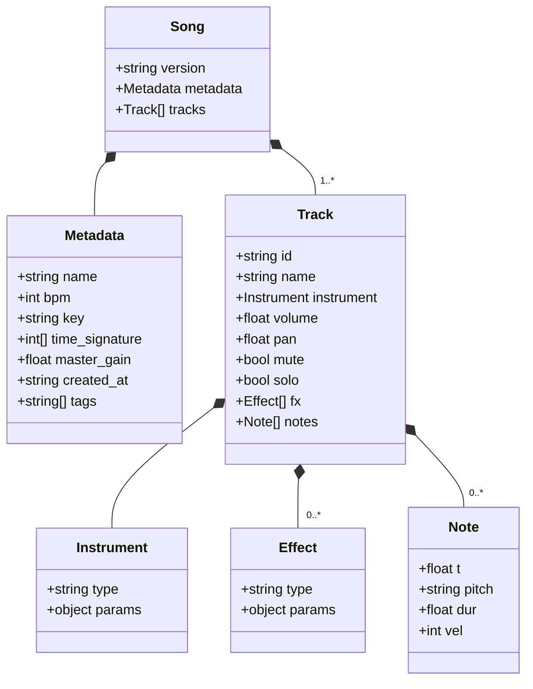

# Codetta — プロジェクトファイル形式

> JSON ベースのテキスト形式。 人間と LLM の双方が読み・書き・編集できることを最優先。
> バイナリブロブなし、 `git diff` が意味を持つ構造とする。

## 設計原則

1. **LLM が直接読み書きできる** — JSON のみ、 拡張子で機械判別可
2. **Git フレンドリー** — 1 行 1 ノートを基本に diff を意味のあるものに
3. **明示的 > 暗黙的** — デフォルト値も書く (LLM が読んだ時に混乱しない)
4. **拡張余地** — `version` フィールドでスキーマ進化に対応
5. **エディタ補完が効く** — JSON Schema を公開し VSCode 等で補完可能に

## ファイル拡張子と命名

| 拡張子 | 用途 |
|---|---|
| `.codetta` | プロジェクトファイル (推奨。 拡張子で Codetta ファイルと判別) |
| `.codetta.json` | 同上の別表記 (JSON エディタが正しく扱えるよう `.json` を末尾に) |

CLI は両方を受け付ける。 内部処理は完全に同一。

`mime_type`: `application/vnd.codetta+json` (Phase 4 で登録検討)

## トップレベル構造



## スキーマバージョニング

- `version` フィールドはセマンティックバージョニング (`"0.1"`, `"0.2"`, `"1.0"`)
- `0.x` 系: **破壊的変更を許容**。 マイグレーション CLI (`codetta migrate`) で対応
- `1.0` 以降: **後方互換性を維持**。 メジャー番号変更時のみ破壊的変更
- 未知のバージョンを読んだ場合は明示的にエラー (推測しない)

## メタデータ (`metadata`)

| フィールド | 型 | 必須 | 説明 |
|---|---|---|---|
| `name` | string | ✓ | 楽曲名 (ファイル名と独立) |
| `bpm` | int | ✓ | 1 分間の拍数。 全曲固定 (Phase 0 はテンポトラック非対応) |
| `key` | string | — | "Am", "C", "F#m" 等の調性表記。 LLM の参考用 (再生には影響しない) |
| `time_signature` | `[int, int]` | — | 拍子。 Phase 0 では `[4, 4]` のみサポート |
| `master_gain` | float (0.0-4.0) | — | 全 track 合算後 (`soft_clip` 前) に乗算する master gain。 デフォルト `1.0`。 SF2 楽器のように内部音量が小さい音源で全体音圧を稼ぎたい時に上げる |
| `created_at` | ISO 8601 string | — | 作成日時 (UTC) |
| `tags` | string[] | — | 自由タグ。 検索用 (例: `["ddc", "battle", "cyber"]`) |

## トラック (`tracks[]`)

トラック = 「1 つの楽器が鳴らす音符の系列」。 順序は描画順 (上から並ぶ)。

| フィールド | 型 | 必須 | デフォルト | 説明 |
|---|---|---|---|---|
| `id` | string | ✓ | — | トラック一意 ID (kebab-case 推奨)。 Effect の send 等で参照に使う |
| `name` | string | ✓ | — | 表示名 (重複可) |
| `instrument` | Instrument | ✓ | — | 楽器定義 |
| `volume` | float (0.0-1.0) | — | `0.8` | 音量 |
| `pan` | float (-1.0-1.0) | — | `0.0` | パン (-1=左、 +1=右) |
| `mute` | bool | — | `false` | ミュート |
| `solo` | bool | — | `false` | ソロ (true なら他トラックを無音化) |
| `fx` | Effect[] | — | `[]` | エフェクトチェーン (順次適用) |
| `notes` | Note[] | — | `[]` | ノート列 |

## ノート (`notes[]`)

ノート = 「いつ・どの音を・どれだけの長さ・どれだけの強さで鳴らすか」。

| フィールド | 型 | 必須 | 説明 |
|---|---|---|---|
| `t` | float | ✓ | 開始時刻 (ビート単位、 `1.0` = 4 分音符 1 つ分) |
| `pitch` | string \| int | ✓ | 音程 (後述) |
| `dur` | float | ✓ | 長さ (ビート単位) |
| `vel` | int (0-127) | — | ベロシティ (省略時 `100`) |

### 時間表現

- 単位: **ビート** (BPM に依存しない)
- `1.0` = 4 分音符 1 つ
- `0.25` = 16 分音符
- `0.5` = 8 分音符
- `2.0` = 2 分音符
- 4/4 拍子なら `4.0` = 1 小節

時間を秒で表さない理由: BPM を変えてもノートを書き直さなくて済む。

### ピッチ表現

2 つの記法をサポート (LLM が読みやすい方を優先):

**A: ノート名 (推奨)**
- `"C4"`, `"D#4"`, `"Bb3"`, `"A5"` 等
- C4 = MIDI 60 = 中央のド
- シャープ: `"C#4"` / フラット: `"Db4"` (両方受け付け、 内部で正規化)

**B: MIDI 番号**
- `60`, `61`, `62` ... (0-127)
- ノート名と相互変換可能

### ドラム特殊扱い

ドラムトラックの `instrument.type` が `"drum_kit"` の場合、 `pitch` はドラム要素名:

| キー | MIDI 番号 (GM Drum 互換) | 説明 |
|---|---|---|
| `"kick"` | 36 | バスドラム |
| `"snare"` | 38 | スネア |
| `"hh_closed"` | 42 | クローズドハイハット |
| `"hh_open"` | 46 | オープンハイハット |
| `"clap"` | 39 | クラップ |
| `"crash"` | 49 | クラッシュシンバル |
| `"ride"` | 51 | ライドシンバル |
| `"tom_lo"` | 41 | ロータム |
| `"tom_mid"` | 47 | ミッドタム |
| `"tom_hi"` | 50 | ハイタム |

## 楽器 (`instrument`)

`instrument.type` で楽器種別を指定。 `params` の中身は type ごとに異なる (discriminated union)。

### シンセ系 (Phase 0)

```json
{ "type": "saw_lead", "params": { "attack": 0.01, "decay": 0.1, "sustain": 0.7, "release": 0.2, "filter_cutoff": 800, "filter_q": 2.0 } }
```

| type | 用途 | 主要 params |
|---|---|---|
| `"sin"` | サイン波 (純音、 サブベース) | `attack`, `decay`, `sustain`, `release` |
| `"saw"` / `"saw_lead"` | ノコギリ波 (リード / ベース) | 上記 + `filter_cutoff`, `filter_q` |
| `"square"` / `"square_bass"` | 矩形波 (チップチューン感) | 上記 + `pulse_width` (0.1-0.9) |
| `"triangle"` | 三角波 (柔らかい) | ADSR のみ |
| `"saw_pad"` | パッド系 (saw + ローパス + アタック遅め) | 上記 + `detune` (cents) |

### ドラム

```json
{ "type": "drum_kit", "params": { "kit": "808" } }
```

| `kit` | 説明 |
|---|---|
| `"808"` | TR-808 風 (低音重視、 電子) |
| `"909"` | TR-909 風 (パンチ強め) |
| `"chip"` | 8bit 風 (ノイズ + 短い矩形波) |

詳細音色仕様は [05-sound.md](05-sound.md)。

## エフェクト (`fx[]`)

トラックに適用するエフェクト。 配列順に適用 (信号は上から下へ流れる)。

### 共通形式

```json
{ "type": "reverb", "size": 0.6, "mix": 0.2 }
```

### Phase 0 サポート

| type | params | 説明 |
|---|---|---|
| `"lowpass"` | `cutoff` (Hz), `q` (resonance) | ローパスフィルタ |
| `"highpass"` | `cutoff` (Hz), `q` | ハイパスフィルタ |
| `"delay"` | `time` ("1/8" 等 or 秒), `feedback` (0-1), `mix` (0-1) | ディレイ |
| `"reverb"` | `size` (0-1), `damp` (0-1), `mix` (0-1) | リバーブ |
| `"distortion"` | `amount` (0-1), `tone` (0-1) | 歪み |

### Phase 1+ 候補

`chorus`, `flanger`, `phaser`, `compressor`, `eq` (3-band) など。

## サンプル: Cyber Battle BGM (1 ループ)

```json
{
  "version": "0.1",
  "metadata": {
    "name": "Cyber Battle Loop",
    "bpm": 140,
    "key": "Am",
    "time_signature": [4, 4],
    "tags": ["ddc", "battle", "cyber"]
  },
  "tracks": [
    {
      "id": "lead",
      "name": "Saw Lead",
      "instrument": {
        "type": "saw_lead",
        "params": { "attack": 0.01, "decay": 0.1, "sustain": 0.7, "release": 0.2, "filter_cutoff": 1200, "filter_q": 2.0 }
      },
      "volume": 0.7,
      "pan": 0.0,
      "fx": [
        { "type": "delay", "time": "1/8", "feedback": 0.3, "mix": 0.25 },
        { "type": "reverb", "size": 0.5, "mix": 0.2 }
      ],
      "notes": [
        { "t": 0.0, "pitch": "A4", "dur": 0.5, "vel": 100 },
        { "t": 0.5, "pitch": "C5", "dur": 0.5, "vel": 100 },
        { "t": 1.0, "pitch": "E5", "dur": 0.5, "vel": 110 },
        { "t": 1.5, "pitch": "A5", "dur": 1.0, "vel": 115 },
        { "t": 4.0, "pitch": "G5", "dur": 0.5, "vel": 100 },
        { "t": 4.5, "pitch": "E5", "dur": 0.5, "vel": 100 },
        { "t": 5.0, "pitch": "C5", "dur": 1.5, "vel": 110 }
      ]
    },
    {
      "id": "bass",
      "name": "Sub Bass",
      "instrument": {
        "type": "sin",
        "params": { "attack": 0.005, "decay": 0.1, "sustain": 0.9, "release": 0.1 }
      },
      "volume": 0.9,
      "notes": [
        { "t": 0.0, "pitch": "A2", "dur": 1.0, "vel": 100 },
        { "t": 2.0, "pitch": "F2", "dur": 1.0, "vel": 100 },
        { "t": 4.0, "pitch": "G2", "dur": 1.0, "vel": 100 },
        { "t": 6.0, "pitch": "E2", "dur": 1.0, "vel": 100 }
      ]
    },
    {
      "id": "drums",
      "name": "Drums",
      "instrument": { "type": "drum_kit", "params": { "kit": "808" } },
      "volume": 0.8,
      "notes": [
        { "t": 0.0,  "pitch": "kick",      "dur": 0.1, "vel": 110 },
        { "t": 1.0,  "pitch": "snare",     "dur": 0.1, "vel": 100 },
        { "t": 2.0,  "pitch": "kick",      "dur": 0.1, "vel": 110 },
        { "t": 3.0,  "pitch": "snare",     "dur": 0.1, "vel": 100 },
        { "t": 0.0,  "pitch": "hh_closed", "dur": 0.1, "vel": 70 },
        { "t": 0.5,  "pitch": "hh_closed", "dur": 0.1, "vel": 70 },
        { "t": 1.0,  "pitch": "hh_closed", "dur": 0.1, "vel": 70 },
        { "t": 1.5,  "pitch": "hh_closed", "dur": 0.1, "vel": 70 }
      ]
    }
  ]
}
```

## バリデーションルール

CLI / Core は以下を検証する:

- `version` が既知のバージョン
- `metadata.bpm` が 20-300 の範囲
- `metadata.time_signature` の分母が 2 の累乗
- `tracks[].id` が重複しない
- `notes[].t` が `>= 0`
- `notes[].dur` が `> 0`
- `notes[].vel` が `0-127` の範囲
- `notes[].pitch` が解釈可能 (ノート名 / MIDI 番号 / ドラムキー)
- `instrument.type` が既知の type
- `fx[].type` が既知の type

違反は `codetta validate` でレポート (Phase 0)。

## 拡張ポイント (Phase 1+ で追加検討)

| 機能 | 追加場所 |
|---|---|
| パターン (ループ可能な単位の再利用) | `patterns[]` トップレベル + `tracks[].pattern_refs[]` |
| 自動化 (volume / pan のオートメーション) | `tracks[].automation[]` |
| テンポトラック (BPM 変化) | `metadata.bpm` を `tempo_track[]` に拡張 |
| MIDI CC | `notes[]` 拡張 + `cc_events[]` |
| マーカー (A メロ / サビ等) | `markers[]` トップレベル |
| グローバルエフェクト (マスター) | `master.fx[]` トップレベル |

これらは **Phase 0 では実装しない**。 ファイル形式の `version` を上げる契機。

## オープンクエスチョン

- [ ] `version` を `"0.1"` (string) にするか `0.1` (number) にするか → **string 採用**で確定
- [ ] パターン (ループ可能単位) を Phase 0 で入れるか → **入れない**で確定
- [ ] note の `pitch` 表現で `"C4"` と `60` をどちらをデフォルトにするか → **ノート名 (`"C4"`) を推奨、 両方受け付け**
- [ ] エフェクト send/return (Phase 1+) のスキーマ
- [ ] JSON Schema 公開先 URL (`https://codetta.dev/schemas/...`)
