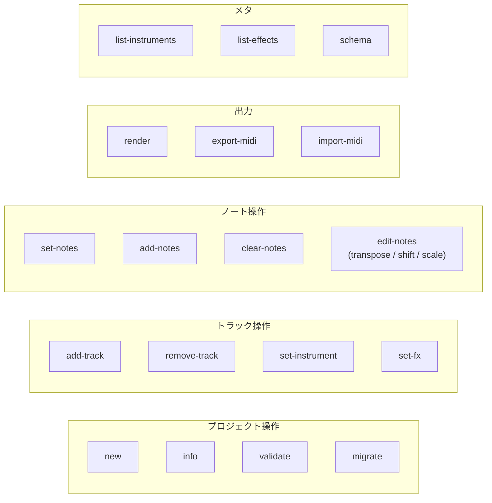

# Codetta — CLI コマンド体系

> `codetta-cli` は LLM と人間の双方が使う CLI。
> **stdout は機械可読 JSON のみ**、 **stderr は人間向けログ**、 **終了コード**で成否を返す。
> MCP server から呼ばれる第一の利用者として設計し、 人間の直接利用はその次。

## 設計原則

1. **stdout = JSON のみ** — パイプ / MCP server が確実にパース可能
2. **stderr = 人間向け** — 進捗 / ヒント / エラー詳細 (色付き、 unicode 可)
3. **副作用は明示的** — `--dry-run` で全コマンドが副作用なしモード可
4. **動詞 + ハイフン** — `add-track`, `set-notes` 等 (kebab-case 統一)
5. **`--format json|text`** — 一部読み取り系コマンドで text 出力可 (デフォルト json)
6. **冪等性を意識** — 同じ入力で何度呼んでも同じ結果になるコマンドを優先

## バイナリ名

実行ファイル名は `codetta` (リポジトリ内の crate 名 `codetta-cli` は実装上の都合のみ)。

## コマンド一覧



### 一覧表

| コマンド | Phase | 副作用 | 説明 |
|---|---|---|---|
| `new` | 0 | ✓ | 新規プロジェクト作成 |
| `info` | 0 | — | プロジェクト情報を JSON 出力 |
| `validate` | 0 | — | スキーマ + 整合性検証 |
| `add-track` | 0 | ✓ | トラック追加 |
| `remove-track` | 0 | ✓ | トラック削除 |
| `set-instrument` | 0 | ✓ | トラックの楽器変更 |
| `set-fx` | 0 | ✓ | トラックのエフェクトチェーン置換 |
| `set-notes` | 0 | ✓ | トラックのノート列を**置換** |
| `add-notes` | 0 | ✓ | トラックにノートを**追加** |
| `clear-notes` | 0 | ✓ | トラックのノートをクリア |
| `edit-notes` | 0 | ✓ | ノートを変形 (transpose / shift / scale) |
| `render` | 0 | ✓ | WAV レンダリング |
| `list-instruments` | 0 | — | 利用可能な楽器一覧 |
| `list-effects` | 0 | — | 利用可能なエフェクト一覧 |
| `schema` | 0 | — | プロジェクトファイルの JSON Schema 出力 |
| `export-midi` | 1 | ✓ | MIDI ファイル書き出し |
| `import-midi` | 1 | ✓ | MIDI ファイル読み込み |
| `migrate` | 0.x → 1.0 | ✓ | 旧バージョンスキーマからのアップグレード |

## 共通オプション

全コマンドに共通:

| オプション | 説明 |
|---|---|
| `--dry-run` | 副作用なしで実行 (バリデーションのみ、 ファイル書き換えなし) |
| `--quiet` / `-q` | stderr ログ抑制 |
| `--verbose` / `-v` | stderr ログ詳細化 |
| `--format json\|text` | 出力フォーマット (デフォルト `json`) |
| `--no-color` | stderr の色付け無効化 |
| `--help` / `-h` | ヘルプ表示 |
| `--version` | バージョン表示 |

## コマンド詳細 (Phase 0)

### `new`

新規プロジェクトファイルを作成。

```
codetta new <PATH> [--bpm <BPM>] [--key <KEY>] [--name <NAME>] [--time-sig <N/D>] [--force]
```

| 引数 / オプション | 説明 |
|---|---|
| `<PATH>` | 出力ファイルパス (`.codetta` 推奨) |
| `--bpm <BPM>` | BPM (デフォルト 120) |
| `--key <KEY>` | 調 (デフォルト `"C"`) |
| `--name <NAME>` | 楽曲名 (デフォルト: ファイル名 stem) |
| `--time-sig <N/D>` | 拍子 (デフォルト `4/4`) |
| `--force` | 既存ファイルを上書き |

**stdout (JSON):**
```json
{ "ok": true, "path": "/abs/path/battle.codetta", "version": "0.1" }
```

**終了コード:** 0 成功 / 1 既存ファイル衝突 / 2 引数不正

### `info`

プロジェクトファイルのメタ情報・統計を出力。

```
codetta info <PATH>
```

**stdout (JSON):**
```json
{
  "version": "0.1",
  "metadata": { "name": "Cyber Battle Loop", "bpm": 140, "key": "Am", "time_signature": [4, 4] },
  "tracks": [
    { "id": "lead",  "name": "Saw Lead", "instrument": "saw_lead",  "note_count": 7,  "fx_count": 2 },
    { "id": "bass",  "name": "Sub Bass", "instrument": "sin",        "note_count": 4,  "fx_count": 0 },
    { "id": "drums", "name": "Drums",    "instrument": "drum_kit",   "note_count": 8,  "fx_count": 0 }
  ],
  "duration_beats": 8.0,
  "duration_sec": 3.43
}
```

### `validate`

スキーマ + 整合性を検証。 違反があれば非ゼロ終了。

```
codetta validate <PATH>
```

**stdout (JSON):**
```json
{
  "ok": false,
  "errors": [
    { "path": "tracks[0].notes[3].vel", "message": "velocity must be 0-127, got 200" },
    { "path": "tracks[1].instrument.type", "message": "unknown instrument type: 'xyz'" }
  ]
}
```

### `add-track`

トラックを追加。 既存 `id` と重複すればエラー。

```
codetta add-track <PATH> --id <ID> [--name <NAME>] [--instrument <TYPE>]
                          [--volume <V>] [--pan <P>] [--params-json <JSON>]
```

| オプション | 説明 |
|---|---|
| `--id <ID>` | トラック ID (必須、 kebab-case 推奨) |
| `--name <NAME>` | 表示名 (デフォルト ID と同じ) |
| `--instrument <TYPE>` | 楽器 type (デフォルト `sin`) |
| `--volume <V>` | 0.0-1.0 (デフォルト 0.8) |
| `--pan <P>` | -1.0 〜 1.0 (デフォルト 0.0) |
| `--params-json <JSON>` | 楽器 params の JSON 文字列 |

**stdout:** `{ "ok": true, "track_id": "lead" }`

### `set-notes`

トラックのノート列を**全置換**。 LLM が「このトラックは結局こうしたい」と最終形を渡す用途。

```
codetta set-notes <PATH> --track <ID> --notes-json <JSON> [--notes-file <FILE>]
```

`--notes-json` と `--notes-file` は排他。 ファイル渡しは大きい配列を扱う用。

**入力 JSON 例:**
```json
[
  { "t": 0.0, "pitch": "A4", "dur": 0.5, "vel": 100 },
  { "t": 0.5, "pitch": "C5", "dur": 0.5, "vel": 100 }
]
```

**stdout:** `{ "ok": true, "track_id": "lead", "note_count": 2 }`

### `add-notes`

トラックにノートを**追加** (既存ノートは保持)。 `t` で並べ替え。 重複ノート (`t` + `pitch` + `dur` すべて同じ) は無視。

```
codetta add-notes <PATH> --track <ID> --notes-json <JSON>
```

**stdout:** `{ "ok": true, "track_id": "lead", "added": 4, "skipped_duplicates": 1, "total_notes": 11 }`

### `clear-notes`

トラックのノートを全削除。

```
codetta clear-notes <PATH> --track <ID>
```

### `edit-notes`

ノートに対する一括変形操作。 複数操作を JSON 配列で渡す。

```
codetta edit-notes <PATH> --track <ID> --ops-json <JSON>
```

**ops の種類 (Phase 0):**

| op | params | 説明 |
|---|---|---|
| `transpose` | `{ "semitones": int, "range": [t_start, t_end]? }` | 範囲内 (省略時は全) を半音単位で移調 |
| `shift_time` | `{ "beats": float, "range": [...]? }` | 時間方向にシフト |
| `scale_time` | `{ "factor": float }` | 時間軸を引き伸ばし / 縮め |
| `set_velocity` | `{ "vel": int, "range": [...]? }` | ベロシティ一括変更 |
| `quantize` | `{ "grid": float }` | グリッド (例: 0.25) に量子化 |
| `delete_range` | `{ "range": [t_start, t_end] }` | 範囲内のノート削除 |

**入力例:**
```json
[
  { "op": "transpose", "semitones": -12 },
  { "op": "set_velocity", "vel": 90 }
]
```

**stdout:** `{ "ok": true, "track_id": "bass", "ops_applied": 2, "notes_affected": 8 }`

### `render`

WAV ファイルにレンダリング。

```
codetta render <PATH> --output <OUT.wav> [--from <BEAT>] [--to <BEAT>]
                       [--sample-rate <SR>] [--bit-depth <BD>]
```

| オプション | 説明 |
|---|---|
| `--output` / `-o` | 出力 WAV ファイルパス (必須) |
| `--from <BEAT>` | 開始ビート (デフォルト 0) |
| `--to <BEAT>` | 終了ビート (デフォルト 末尾) |
| `--sample-rate` | 44100 (デフォルト) / 48000 |
| `--bit-depth` | 16 (デフォルト) / 24 |

**stderr:** 進捗バー (`--quiet` で抑制)

**stdout (JSON):**
```json
{
  "ok": true,
  "output": "/abs/path/out.wav",
  "duration_sec": 3.43,
  "sample_rate": 44100,
  "bit_depth": 16,
  "render_time_sec": 0.31,
  "rtfactor": 11.1
}
```

### `list-instruments`

利用可能な楽器一覧 + 各 type のパラメータスキーマ。

```
codetta list-instruments [--format json|text]
```

**stdout (JSON):**
```json
[
  {
    "type": "saw_lead",
    "description": "ノコギリ波リード (ローパス付き)",
    "params": {
      "attack":         { "type": "float", "default": 0.01, "range": [0, 10] },
      "decay":          { "type": "float", "default": 0.1,  "range": [0, 10] },
      "sustain":        { "type": "float", "default": 0.7,  "range": [0, 1] },
      "release":        { "type": "float", "default": 0.2,  "range": [0, 10] },
      "filter_cutoff":  { "type": "float", "default": 1000, "range": [20, 20000] },
      "filter_q":       { "type": "float", "default": 1.0,  "range": [0.5, 10] }
    }
  },
  ...
]
```

### `list-effects`

エフェクト一覧 + パラメータスキーマ (`list-instruments` と同形式)。

### `schema`

プロジェクトファイルの JSON Schema を出力 (エディタ補完用)。

```
codetta schema [--version 0.1]
```

**stdout:** JSON Schema (draft-2020-12 準拠)

## 出力フォーマット規約

### stdout (JSON)

すべての成功レスポンスに `"ok": true`。 失敗時は `"ok": false` + `"errors": [...]`。

```json
{ "ok": true, ...結果データ... }
```
```json
{ "ok": false, "errors": [ { "code": "...", "message": "..." } ] }
```

### stderr (人間向け)

- 進捗バー / 何が起きているかのナレーション
- TTY 検出して色付け (`--no-color` で無効化可)
- `--quiet` で抑制

例:
```
[INFO] Loading battle.codetta
[INFO] 3 tracks, 19 notes, duration 3.43s
[RENDER] ████████████████████ 100% (0.31s)
[OK] Wrote out.wav (3.43s @ 44.1kHz, 16bit)
```

### 終了コード

| コード | 意味 |
|---|---|
| 0 | 成功 |
| 1 | バリデーション / ロジックエラー (ファイル不正、 ID 衝突等) |
| 2 | 引数不正 (CLI パース失敗、 必須オプション欠落) |
| 3 | I/O エラー (ファイル読み書き失敗、 権限) |
| 4 | パニック / 予期しないエラー (バグ報告対象) |

## エラー JSON 形式

```json
{
  "ok": false,
  "errors": [
    {
      "code": "TRACK_NOT_FOUND",
      "message": "Track 'leadz' does not exist (did you mean 'lead'?)",
      "context": { "available_tracks": ["lead", "bass", "drums"] }
    }
  ]
}
```

### エラーコード (Phase 0)

| code | 終了コード |
|---|---|
| `FILE_NOT_FOUND` | 3 |
| `FILE_EXISTS` (force なし) | 1 |
| `INVALID_JSON` | 1 |
| `INVALID_SCHEMA` | 1 |
| `UNKNOWN_VERSION` | 1 |
| `TRACK_NOT_FOUND` | 1 |
| `TRACK_ID_DUPLICATE` | 1 |
| `UNKNOWN_INSTRUMENT_TYPE` | 1 |
| `UNKNOWN_EFFECT_TYPE` | 1 |
| `INVALID_NOTE` | 1 |
| `RENDER_FAILED` | 1 |
| `IO_ERROR` | 3 |
| `INTERNAL_ERROR` | 4 |

## 利用例: LLM が曲を作る

```bash
# 1. 新規作成
codetta new battle.codetta --bpm 140 --key Am --name "Cyber Battle"

# 2. リードトラック追加
codetta add-track battle.codetta --id lead --instrument saw_lead \
    --params-json '{"filter_cutoff": 1500, "filter_q": 3.0}'

# 3. リードのノート
codetta set-notes battle.codetta --track lead --notes-json '[
    {"t":0.0,"pitch":"A4","dur":0.5,"vel":100},
    {"t":0.5,"pitch":"C5","dur":0.5,"vel":100}
]'

# 4. レンダリング
codetta render battle.codetta -o out.wav

# 5. 「ベース 1 オクターブ下げて」
codetta edit-notes battle.codetta --track bass --ops-json '[
    {"op":"transpose","semitones":-12}
]'

# 6. 再レンダリング
codetta render battle.codetta -o out.wav
```

## 人間が手で書く時の楽さ

CLI は LLM 第一だが、 人間が直接編集する場合は次が現実的:

```bash
# プロジェクトファイルを直接エディタで書き換え
$EDITOR battle.codetta

# 検証してレンダリング
codetta validate battle.codetta && codetta render battle.codetta -o out.wav
```

`set-notes` 等を bash で叩くより、 JSON を直接編集する方が早い。 CLI は LLM / 自動化のための入り口。

## オープンクエスチョン

- [ ] `--notes-file <FILE>` のフォーマット: JSON のみか YAML も受け付けるか → JSON のみ
- [ ] `edit-notes` の op を 1 オペレーション 1 コマンドにするか、 まとめて配列で渡すか → **配列で渡す** (1 回の呼び出しで複数 op、 LLM が楽)
- [ ] `render` の `--bit-depth 24` を Phase 0 で実装するか → **Phase 0 は 16 のみ、 24 は Phase 1+**
- [ ] `migrate` の対象スキーマバージョンをどこまで遡るか → 当面 `0.1` のみ
