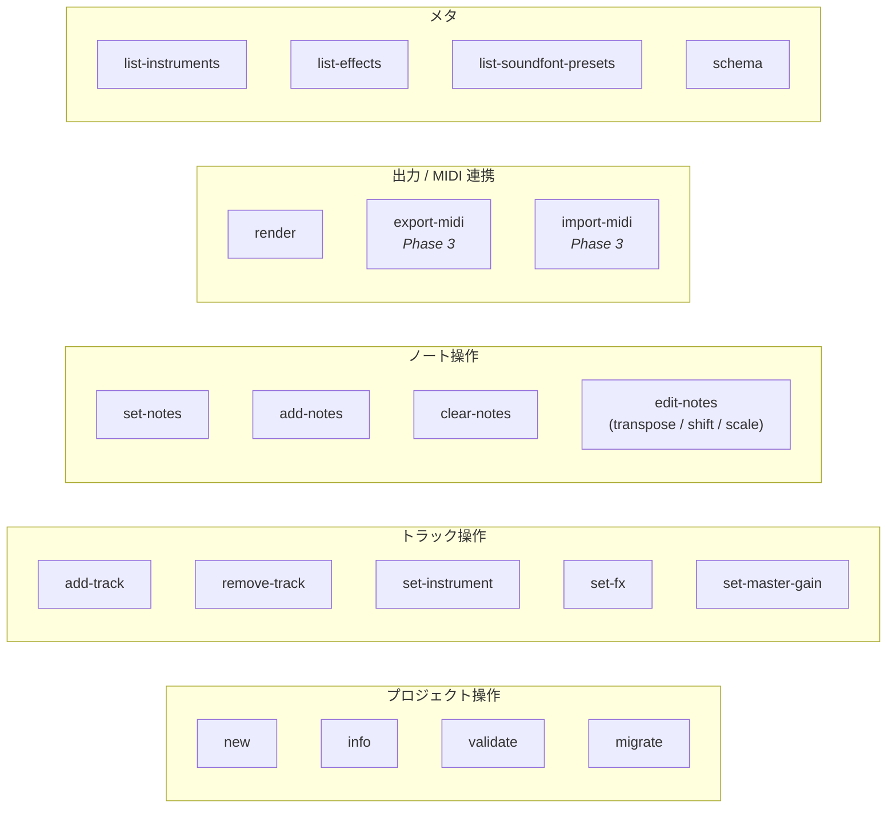

# Codetta — CLI コマンド体系

> `codetta-cli` は LLM と人間の双方が使う CLI。
> **stdout は機械可読 JSON のみ**、 **stderr は人間向けログ**、 **終了コード**で成否を返す。
> MCP server から呼ばれる第一の利用者として設計し、 人間の直接利用はその次。
> 音源は外付け SF2 (= schema 0.2 化後)、 内蔵 synth 系コマンドは Phase 2 で削除予定。

## doc と実装の対応関係 (= Phase 1+ 時点)

本 doc は **schema 0.2 化 (= Phase 2) 完了後の到達状態** を spec として記述する。 現実装 (Phase 1+ = commit `a2c12d9` 時点) の状態:

| 項目 | 現実装 | Phase 2 完了後 (= 本 doc の spec) |
|---|---|---|
| `SCHEMA_VERSION` | `"0.1"` | `"0.2"` |
| `KNOWN_INSTRUMENT_TYPES` | sin / saw / saw_lead / square / square_bass / triangle / saw_pad / drum_kit / soundfont (9 種) | soundfont のみ (1 種) |
| `add-track --instrument` 省略時 | `"sin"` | `"soundfont"` |
| ドラム track での `pitch: "kick"` 等 | 内蔵 `drum_kit` 経路のみ機能 | SF2 GM Drum (bank 128) 経路でも `kick` 等を MIDI 番号に正規化 |
| `LEGACY_VERSION` warning | 未実装 | 0.1 ファイル load 時に出力 |
| `migrate` subcommand | 未実装 | 0.1 → 0.2 を自動変換 |
| `export-midi` / `import-midi` | 未実装 | Phase 3 で実装 |

本 doc 内で「**Phase N 計画**」 と注記している subcommand は当該 Phase で実装する未来形。 注記の無い subcommand は **Phase 1+ で既に動いている** 現役機能 (= 出力 JSON / フラグ名は現実装に揃えてある)。

## 設計原則

1. **stdout = JSON のみ** — パイプ / MCP server が確実にパース可能
2. **stderr = 人間向け** — 進捗 / ヒント / エラー詳細 (色付き、 unicode 可)
3. **副作用は明示的** — `--dry-run` で全コマンドが副作用なしモード可
4. **動詞 + ハイフン** — `add-track`, `set-notes` 等 (kebab-case 統一)
5. **`--format json|text`** — 一部読み取り系コマンドで text 出力可 (デフォルト json)
6. **冪等性を意識** — 同じ入力で何度呼んでも同じ結果になるコマンドを優先

## バイナリ名

実行ファイル名は `codetta` (リポジトリ内の crate 名 `codetta-cli` は実装上の都合のみ)。

## コマンド一覧



### 一覧表

| コマンド | Phase | 副作用 | 説明 |
|---|---|---|---|
| `new` | 0 | ✓ | 新規プロジェクト作成 |
| `info` | 0 | — | プロジェクト情報を JSON 出力 |
| `validate` | 0 | — | スキーマ + 整合性検証 |
| `add-track` | 0 | ✓ | トラック追加 |
| `remove-track` | 0 | ✓ | トラック削除 |
| `set-instrument` | 0 | ✓ | トラックの楽器変更 |
| `set-fx` | 0 | ✓ | トラックのエフェクトチェーン置換 |
| `set-notes` | 0 | ✓ | トラックのノート列を**置換** |
| `add-notes` | 0 | ✓ | トラックにノートを**追加** |
| `clear-notes` | 0 | ✓ | トラックのノートをクリア |
| `edit-notes` | 0 | ✓ | ノートを変形 (transpose / shift / scale) |
| `set-master-gain` | 1+ | ✓ | `metadata.master_gain` を設定 |
| `render` | 0 | ✓ | WAV レンダリング |
| `list-instruments` | 0 | — | 利用可能な楽器一覧 (= schema 0.2 では `"soundfont"` 一本) |
| `list-effects` | 0 | — | 利用可能なエフェクト一覧 |
| `list-soundfont-presets` | 1+ | — | 指定 SF2 ファイル内の preset / bank 一覧 |
| `schema` | 0 | — | プロジェクトファイルの JSON Schema 出力 |
| `migrate` | **2 計画** | ✓ | 旧バージョンスキーマからのアップグレード (0.1 → 0.2) |
| `export-midi` | **3 計画** | ✓ | `.codetta` から MIDI (`.mid`) を書き出す |
| `import-midi` | **3 計画** | ✓ | MIDI (`.mid`) を `.codetta` に変換 |

「**Phase N 計画**」 表記は本 doc 執筆時点 (= Phase 1+ 完了) で未実装、 当該 Phase で実装する subcommand。

## 共通オプション

全コマンドに共通:

| オプション | 説明 |
|---|---|
| `--dry-run` | 副作用なしで実行 (バリデーションのみ、 ファイル書き換えなし) |
| `--quiet` / `-q` | stderr ログ抑制 |
| `--verbose` / `-v` | stderr ログ詳細化 |
| `--format json\|text` | 出力フォーマット (デフォルト `json`) |
| `--no-color` | stderr の色付け無効化 |
| `--help` / `-h` | ヘルプ表示 |
| `--version` | バージョン表示 |

## 環境変数

| 変数 | デフォルト | 説明 |
|---|---|---|
| `CODETTA_WORKSPACE` | `$HOME/codetta-songs/` | `.codetta` ファイルの相対 path 解決 (MCP server 経由時。 CLI 単体で相対 path を渡せばカレントから解決) |
| `CODETTA_SOUNDFONT_DIR` | `$HOME/Music/sf2/` | SF2 ファイルの相対 path 解決 |

MCP server は環境変数を継承する。

## コマンド詳細 (Phase 0-1+)

### `new`

新規プロジェクトファイルを作成 (= schema 0.2)。

```
codetta new <PATH> [--bpm <BPM>] [--key <KEY>] [--name <NAME>] [--time-sig <N/D>] [--master-gain <G>] [--force]
```

| 引数 / オプション | 説明 |
|---|---|
| `<PATH>` | 出力ファイルパス (`.codetta` 推奨) |
| `--bpm <BPM>` | BPM (デフォルト 120) |
| `--key <KEY>` | 調 (デフォルト `"C"`) |
| `--name <NAME>` | 楽曲名 (デフォルト: ファイル名 stem) |
| `--time-sig <N/D>` | 拍子 (デフォルト `4/4`) |
| `--master-gain <G>` | `metadata.master_gain` (デフォルト 1.0、 範囲 0.0-4.0) |
| `--force` | 既存ファイルを上書き |

**stdout (JSON):**
```json
{ "ok": true, "path": "/abs/path/battle.codetta", "version": "0.2" }
```

`version` フィールドの値は `core::SCHEMA_VERSION` をそのまま出す (= Phase 1+ では `"0.1"`、 Phase 2 完了後は `"0.2"`)。

**終了コード:** 0 成功 / 1 既存ファイル衝突 / 2 引数不正

### `info`

プロジェクトファイルのメタ情報・統計を出力。

```
codetta info <PATH>
```

**stdout (JSON):**
```json
{
  "ok": true,
  "version": "0.2",
  "metadata": {
    "name": "Cyber Battle Loop",
    "bpm": 140,
    "key": "Am",
    "time_signature": [4, 4],
    "master_gain": 2.0
  },
  "tracks": [
    { "id": "lead",  "name": "Saw Lead",   "instrument": "soundfont", "note_count": 7, "fx_count": 2 },
    { "id": "bass",  "name": "Synth Bass", "instrument": "soundfont", "note_count": 4, "fx_count": 0 },
    { "id": "drums", "name": "Drums",      "instrument": "soundfont", "note_count": 8, "fx_count": 0 }
  ],
  "duration_beats": 8.0,
  "duration_sec": 3.43
}
```

`tracks[].instrument` は `kind` (type 名 string) のみ。 SF2 preset / bank 等の params は出力しない (= 詳細は元 `.codetta` を直接読む)。

### `validate`

スキーマ + 整合性を検証。 違反があれば非ゼロ終了。 SoundFont path 解決失敗も検出する。

```
codetta validate <PATH>
```

**stdout (JSON):**
```json
{
  "ok": false,
  "errors": [
    { "code": "INVALID_NOTE", "path": "tracks[0].notes[3].vel", "message": "velocity must be 0-127, got 200" },
    { "code": "SOUNDFONT_FILE_NOT_FOUND", "path": "tracks[1].instrument.params.file", "message": "SF2 file not found: 'missing.sf2'" }
  ],
  "warnings": [
    { "code": "UNKNOWN_PARAM", "path": "tracks[2].instrument.params.foo", "message": "Unknown instrument param 'foo' (ignored)" }
  ]
}
```

### `add-track`

トラックを追加。 既存 `id` と重複すればエラー。

```
codetta add-track <PATH> --id <ID> [--name <NAME>] [--instrument <TYPE>]
                          [--volume <V>] [--pan <P>] [--params-json <JSON>]
```

| オプション | 説明 |
|---|---|
| `--id <ID>` | トラック ID (必須、 kebab-case 推奨) |
| `--name <NAME>` | 表示名 (デフォルト ID と同じ) |
| `--instrument <TYPE>` | 楽器 type (Phase 1+ では現実装デフォルト `"sin"`、 Phase 2 で `"soundfont"` 1 種に縮退するため省略推奨) |
| `--volume <V>` | 0.0-1.0 (デフォルト 0.8) |
| `--pan <P>` | -1.0 〜 1.0 (デフォルト 0.0) |
| `--params-json <JSON>` | 楽器 params の JSON 文字列 (= SF2 では `{"file":..., "preset":..., "bank":...}`) |

**stdout:** `{ "ok": true, "track_id": "lead" }`

### `set-instrument`

トラックの楽器を差し替える。 SF2 preset 切替 / SF2 ファイル変更に使う。

```
codetta set-instrument <PATH> --track <ID> --type <TYPE> [--params-json <JSON>]
```

| オプション | 説明 |
|---|---|
| `--type <TYPE>` | 楽器 type (必須)。 Phase 2 完了後は `soundfont` 一択 |
| `--params-json <JSON>` | 楽器 params (省略時は空オブジェクト) |

例: lead を Saw Lead (preset 81) から Square Lead (preset 80) に差し替える。

```bash
codetta set-instrument battle.codetta --track lead --type soundfont \
    --params-json '{"file":"GeneralUser-GS-v1.471.sf2","preset":80,"bank":0}'
```

**stdout:** `{ "ok": true, "track_id": "lead" }`

### `set-fx`

トラックのエフェクトチェーンを置換 (= 全置換)。 順序が重要なため。

```
codetta set-fx <PATH> --track <ID> --fx-json <JSON>
```

**stdout:** `{ "ok": true, "track_id": "lead", "fx_count": 2 }`

### `set-notes`

トラックのノート列を**全置換**。 LLM が「このトラックは結局こうしたい」 と最終形を渡す用途。

```
codetta set-notes <PATH> --track <ID> --notes-json <JSON> [--notes-file <FILE>]
```

`--notes-json` と `--notes-file` は排他。 ファイル渡しは大きい配列を扱う用。

**入力 JSON 例:**
```json
[
  { "t": 0.0, "pitch": "A4", "dur": 0.5, "vel": 100 },
  { "t": 0.5, "pitch": "C5", "dur": 0.5, "vel": 100 }
]
```

ドラムトラック (= SF2 bank 128) では `pitch` に要素名キー (`"kick"` / `"snare"` 等) を書ける。 内部で GM Drum Map (MIDI 番号) に正規化される (= **Phase 2 で SF2 経路への実装追加が必要**。 現実装 (Phase 1+) では内蔵 `drum_kit` track 経由のみ機能)。

**stdout:** `{ "ok": true, "track_id": "lead", "note_count": 2 }`

### `add-notes`

トラックにノートを**追加** (既存ノートは保持)。 `t` で並べ替え。 重複ノート (`t` + `pitch` + `dur` すべて同じ) は無視。

```
codetta add-notes <PATH> --track <ID> --notes-json <JSON>
```

**stdout:** `{ "ok": true, "track_id": "lead", "added": 4, "skipped_duplicates": 1, "total_notes": 11 }`

### `clear-notes`

トラックのノートを全削除。

```
codetta clear-notes <PATH> --track <ID>
```

### `edit-notes`

ノートに対する一括変形操作。 複数操作を JSON 配列で渡す。

```
codetta edit-notes <PATH> --track <ID> --ops-json <JSON>
```

**ops の種類 (Phase 0):**

| op | params | 説明 |
|---|---|---|
| `transpose` | `{ "semitones": int, "range": [t_start, t_end]? }` | 範囲内 (省略時は全) を半音単位で移調 |
| `shift_time` | `{ "beats": float, "range": [...]? }` | 時間方向にシフト |
| `scale_time` | `{ "factor": float }` | 時間軸を引き伸ばし / 縮め |
| `set_velocity` | `{ "vel": int, "range": [...]? }` | ベロシティ一括変更 |
| `quantize` | `{ "grid": float }` | グリッド (例: 0.25) に量子化 |
| `delete_range` | `{ "range": [t_start, t_end] }` | 範囲内のノート削除 |

**入力例:**
```json
[
  { "op": "transpose", "semitones": -12 },
  { "op": "set_velocity", "vel": 90 }
]
```

**stdout:** `{ "ok": true, "track_id": "bass", "ops_applied": 2, "notes_affected": 8 }`

### `set-master-gain`

`metadata.master_gain` を設定。 SF2 楽器のように内部音量が小さい音源で全体音圧を稼ぎたい時に使う (= 全 track 合算後の soft_clip 直前に乗算)。

```
codetta set-master-gain <PATH> --value <G>
```

`<G>` は 0.0-4.0。 フラグ名が `--gain` ではなく `--value` なのは `--master-gain` (= `codetta new` 側のフラグ) と用語が衝突しないように。

**stdout:** `{ "ok": true, "master_gain": 2.0 }`

### `render`

WAV ファイルにレンダリング。 すべての track の SF2 を load → 合算 → master_gain → soft_clip → WAV 出力。

```
codetta render <PATH> --output <OUT.wav> [--from <BEAT>] [--to <BEAT>]
                       [--sample-rate <SR>] [--bit-depth <BD>]
```

| オプション | 説明 |
|---|---|
| `--output` / `-o` | 出力 WAV ファイルパス (必須) |
| `--from <BEAT>` | 開始ビート (デフォルト 0) |
| `--to <BEAT>` | 終了ビート (デフォルト 末尾) |
| `--sample-rate` | 44100 (デフォルト) / 48000 |
| `--bit-depth` | 16 (デフォルト) / 24 |

**stderr:** 進捗バー (`--quiet` で抑制)

**stdout (JSON):**
```json
{
  "ok": true,
  "output": "/abs/path/out.wav",
  "duration_sec": 3.43,
  "sample_rate": 44100,
  "bit_depth": 16,
  "render_time_sec": 0.31,
  "rtfactor": 11.1
}
```

### `list-instruments`

利用可能な楽器一覧 + パラメータスキーマ。 現実装 (Phase 1+) は内蔵 synth + soundfont の全 9 種を返す。 Phase 2 完了後は **`"soundfont"` 1 entry のみ** に縮退。

```
codetta list-instruments [--format json|text]
```

**stdout (JSON、 Phase 2 完了後の到達状態):**
```json
{
  "ok": true,
  "instruments": [
    {
      "type": "soundfont",
      "category": "sampler",
      "description": "外部 SoundFont (.sf2) ファイル経由のサンプラ",
      "params": {
        "file":   { "type": "string",  "required": true, "note": "SF2 ファイル path (絶対 or $CODETTA_SOUNDFONT_DIR 配下の相対)" },
        "preset": { "type": "integer", "default": 0, "range": [0, 127], "note": "GM Program 番号" },
        "bank":   { "type": "integer", "default": 0, "range": [0, 128], "note": "GM/GS bank (melodic は 0、 GS Drum は 128)" }
      }
    }
  ]
}
```

`params` の各エントリは type ごとに揺れる (= `note` / `unit` / `default` / `enum` / `range` / `required` の任意組合せ)。 機械的に処理する場合は欠落フィールドを許容する形で読むこと。 Phase 1+ の `instrument_catalog()` 出力 (= 内蔵 synth + drum_kit + soundfont) はそのまま読める。

### `list-effects`

エフェクト一覧 + パラメータスキーマ (`list-instruments` と同形式)。

### `list-soundfont-presets`

指定 SF2 ファイル内の preset / bank 一覧を出力。 LLM が「ファイルにどんな音色が入っているか」 を確認する用途。

```
codetta list-soundfont-presets <SF2_PATH> [--format json|text]
```

`<SF2_PATH>` は絶対 or `$CODETTA_SOUNDFONT_DIR` 相対。

**stdout (JSON):**
```json
{
  "ok": true,
  "file": "/abs/path/GeneralUser-GS-v1.471.sf2",
  "soundfont": {
    "bank_name": "GeneralUser GS",
    "version": "1.471",
    "author": "S. Christian Collins",
    "copyright": "...",
    "comments": "..."
  },
  "preset_count": 4,
  "presets": [
    { "bank": 0,   "preset": 0,  "name": "Acoustic Grand Piano" },
    { "bank": 0,   "preset": 24, "name": "Nylon Guitar" },
    { "bank": 0,   "preset": 81, "name": "Saw Lead" },
    { "bank": 128, "preset": 0,  "name": "Standard Drum Kit" }
  ]
}
```

### `schema`

プロジェクトファイルの JSON Schema を出力 (エディタ補完用)。

```
codetta schema [--version 0.2]
```

省略時は現行 schema (= `0.2`)。 `0.1` を指定すれば legacy schema を出す。

**stdout:** JSON Schema (draft-2020-12 準拠)

## Phase 2 計画コマンド

### `migrate` (Phase 2)

旧バージョンスキーマファイルを現行版にアップグレード。 当面 `0.1 → 0.2` のみサポート。

```
codetta migrate <PATH> [--in-place | --output <OUT>] [--sf2 <FILE>] [--manual]
```

| オプション | 説明 |
|---|---|
| `--in-place` | 同 path に上書き保存 |
| `--output <OUT>` | 別 path に出力 (`--in-place` と排他) |
| `--sf2 <FILE>` | migrate 後の SF2 ファイル (省略時 bundle SF2、 Phase 4 で確定) |
| `--manual` | LUT 自動マッピングではなく、 各 track ごとに対話的に preset を決める |

**動作概要 (0.1 → 0.2):**

| 0.1 の `instrument.type` | 0.2 への変換 (LUT、 `--manual` で上書き可) |
|---|---|
| `sin` | `soundfont` / preset 38 (Synth Bass 1) — sin の dogfood 使用は sub bass 中心。 melody 用途で sin を使っていた場合は `--manual` で個別調整 |
| `saw` / `saw_lead` | `soundfont` / preset 81 (Saw Lead) |
| `square` / `square_bass` | `soundfont` / preset 80 (Square Lead) |
| `triangle` | `soundfont` / preset 73 (Flute) — 候補に preset 71 (Clarinet)、 sin との重複を避けるため Whistle 系は採用しない |
| `saw_pad` | `soundfont` / preset 88 (New Age Pad) |
| `drum_kit` (`kit=808/909/chip`) | `soundfont` / preset 0 / bank 128 (= GM Standard Drum Kit)。 `kick`/`snare` 等の要素名キーは GM Drum MIDI 番号 (36/38/...) に展開 |

LUT の最終形は Phase 2 着手時に確定。 詳細は (Phase 2 で起こす) `migrate` 実装 ADR を参照。

**stdout (JSON):**
```json
{
  "ok": true,
  "path": "/abs/path/out.codetta",
  "from_version": "0.1",
  "to_version": "0.2",
  "tracks_migrated": 3,
  "instrument_mapping": [
    { "track_id": "lead",  "from": { "type": "saw_lead" },              "to": { "type": "soundfont", "preset": 81,  "bank": 0   } },
    { "track_id": "bass",  "from": { "type": "sin" },                   "to": { "type": "soundfont", "preset": 38,  "bank": 0   } },
    { "track_id": "drums", "from": { "type": "drum_kit", "kit": "808" }, "to": { "type": "soundfont", "preset": 0,   "bank": 128 } }
  ]
}
```

## Phase 3 計画コマンド (MIDI 連携)

詳細仕様は (Phase 3 で起こす) `docs/design/08-midi.md` に集約予定。 ここでは subcommand 形を決め打ちで予約しておく。

### `export-midi` (Phase 3)

`.codetta` から MIDI ファイル (`.mid`) を書き出す。 1 track 1 channel が基本 (A 案、 channel→track と対称)。 ドラム track は channel 10。

```
codetta export-midi <PATH> --output <OUT.mid>
                            [--ppq <N>]
                            [--extensions text-meta|sidecar|none]
                            [--from <BEAT>] [--to <BEAT>]
```

| オプション | 説明 |
|---|---|
| `--output` / `-o` | 出力 MIDI ファイルパス (必須) |
| `--ppq <N>` | tick per quarter (デフォルト 480) |
| `--extensions` | codetta 拡張属性 (`master_gain` / fx / SF2 preset 詳細) の埋め込み方式 (デフォルト `text-meta`) |
| `--from <BEAT>` / `--to <BEAT>` | 範囲指定 (省略時は曲全体) |

**stdout (JSON):**
```json
{
  "ok": true,
  "output": "/abs/path/out.mid",
  "track_count": 3,
  "ppq": 480,
  "extensions_mode": "text-meta",
  "duration_beats": 8.0
}
```

### `import-midi` (Phase 3)

MIDI ファイル (`.mid`) を `.codetta` に変換。 channel → track へ展開、 GM Program → SF2 preset へ自動マッピング。 ドラム channel 10 は `bank: 128` に。

```
codetta import-midi <MID_PATH> --output <OUT.codetta>
                                [--sf2 <FILE>]
                                [--extensions text-meta|sidecar|none]
                                [--force]
```

| オプション | 説明 |
|---|---|
| `--output` / `-o` | 出力 `.codetta` ファイルパス (必須) |
| `--sf2 <FILE>` | 使用 SF2 (省略時 bundle SF2、 Phase 4 で確定) |
| `--extensions` | codetta 拡張属性の取り込み方式 (デフォルト `text-meta`、 `export-midi` で書いたものを復元) |
| `--force` | 既存 `.codetta` を上書き |

**stdout (JSON):**
```json
{
  "ok": true,
  "output": "/abs/path/out.codetta",
  "version": "0.2",
  "tracks_imported": 4,
  "extensions_mode": "text-meta",
  "extensions_recovered": ["master_gain", "fx", "soundfont_params"]
}
```

GM Program → SF2 preset マッピングの戦略 (= preset 番号 100% 一致しない SF2 への扱い) は Phase 3 で 08-midi.md に集約して詰める。

## 出力フォーマット規約

### stdout (JSON)

すべての成功レスポンスに `"ok": true`。 失敗時は `"ok": false` + `"errors": [...]`。

```json
{ "ok": true, ...結果データ... }
```
```json
{ "ok": false, "errors": [ { "code": "...", "message": "..." } ] }
```

### stderr (人間向け)

- 進捗バー / 何が起きているかのナレーション
- TTY 検出して色付け (`--no-color` で無効化可)
- `--quiet` で抑制

例:
```
[INFO] Loading battle.codetta
[INFO] 3 tracks, 19 notes, duration 3.43s
[INFO] Loading SF2: GeneralUser-GS-v1.471.sf2
[RENDER] ████████████████████ 100% (0.31s)
[OK] Wrote out.wav (3.43s @ 44.1kHz, 16bit)
```

### 終了コード

| コード | 意味 |
|---|---|
| 0 | 成功 |
| 1 | バリデーション / ロジックエラー (ファイル不正、 ID 衝突等) |
| 2 | 引数不正 (CLI パース失敗、 必須オプション欠落) |
| 3 | I/O エラー (ファイル読み書き失敗、 権限) |
| 4 | パニック / 予期しないエラー (バグ報告対象) |

## エラー JSON 形式

```json
{
  "ok": false,
  "errors": [
    {
      "code": "TRACK_NOT_FOUND",
      "message": "Track 'leadz' does not exist (did you mean 'lead'?)",
      "context": { "available_tracks": ["lead", "bass", "drums"] }
    }
  ]
}
```

### エラーコード

| code | 終了コード | 備考 |
|---|---|---|
| `FILE_NOT_FOUND` | 3 | |
| `FILE_EXISTS` (force なし) | 1 | |
| `INVALID_JSON` | 1 | |
| `INVALID_SCHEMA` | 1 | |
| `UNKNOWN_VERSION` | 1 | 0.1 ファイルは load 時に warning + migrate 推奨 |
| `TRACK_NOT_FOUND` | 1 | |
| `TRACK_ID_DUPLICATE` | 1 | |
| `UNKNOWN_INSTRUMENT_TYPE` | 1 | schema 0.2 では `soundfont` 以外で発火 |
| `UNKNOWN_EFFECT_TYPE` | 1 | |
| `SOUNDFONT_FILE_NOT_FOUND` | 1 | SF2 path 解決失敗 (= `validate` / `render` 経路) |
| `SOUNDFONT_PARSE_FAILED` | 1 | SF2 ファイル parse / synth init 失敗 (= `list-soundfont-presets` / SF2 load 経路) |
| `INVALID_NOTE` | 1 | |
| `RENDER_FAILED` | 1 | |
| `IO_ERROR` | 3 | |
| `INTERNAL_ERROR` | 4 | |

警告 (`warnings` 配列、 終了コード 0):

| code | 状態 | 備考 |
|---|---|---|
| `UNKNOWN_PARAM` | ✅ 実装済 | instrument / fx の未知 params (= 無視されたパラメータの通知) |
| `LEGACY_VERSION` | 🔜 Phase 2 計画 | schema 0.1 を load した場合 (`migrate` 推奨) |

## 利用例: LLM が曲を作る (= SF2 版)

```bash
# 1. 新規作成
codetta new battle.codetta --bpm 140 --key Am --name "Cyber Battle" --master-gain 2.0

# 2. リードトラック (Saw Lead = preset 81)
codetta add-track battle.codetta --id lead --instrument soundfont \
    --params-json '{"file":"GeneralUser-GS-v1.471.sf2","preset":81,"bank":0}'

# 3. リードのノート
codetta set-notes battle.codetta --track lead --notes-json '[
    {"t":0.0,"pitch":"A4","dur":0.5,"vel":100},
    {"t":0.5,"pitch":"C5","dur":0.5,"vel":100}
]'

# 4. ベーストラック (Synth Bass 1 = preset 38)
codetta add-track battle.codetta --id bass --instrument soundfont \
    --params-json '{"file":"GeneralUser-GS-v1.471.sf2","preset":38,"bank":0}'

# 5. ドラムトラック (GM Drum Kit = preset 0 / bank 128)
codetta add-track battle.codetta --id drums --instrument soundfont \
    --params-json '{"file":"GeneralUser-GS-v1.471.sf2","preset":0,"bank":128}'

codetta set-notes battle.codetta --track drums --notes-json '[
    {"t":0.0,"pitch":"kick","dur":0.1,"vel":110},
    {"t":1.0,"pitch":"snare","dur":0.1,"vel":100}
]'

# 6. レンダリング
codetta render battle.codetta -o out.wav

# 7. 「ベース 1 オクターブ下げて」
codetta edit-notes battle.codetta --track bass --ops-json '[
    {"op":"transpose","semitones":-12}
]'

# 8. 再レンダリング
codetta render battle.codetta -o out.wav

# 9. (Phase 3) DAW に持っていく
codetta export-midi battle.codetta -o battle.mid
```

## 人間が手で書く時の楽さ

CLI は LLM 第一だが、 人間が直接編集する場合は次が現実的:

```bash
# プロジェクトファイルを直接エディタで書き換え
$EDITOR battle.codetta

# 検証してレンダリング
codetta validate battle.codetta && codetta render battle.codetta -o out.wav
```

`set-notes` 等を bash で叩くより、 JSON を直接編集する方が早い。 CLI は LLM / 自動化のための入り口。

GUI (Phase 5) では piano roll / 再生バッファの両方を提供予定なので、 「人間が触る」 体験は Phase 5 から本格化する。

## オープンクエスチョン

新規 (= 次以降のマイルストーンで決定):

- [ ] `migrate` の LUT で内蔵 synth → SF2 preset を完全自動マッピングするか、 dogfood 上 OK なものに絞って残りは `--manual` 必須にするか → Phase 2 着手時に確定
- [ ] `export-midi` の channel 割当 (= 同時に鳴らす track が 16 を超えた場合の戦略) → Phase 3 (08-midi.md)
- [ ] `export-midi` の `--extensions text-meta` で書き込む拡張属性のフォーマット (= JSON inline / key=value / カスタム) → Phase 3 (08-midi.md)
- [ ] `import-midi` の SF2 preset 自動マッピング失敗時の振る舞い (= preset 0 fallback / 該当 channel スキップ / エラー) → Phase 3 (08-midi.md)
- [ ] `list-soundfont-presets` の bank 順 / preset 順以外のソート選択肢 → Phase 1+ 着手で確定

決着済 (履歴):

- [x] `--notes-file <FILE>` のフォーマット: JSON のみか YAML も受け付けるか → **JSON のみ**
- [x] `edit-notes` の op を 1 オペレーション 1 コマンドにするか、 まとめて配列で渡すか → **配列で渡す** (1 回の呼び出しで複数 op、 LLM が楽)
- [x] `render` の `--bit-depth 24` を Phase 0 で実装するか → **Phase 0 は 16 のみ、 24 は将来検討**
- [x] `migrate` の対象スキーマバージョンをどこまで遡るか → **当面 `0.1 → 0.2` のみ**
- [x] 内蔵 synth の `list-instruments` を将来も維持するか → **schema 0.2 で `soundfont` 一本に縮退**

## 関連ドキュメント

- [00-vision.md](00-vision.md) — ビジョン / ターゲット / Phase 計画
- [01-architecture.md](01-architecture.md) — アーキテクチャ
- [02-project-format.md](02-project-format.md) — `.codetta` JSON スキーマ
- [04-mcp.md](04-mcp.md) — MCP tool 仕様 (= CLI と pair で expose)
- [06-examples.md](06-examples.md) — サンプル `.codetta`
- [07-soundfont.md](07-soundfont.md) — SF2 統合の詳細仕様
- 08-midi.md — MIDI import/export (Phase 3 で起こす)
- 09-distribution.md — 配布戦略 (Phase 4 で起こす)
