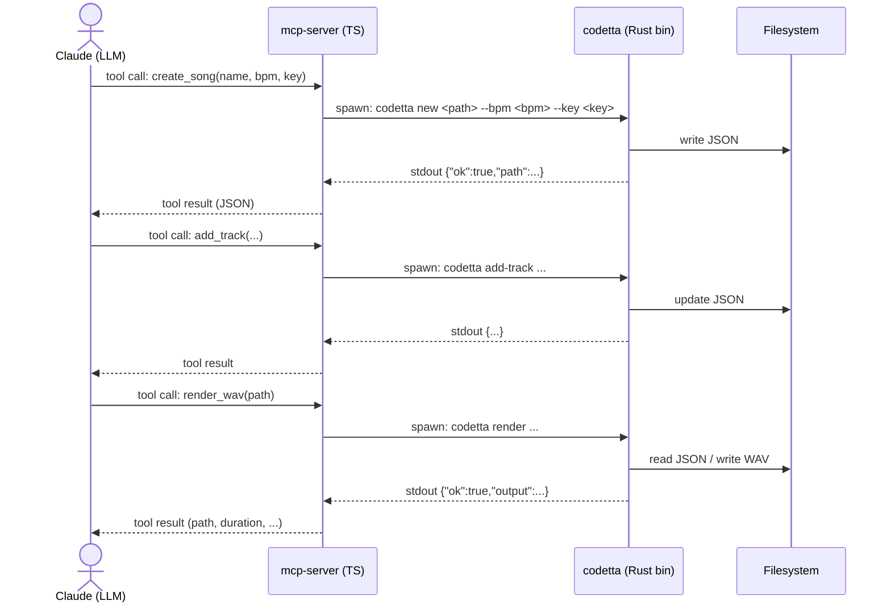
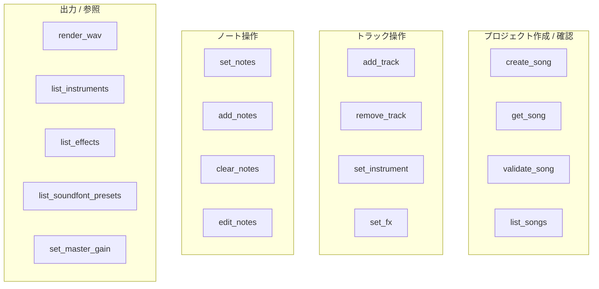

# Codetta — MCP server tools API

> Codetta の **目玉機能**。 Claude / Cursor / Claude Desktop 等の MCP クライアントから
> 作曲・編集・レンダリングを呼べる server を、 `codetta-cli` の薄いラッパーとして提供する。

## 設計原則

1. **CLI への薄いラッパー** — server 自体に音楽ロジックは持たない。 すべて `codetta-cli` に委譲
2. **LLM が単独で完結できる粒度** — 1 tool で意味のある単位 (細かすぎる分割は避ける)
3. **冪等性を可能な限り** — 同じ tool を 2 回呼んでも壊れない (`set_notes` は冪等、 `add_notes` は加算)
4. **エラーは hint 付き** — 失敗時に「次に何をすればいいか」を示す
5. **絶対パス推奨** — ワークディレクトリ依存を最小化

## 全体フロー



## ワークスペース管理

MCP server が扱うファイルの場所は、 環境変数で制御する:

```
CODETTA_WORKSPACE=<absolute path>   # デフォルト: ~/codetta-songs/
```

tool に `path` を渡す時の扱い:

| 入力 | 解釈 |
|---|---|
| 絶対パス (`/...`) | そのまま使う |
| 相対パス (`battle.codetta`) | `$CODETTA_WORKSPACE` 配下として解釈 |
| パス未指定 (一部 tool) | 直近に作成 / 編集したファイルを使う (server 側で last_used を保持) |

セキュリティ: `CODETTA_WORKSPACE` 配下に限定 (シンボリックリンク経由の外部脱出を禁止)。

## tools 一覧



### 一覧表

| tool | Phase | 冪等 | 説明 |
|---|---|---|---|
| `create_song` | 0 | ⚠️ `overwrite=true` 必要 | 新規プロジェクト作成 |
| `get_song` | 0 | ✓ | プロジェクトの metadata + track 概要を返す |
| `validate_song` | 0 | ✓ | スキーマ検証 |
| `list_songs` | 0 | ✓ | ワークスペース内の `.codetta` 一覧 |
| `add_track` | 0 | ⚠️ ID 衝突あり | トラック追加 |
| `remove_track` | 0 | ✓ (存在しない時は no-op) | トラック削除 |
| `set_instrument` | 0 | ✓ | トラックの楽器変更 |
| `set_fx` | 0 | ✓ | エフェクトチェーン置換 |
| `set_notes` | 0 | ✓ | ノート列を**置換** |
| `add_notes` | 0 | ⚠️ 重複あり (skip される) | ノート追加 |
| `clear_notes` | 0 | ✓ | ノート全削除 |
| `edit_notes` | 0 | ✓ | 変形操作 |
| `set_master_gain` | 0 | ✓ | `metadata.master_gain` を変更 (post-mix gain) |
| `render_wav` | 0 | ✓ | WAV レンダリング |
| `list_instruments` | 0 | ✓ | 利用可能な楽器一覧 |
| `list_effects` | 0 | ✓ | 利用可能なエフェクト一覧 |
| `list_soundfont_presets` | 0 | ✓ | SF2 ファイル内の preset 一覧 + meta |

## tool 詳細

### `create_song`

新規プロジェクトを作成。

**input:**
```json
{
  "path": "string (relative or absolute)",
  "name": "string (optional, default: path stem)",
  "bpm": "int (optional, default: 120)",
  "key": "string (optional, default: 'C')",
  "time_signature": "[int, int] (optional, default: [4, 4])",
  "master_gain": "float 0..=4 (optional, default: 1.0)",
  "overwrite": "bool (optional, default: false)"
}
```

`master_gain` は全 track 合算後 (soft_clip 前) に乗算される post-mix gain。
SF2 系で内蔵合成より peak が低い時のヘッドルーム調整に使う (dogfooding 推奨値 2.0)。
あとから変更したい場合は `set_master_gain` を呼ぶ。

**output (success):**
```json
{
  "ok": true,
  "path": "/abs/path/battle.codetta",
  "metadata": { "name": "...", "bpm": 140, "key": "Am", "time_signature": [4,4] }
}
```

**output (error, file exists):**
```json
{
  "ok": false,
  "error": { "code": "FILE_EXISTS", "message": "File exists. Pass overwrite=true to replace.", "hint": "If you want to keep editing the existing song, use get_song instead." }
}
```

### `get_song`

プロジェクトの metadata + track 概要を返す (LLM が「現状を把握」するための tool)。
内部的には CLI `info` を呼ぶ。ノートの中身が大きすぎるため、各 track の全ノートは含めない —
ノート詳細が必要なら resource `codetta://songs/{name}` を読む。

**input:** `{ "path": "string" }`

**output:**
```json
{
  "ok": true,
  "path": "/abs/path/battle.codetta",
  "metadata": { "name": "...", "bpm": 140, "key": "Am", "time_signature": [4,4], "master_gain": 1.0 },
  "tracks": [
    { "id": "lead", "name": "Lead", "instrument": "saw_lead", "note_count": 8, "fx_count": 2 }
  ],
  "duration_beats": 8.0
}
```

### `validate_song`

スキーマ + 整合性検証。

**input:** `{ "path": "string" }`

**output:**
```json
{
  "ok": true,
  "valid": false,
  "errors": [
    { "path": "tracks[0].notes[3].vel", "message": "velocity must be 0-127, got 200" }
  ]
}
```

`ok` は tool 呼び出しの成功、 `valid` がプロジェクトファイルの妥当性。

### `list_songs`

ワークスペース内の `.codetta` ファイル一覧。

**input:** `{ "dir": "string (optional, default: $CODETTA_WORKSPACE)" }`

**output:**
```json
{
  "ok": true,
  "songs": [
    { "path": "/abs/.../battle.codetta", "name": "Cyber Battle Loop", "bpm": 140, "track_count": 3, "modified_at": "2026-05-16T14:35:00Z" },
    { "path": "/abs/.../menu.codetta", "name": "Menu", "bpm": 100, "track_count": 2, "modified_at": "..." }
  ]
}
```

### `add_track`

**input:**
```json
{
  "path": "string",
  "track_id": "string (kebab-case)",
  "name": "string (optional)",
  "instrument": "string (e.g. 'saw_lead', default 'sin')",
  "params": "object (optional, instrument 固有パラメータ)",
  "volume": "float 0-1 (optional, default 0.8)",
  "pan": "float -1..1 (optional, default 0)"
}
```

fx は別 tool (`set_fx`) で後付けする。初期状態は空チェーン。

**output:**
```json
{ "ok": true, "track_id": "lead", "track_index": 0 }
```

### `remove_track`

**input:** `{ "path": "string", "track_id": "string" }`

**output:** `{ "ok": true, "removed": true }` (存在しない場合は CLI 側でエラー)

### `set_instrument`

楽器 (type + params) を完全置換。

**input:**
```json
{
  "path": "string",
  "track_id": "string",
  "type": "string (e.g. 'saw_lead', 'drum_kit', 'soundfont')",
  "params": "object (optional, 楽器固有パラメータ)"
}
```

### `set_fx`

エフェクトチェーンを全置換。

**input:**
```json
{
  "path": "string",
  "track_id": "string",
  "fx": [
    { "type": "delay", "time": "1/8", "feedback": 0.3, "mix": 0.25 },
    { "type": "reverb", "size": 0.5, "mix": 0.2 }
  ]
}
```

### `set_notes`

ノート列を**全置換**。 LLM が「最終形を渡す」用途。

**input:**
```json
{
  "path": "string",
  "track_id": "string",
  "notes": [
    { "t": 0.0, "pitch": "A4", "dur": 0.5, "vel": 100 }
  ]
}
```

**output:** `{ "ok": true, "note_count": 7 }`

### `add_notes`

**追加** (既存ノート保持、 重複は skip)。

**input:** `{ "path": "string", "track_id": "string", "notes": [...] }`

**output:** `{ "ok": true, "added": 4, "skipped_duplicates": 1, "total_notes": 11 }`

### `clear_notes`

**input:** `{ "path": "string", "track_id": "string" }`

### `edit_notes`

ノートに対する一括変形。

**input:**
```json
{
  "path": "string",
  "track_id": "string",
  "ops": [
    { "op": "transpose", "semitones": -12 },
    { "op": "set_velocity", "vel": 90, "range": [0, 4] }
  ]
}
```

`op` の種類は CLI `edit-notes` と同じ ([03-cli.md](03-cli.md) 参照)。

**output:** `{ "ok": true, "ops_applied": 2, "notes_affected": 8 }`

### `set_master_gain`

プロジェクトの `metadata.master_gain` を変更する。 全 track 合算後 (soft_clip 前) に乗算される post-mix gain。
SF2 系で内蔵合成より peak が低い時のヘッドルーム調整に使う (dogfooding 推奨値 2.0)。

**input:**
```json
{
  "path": "string",
  "value": "float 0..=4 (required)"
}
```

**output:** `{ "ok": true, "master_gain": 2.0 }`

### `render_wav`

**input:**
```json
{
  "path": "string",
  "output": "string (optional, default: <input>.wav)",
  "sample_rate": "int (optional, 44100 | 48000, default 44100)",
  "bit_depth": "int (optional, Phase 0 first cut は 16 のみ, default 16)"
}
```

`from_beat` / `to_beat` トリミング、 24bit、 48kHz は **Phase 1+ で実装予定** (現状未対応)。

**output:**
```json
{
  "ok": true,
  "output": "/abs/path/out.wav",
  "duration_sec": 3.43,
  "render_time_sec": 0.31,
  "rtfactor": 11.1
}
```

LLM への hint: WAV のバイト列は返さない (大きすぎる)。 path を返すのみ。 ユーザーがファイルマネージャ / GUI / `afplay` 等で再生する。

### `list_instruments` / `list_effects`

CLI と同じスキーマを返す ([03-cli.md](03-cli.md) 参照)。

### `list_soundfont_presets`

指定 SF2 ファイルに含まれる preset 一覧 (bank / preset / name) と SF2 メタ情報を返す。
`soundfont` 楽器の `preset` / `bank` 値を決める前に使う。

**input:**
```json
{
  "file": "string (絶対パス or $CODETTA_SOUNDFONT_DIR 配下の相対)"
}
```

`$CODETTA_SOUNDFONT_DIR` の default は `~/Music/sf2/`。

**output:**
```json
{
  "ok": true,
  "file": "/abs/path/GeneralUser-GS-v1.471.sf2",
  "soundfont": { "name": "GeneralUser GS", "engineers": "..." },
  "presets": [
    { "bank": 0, "preset": 0, "name": "Stereo Grand" }
  ]
}
```

resource 版は `codetta://soundfonts/{name}` (同等の payload)。

## Resources

MCP の resources としてプロジェクトファイル / メタを公開。

| URI | 内容 |
|---|---|
| `codetta://songs/{name}` | `$CODETTA_WORKSPACE/{name}.codetta` の生 JSON (`name` は拡張子なし) |
| `codetta://instruments` | 利用可能な楽器一覧 (`list_instruments` tool と同内容) |
| `codetta://effects` | 利用可能なエフェクト一覧 (`list_effects` tool と同内容) |
| `codetta://schema/song/{version}` | プロジェクトファイル JSON Schema (`version` は `schema_version` 文字列) |
| `codetta://soundfonts/{name}` | `$CODETTA_SOUNDFONT_DIR/{name}.sf2` の preset 一覧 + meta (`list_soundfont_presets` tool と同内容) |
| `codetta://presets/{name}` | `docs/examples/{name}.codetta` のサンプル曲 |

各 template URI は `resources/list` で動的に列挙される (workspace / SF2 dir / presets dir をスキャン)。
resources を読むのは tools と等価だが、 LLM クライアント側で「資料」として扱える (より自然なコンテキスト挿入)。

## MCP server 実装方針

### スタック

| | 採用 |
|---|---|
| 言語 | TypeScript |
| ランタイム | Node 20+ |
| SDK | `@modelcontextprotocol/sdk` (公式) |
| ビルド | `tsc` (esbuild は最終配布時に検討) |
| 配布 | `~/.mcp-servers/codetta/dist/index.js` (既存 MCP server と同じ場所) |

### CLI 呼び出しの実装

各 tool ハンドラは概ね以下のパターン:

```typescript
async function callCli(args: string[]): Promise<unknown> {
  const child = spawn(CODETTA_BIN, args, { stdio: ["ignore", "pipe", "pipe"] });
  let stdout = "", stderr = "";
  for await (const chunk of child.stdout) stdout += chunk;
  for await (const chunk of child.stderr) stderr += chunk;
  const code = await new Promise<number>(r => child.on("close", r));
  if (code !== 0) {
    const parsed = tryParseJson(stdout);
    throw new McpError(parsed?.error ?? { code: "CLI_FAILURE", message: stderr });
  }
  return JSON.parse(stdout);
}
```

### バイナリ位置の解決

- 環境変数 `CODETTA_BIN` で明示指定可
- 未指定なら `PATH` から `codetta` を解決
- どちらも見つからなければ起動時にエラー

### ロギング

- MCP プロトコルは stdio 経由なので **stdout に何も出してはいけない**
- ログは stderr または `~/.cache/codetta-mcp/log.txt` (rotation 付き)

### `CODETTA_WORKSPACE` の起動時検証

- 環境変数チェック → 未設定なら `~/codetta-songs/` を作成
- 書き込み権限チェック
- パスがシンボリックリンク経由で外部に出ないことを保証

## Claude 視点の使用例

実際の Claude のターン例 (省略表記):

```
User: "ddc 用にサイバー感ある対戦 BGM を 1 ループ作って"

Claude:
  → list_instruments() で使える楽器を確認
  → create_song(path="ddc-battle.codetta", bpm=140, key="Am", name="Cyber Battle Loop")
  → add_track(id="lead", instrument={type:"saw_lead", params:{filter_cutoff:1500, filter_q:3.0}}, fx=[{type:"delay",time:"1/8",mix:0.3},{type:"reverb",size:0.4,mix:0.2}])
  → set_notes(track_id="lead", notes=[ ...8 ノート ...])
  → add_track(id="bass", instrument={type:"sin"}, volume=0.9)
  → set_notes(track_id="bass", notes=[ ...4 ノート ...])
  → add_track(id="drums", instrument={type:"drum_kit", params:{kit:"808"}})
  → set_notes(track_id="drums", notes=[ ...kick/snare/hh ...])
  → render_wav(output="ddc-battle.wav")
  → "出来ました。 ddc-battle.wav (3.4秒、 リアルタイム 11x で生成)。 リードは saw_lead + delay/reverb、 ベースは sub sin、 ドラムは 808。 試聴して気になる点があれば調整します。"

User: "リードもう少し攻撃的に"

Claude:
  → get_song(path="ddc-battle.codetta")  # 現状確認
  → set_instrument(track_id="lead", instrument={type:"saw_lead", params:{attack:0.001, filter_cutoff:2500, filter_q:5.0}})  # フィルタを開けて Q 強める
  → set_fx(track_id="lead", fx=[{type:"distortion",amount:0.3},{type:"delay",time:"1/8",mix:0.3},{type:"reverb",size:0.4,mix:0.2}])  # distortion 追加
  → render_wav(output="ddc-battle.wav")
  → "歪み追加 + フィルタ開けました。"
```

## エラー処理の方針

すべての tool 呼び出しは以下の形式を返す:

```json
{
  "ok": false,
  "error": {
    "code": "TRACK_NOT_FOUND",
    "message": "Track 'leadz' does not exist (did you mean 'lead'?)",
    "hint": "Call get_song to see all track IDs.",
    "context": { "available_tracks": ["lead", "bass", "drums"] }
  }
}
```

`hint` は **必ず付ける** — LLM が次に取るべきアクションをサジェスト。 これで再呼び出しがスムーズになる。

## オープンクエスチョン

- [ ] `CODETTA_WORKSPACE` のデフォルトを `~/codetta-songs/` にするか `~/Documents/codetta/` にするか → **`~/codetta-songs/`** で確定
- [ ] resources で公開する楽曲ファイルの権限 (読み取り専用 vs 編集も可) → **読み取り専用、 編集は tool 経由のみ** (副作用を明示化)
- [ ] `render_wav` で WAV を base64 で返すオプション → **不要** (大きすぎる、 path 返却で十分)
- [ ] subscriptions (ファイル変更の push 通知) → Phase 1+ で検討
- [ ] tool 呼び出しのレート制限 → 不要 (ローカル subprocess のため)
