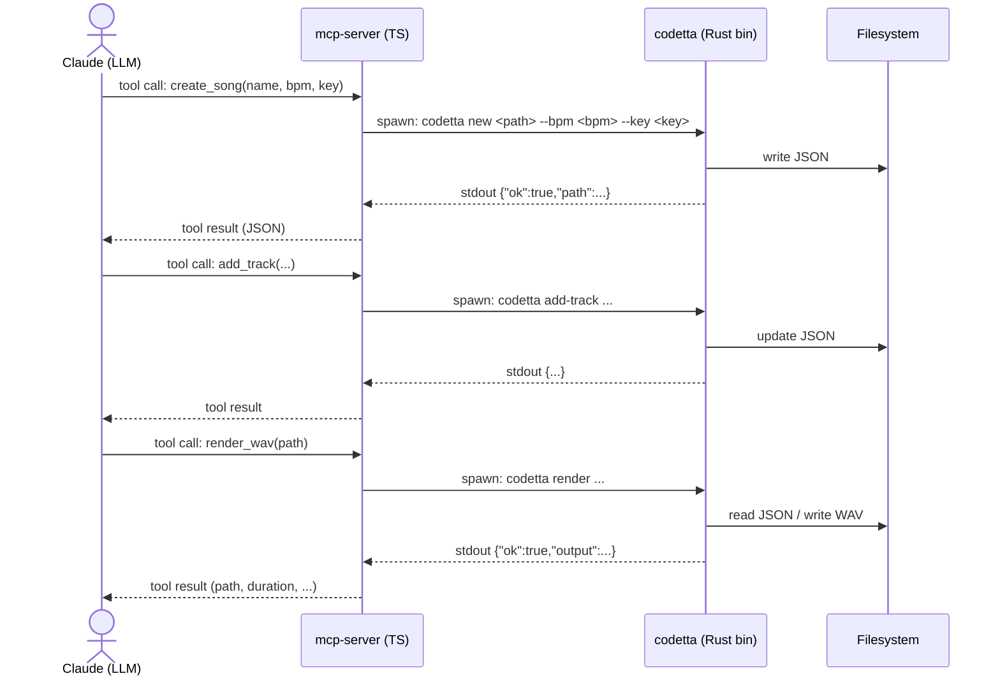
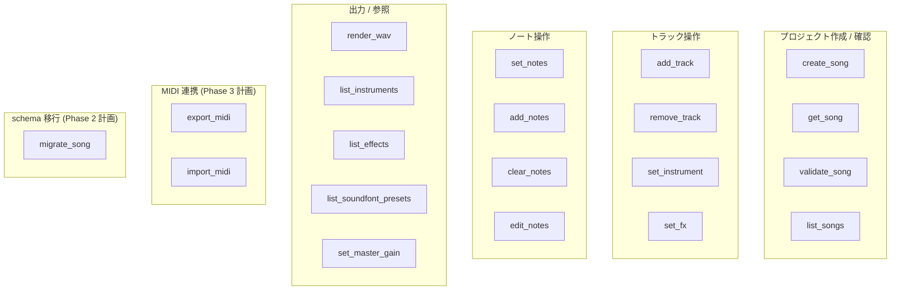

# Codetta — MCP server tools API

> Codetta の **目玉機能**。 Claude / Cursor / Claude Desktop 等の MCP クライアントから
> 作曲・編集・レンダリングを呼べる server を、 `codetta-cli` の薄いラッパーとして提供する。
> 音源は外付け SF2 (= schema 0.2 化後)、 内蔵 synth 系 tool 例示は Phase 2 で SF2 一本に縮退。

## doc と実装の対応関係 (= Phase 1+ 時点)

本 doc は **schema 0.2 化 (= Phase 2) 完了後の到達状態** を spec として記述する。 現実装 (Phase 1+) の状態:

| 項目 | 現実装 | Phase 2 完了後 |
|---|---|---|
| `add_track` の `instrument` 例示 / default | `'sin'`, `'saw_lead'`, `'drum_kit'` 等が指定可、 default `'sin'` | `'soundfont'` 一択、 default `'soundfont'` |
| `set_instrument` の `type` 例示 | `'saw_lead'` / `'drum_kit'` / `'soundfont'` 並列 | `'soundfont'` のみ |
| ドラム track での `pitch: "kick"` 等 | 内蔵 `drum_kit` 経路のみ機能 | SF2 GM Drum (bank 128) 経路でも `kick` 等を MIDI 番号に正規化 |
| `migrate_song` tool | 未実装 | Phase 2 で追加 (= CLI `migrate` と pair) |
| MIDI 連携 tool (`export_midi` / `import_midi`) | 未実装 | Phase 3 で追加 |

tool 名 / input schema / 出力 JSON 構造は **前セッション (= commit `f5465c7`) で実装と同期済**、 本 doc は SF2 統一観点での例示更新と Phase 3 MIDI tool 予約が主な作業範囲。

## 設計原則

1. **CLI への薄いラッパー** — server 自体に音楽ロジックは持たない。 すべて `codetta-cli` に委譲
2. **LLM が単独で完結できる粒度** — 1 tool で意味のある単位 (細かすぎる分割は避ける)
3. **冪等性を可能な限り** — 同じ tool を 2 回呼んでも壊れない (`set_notes` は冪等、 `add_notes` は加算)
4. **エラーは hint 付き** — 失敗時に「次に何をすればいいか」を示す
5. **絶対パス推奨** — ワークディレクトリ依存を最小化

## 全体フロー



## ワークスペース管理

MCP server が扱うファイルの場所は、 環境変数で制御する:

```
CODETTA_WORKSPACE=<absolute path>   # デフォルト: ~/codetta-songs/
```

tool に `path` を渡す時の扱い:

| 入力 | 解釈 |
|---|---|
| 絶対パス (`/...`) | そのまま使う |
| 相対パス (`battle.codetta`) | `$CODETTA_WORKSPACE` 配下として解釈 |
| パス未指定 (一部 tool) | 直近に作成 / 編集したファイルを使う (server 側で last_used を保持) |

セキュリティ: `CODETTA_WORKSPACE` 配下に限定 (シンボリックリンク経由の外部脱出を禁止)。

## tools 一覧



### 一覧表

| tool | Phase | 冪等 | 説明 |
|---|---|---|---|
| `create_song` | 0 | ⚠️ `overwrite=true` 必要 | 新規プロジェクト作成 |
| `get_song` | 0 | ✓ | プロジェクトの metadata + track 概要を返す |
| `validate_song` | 0 | ✓ | スキーマ検証 |
| `list_songs` | 0 | ✓ | ワークスペース内の `.codetta` 一覧 |
| `add_track` | 0 | ⚠️ ID 衝突あり | トラック追加 |
| `remove_track` | 0 | ✓ (存在しない時は no-op) | トラック削除 |
| `set_instrument` | 0 | ✓ | トラックの楽器変更 |
| `set_fx` | 0 | ✓ | エフェクトチェーン置換 |
| `set_notes` | 0 | ✓ | ノート列を**置換** |
| `add_notes` | 0 | ⚠️ 重複あり (skip される) | ノート追加 |
| `clear_notes` | 0 | ✓ | ノート全削除 |
| `edit_notes` | 0 | ✓ | 変形操作 |
| `set_master_gain` | 0 | ✓ | `metadata.master_gain` を変更 (post-mix gain) |
| `render_wav` | 0 | ✓ | WAV レンダリング |
| `list_instruments` | 0 | ✓ | 利用可能な楽器一覧 |
| `list_effects` | 0 | ✓ | 利用可能なエフェクト一覧 |
| `list_soundfont_presets` | 0 | ✓ | SF2 ファイル内の preset 一覧 + meta |
| `migrate_song` | **2 計画** | ✓ | 旧バージョンスキーマからのアップグレード (0.1 → 0.2) |
| `export_midi` | **3 計画** | ✓ | `.codetta` → `.mid` 書き出し |
| `import_midi` | **3 計画** | ✓ | `.mid` → `.codetta` 変換 |

## tool 詳細

### `create_song`

新規プロジェクトを作成。

**input:**
```json
{
  "path": "string (relative or absolute)",
  "name": "string (optional, default: path stem)",
  "bpm": "int (optional, default: 120)",
  "key": "string (optional, default: 'C')",
  "time_signature": "[int, int] (optional, default: [4, 4])",
  "master_gain": "float 0..=4 (optional, default: 1.0)",
  "overwrite": "bool (optional, default: false)"
}
```

`master_gain` は全 track 合算後 (soft_clip 前) に乗算される post-mix gain。
SF2 系で内蔵合成より peak が低い時のヘッドルーム調整に使う (dogfooding 推奨値 2.0)。
あとから変更したい場合は `set_master_gain` を呼ぶ。

**output (success):**
```json
{
  "ok": true,
  "path": "/abs/path/battle.codetta",
  "metadata": { "name": "...", "bpm": 140, "key": "Am", "time_signature": [4,4] }
}
```

**output (error, file exists):**
```json
{
  "ok": false,
  "error": { "code": "FILE_EXISTS", "message": "File exists. Pass overwrite=true to replace.", "hint": "If you want to keep editing the existing song, use get_song instead." }
}
```

### `get_song`

プロジェクトの metadata + track 概要を返す (LLM が「現状を把握」するための tool)。
内部的には CLI `info` を呼ぶ。ノートの中身が大きすぎるため、各 track の全ノートは含めない —
ノート詳細が必要なら resource `codetta://songs/{name}` を読む。

**input:** `{ "path": "string" }`

**output:**
```json
{
  "ok": true,
  "path": "/abs/path/battle.codetta",
  "metadata": { "name": "...", "bpm": 140, "key": "Am", "time_signature": [4,4], "master_gain": 2.0 },
  "tracks": [
    { "id": "lead", "name": "Lead", "instrument": "soundfont", "note_count": 8, "fx_count": 2 }
  ],
  "duration_beats": 8.0
}
```

`tracks[].instrument` は kind 名 string (= `soundfont` / `sin` / `saw_lead` 等)。 SF2 preset / bank 等の params は含まない (= ノート詳細と同様、 必要なら resource `codetta://songs/{name}` の生 JSON を読む)。

### `validate_song`

スキーマ + 整合性検証。

**input:** `{ "path": "string" }`

**output:**
```json
{
  "ok": true,
  "valid": false,
  "errors": [
    { "path": "tracks[0].notes[3].vel", "message": "velocity must be 0-127, got 200" }
  ]
}
```

`ok` は tool 呼び出しの成功、 `valid` がプロジェクトファイルの妥当性。

### `list_songs`

ワークスペース内の `.codetta` ファイル一覧。

**input:** `{ "dir": "string (optional, default: $CODETTA_WORKSPACE)" }`

**output:** ファイル一覧を軽量に列挙 (Node fs 経由、 `.codetta` の中身は読まない)。

```json
{
  "ok": true,
  "songs": [
    { "name": "battle",  "path": "/abs/.../battle.codetta", "size_bytes": 3421, "modified": "2026-05-16T14:35:00.000Z" },
    { "name": "menu",    "path": "/abs/.../menu.codetta",   "size_bytes": 1820, "modified": "2026-05-10T09:12:00.000Z" }
  ]
}
```

楽曲メタ (bpm / track 数等) が必要なら個別に `get_song` を呼ぶ (= `list_songs` は軽量列挙に徹する設計)。

### `add_track`

**input:**
```json
{
  "path": "string",
  "track_id": "string (kebab-case)",
  "name": "string (optional)",
  "instrument": "string (Phase 2 完了後は 'soundfont' 一択。 現実装の default は 'sin')",
  "params": "object (SF2 では { file, preset, bank })",
  "volume": "float 0-1 (optional, default 0.8)",
  "pan": "float -1..1 (optional, default 0)"
}
```

例 (SF2 Saw Lead を載せる):

```json
{
  "path": "battle.codetta",
  "track_id": "lead",
  "instrument": "soundfont",
  "params": { "file": "GeneralUser-GS-v1.471.sf2", "preset": 81, "bank": 0 },
  "volume": 0.7
}
```

fx は別 tool (`set_fx`) で後付けする。初期状態は空チェーン。

**output:**
```json
{ "ok": true, "track_id": "lead", "track_index": 0 }
```

### `remove_track`

**input:** `{ "path": "string", "track_id": "string" }`

**output:** `{ "ok": true, "removed": true }` (存在しない場合は CLI 側でエラー)

### `set_instrument`

楽器 (type + params) を完全置換。

**input:**
```json
{
  "path": "string",
  "track_id": "string",
  "type": "string (Phase 2 完了後は 'soundfont' 一択)",
  "params": "object (optional、 SF2 では { file, preset, bank })"
}
```

例 (lead を Saw Lead → Square Lead):

```json
{
  "path": "battle.codetta",
  "track_id": "lead",
  "type": "soundfont",
  "params": { "file": "GeneralUser-GS-v1.471.sf2", "preset": 80, "bank": 0 }
}
```

### `set_fx`

エフェクトチェーンを全置換。

**input:**
```json
{
  "path": "string",
  "track_id": "string",
  "fx": [
    { "type": "delay", "time": "1/8", "feedback": 0.3, "mix": 0.25 },
    { "type": "reverb", "size": 0.5, "mix": 0.2 }
  ]
}
```

### `set_notes`

ノート列を**全置換**。 LLM が「最終形を渡す」用途。

**input:**
```json
{
  "path": "string",
  "track_id": "string",
  "notes": [
    { "t": 0.0, "pitch": "A4", "dur": 0.5, "vel": 100 }
  ]
}
```

ドラム track (= SF2 bank 128) では `pitch` に要素名キー (`"kick"` / `"snare"` 等) を書ける。 内部で GM Drum Map (MIDI 番号) に正規化される (= **Phase 2 で SF2 経路への実装追加が必要**。 現実装は内蔵 `drum_kit` track 経由のみ機能)。

**output:** `{ "ok": true, "note_count": 7 }`

### `add_notes`

**追加** (既存ノート保持、 重複は skip)。

**input:** `{ "path": "string", "track_id": "string", "notes": [...] }`

**output:** `{ "ok": true, "added": 4, "skipped_duplicates": 1, "total_notes": 11 }`

### `clear_notes`

**input:** `{ "path": "string", "track_id": "string" }`

### `edit_notes`

ノートに対する一括変形。

**input:**
```json
{
  "path": "string",
  "track_id": "string",
  "ops": [
    { "op": "transpose", "semitones": -12 },
    { "op": "set_velocity", "vel": 90, "range": [0, 4] }
  ]
}
```

`op` の種類は CLI `edit-notes` と同じ ([03-cli.md](03-cli.md) 参照)。

**output:** `{ "ok": true, "ops_applied": 2, "notes_affected": 8 }`

### `set_master_gain`

プロジェクトの `metadata.master_gain` を変更する。 全 track 合算後 (soft_clip 前) に乗算される post-mix gain。
SF2 系で内蔵合成より peak が低い時のヘッドルーム調整に使う (dogfooding 推奨値 2.0)。

**input:**
```json
{
  "path": "string",
  "value": "float 0..=4 (required)"
}
```

**output:** `{ "ok": true, "master_gain": 2.0 }`

### `render_wav`

**input:**
```json
{
  "path": "string",
  "output": "string (optional, default: <input>.wav)",
  "sample_rate": "int (optional, 44100 | 48000, default 44100)"
}
```

`from_beat` / `to_beat` トリミング、 24bit、 48kHz、 `bit_depth` 指定は **将来検討** (現状未対応、 CLI 側もデフォルト 16bit / 44.1kHz のみ受け付け)。

**output:**
```json
{
  "ok": true,
  "output": "/abs/path/out.wav",
  "duration_sec": 3.43,
  "render_time_sec": 0.31,
  "rtfactor": 11.1
}
```

LLM への hint: WAV のバイト列は返さない (大きすぎる)。 path を返すのみ。 ユーザーがファイルマネージャ / GUI / `afplay` 等で再生する。

### `list_instruments` / `list_effects`

CLI と同じスキーマを返す ([03-cli.md](03-cli.md) 参照)。

### `list_soundfont_presets`

指定 SF2 ファイルに含まれる preset 一覧 (bank / preset / name) と SF2 メタ情報を返す。
`soundfont` 楽器の `preset` / `bank` 値を決める前に使う。

**input:**
```json
{
  "file": "string (絶対パス or $CODETTA_SOUNDFONT_DIR 配下の相対)"
}
```

`$CODETTA_SOUNDFONT_DIR` の default は `~/Music/sf2/`。

**output:**
```json
{
  "ok": true,
  "file": "/abs/path/GeneralUser-GS-v1.471.sf2",
  "soundfont": {
    "bank_name": "GeneralUser GS",
    "version": "1.471",
    "author": "S. Christian Collins",
    "copyright": "...",
    "comments": "..."
  },
  "preset_count": 235,
  "presets": [
    { "bank": 0,   "preset": 0,  "name": "Stereo Grand" },
    { "bank": 0,   "preset": 81, "name": "Saw Lead" },
    { "bank": 128, "preset": 0,  "name": "Standard Drum Kit" }
  ]
}
```

resource 版は `codetta://soundfonts/{name}` (同等の payload)。

## Phase 2 計画 tool (schema 移行)

CLI subcommand `migrate` ([03-cli.md](03-cli.md) 「Phase 2 計画コマンド」 と pair で expose) 。

### `migrate_song` (Phase 2)

旧スキーマファイルを現行版にアップグレード。 当面 0.1 → 0.2 のみ。 内蔵 synth instrument を SF2 preset に LUT 変換 (詳細 LUT は 03-cli.md 参照)。

**input:**
```json
{
  "path": "string (入力 .codetta)",
  "output": "string (省略時は --in-place 扱いで同 path 上書き)",
  "sf2": "string (省略時は bundle SF2、 Phase 4 で確定)",
  "manual": "bool (default false。 true なら自動 LUT を使わず、 各 track の preset を input に明示)",
  "overwrite": "bool (default false。 output 既存ファイル上書き許可)"
}
```

**output:**
```json
{
  "ok": true,
  "path": "/abs/path/out.codetta",
  "from_version": "0.1",
  "to_version": "0.2",
  "tracks_migrated": 3,
  "instrument_mapping": [
    { "track_id": "lead",  "from": { "type": "saw_lead" },               "to": { "type": "soundfont", "preset": 81, "bank": 0   } },
    { "track_id": "bass",  "from": { "type": "sin" },                    "to": { "type": "soundfont", "preset": 38, "bank": 0   } },
    { "track_id": "drums", "from": { "type": "drum_kit", "kit": "808" }, "to": { "type": "soundfont", "preset": 0,  "bank": 128 } }
  ]
}
```

## Phase 3 計画 tools (MIDI 連携)

詳細仕様は [08-midi.md](08-midi.md) に集約 (= CDT-2 ADR 確定済)。 本セクションは tool 名 / input / output のみ載せる (= CLI subcommand `export-midi` / `import-midi` と pair で expose、 [03-cli.md](03-cli.md) 「Phase 3 計画コマンド」 と整合)。

### `export_midi` (Phase 3)

`.codetta` から MIDI ファイル (`.mid`) を書き出す。

**input:**
```json
{
  "path": "string (入力 .codetta)",
  "output": "string (出力 .mid、 省略時 <path>.mid)",
  "ppq": "int (optional, default 480)",
  "extensions": "string ('text-meta' | 'sidecar' | 'none'、 default 'text-meta')",
  "from_beat": "float (optional)",
  "to_beat": "float (optional)"
}
```

`extensions` = codetta 拡張属性 (`master_gain` / fx / SF2 preset 詳細) の埋め込み方式 (= [08-midi.md](08-midi.md) で確定、 default は `text-meta`)。

**output:**
```json
{
  "ok": true,
  "output": "/abs/path/out.mid",
  "track_count": 3,
  "ppq": 480,
  "extensions_mode": "text-meta",
  "duration_beats": 8.0
}
```

### `import_midi` (Phase 3)

MIDI ファイル (`.mid`) を `.codetta` に変換。 channel → track へ展開、 GM Program → SF2 preset へ自動マッピング。 ドラム channel 10 は `bank: 128` に。

**input:**
```json
{
  "path": "string (入力 .mid)",
  "output": "string (出力 .codetta、 省略時 <path>.codetta)",
  "sf2": "string (使用 SF2、 省略時 bundle SF2)",
  "extensions": "string ('text-meta' | 'sidecar' | 'none'、 default 'text-meta')",
  "overwrite": "bool (default false)"
}
```

他 tool が `path` を `.codetta` 入力に使っているのに対し、 `import_midi` は `path` を `.mid` 入力として扱う (= 拡張子で判別)。

**output:**
```json
{
  "ok": true,
  "output": "/abs/path/out.codetta",
  "version": "0.2",
  "tracks_imported": 4,
  "extensions_mode": "text-meta",
  "extensions_recovered": ["master_gain", "fx", "soundfont_params"]
}
```

GM Program → SF2 preset 自動マッピング戦略は [08-midi.md](08-midi.md) で確定 (= melodic は同 program 番号、 SF2 に preset 無し時は preset 0 fallback + warning)。

## Resources

MCP の resources としてプロジェクトファイル / メタを公開。

| URI | 内容 |
|---|---|
| `codetta://songs/{name}` | `$CODETTA_WORKSPACE/{name}.codetta` の生 JSON (`name` は拡張子なし) |
| `codetta://instruments` | 利用可能な楽器一覧 (`list_instruments` tool と同内容) |
| `codetta://effects` | 利用可能なエフェクト一覧 (`list_effects` tool と同内容) |
| `codetta://schema/song/{version}` | プロジェクトファイル JSON Schema (`version` は `schema_version` 文字列) |
| `codetta://soundfonts/{name}` | `$CODETTA_SOUNDFONT_DIR/{name}.sf2` の preset 一覧 + meta (`list_soundfont_presets` tool と同内容) |
| `codetta://presets/{name}` | `docs/examples/{name}.codetta` のサンプル曲 |

各 template URI は `resources/list` で動的に列挙される (workspace / SF2 dir / presets dir をスキャン)。
resources を読むのは tools と等価だが、 LLM クライアント側で「資料」として扱える (より自然なコンテキスト挿入)。

## MCP server 実装方針

### スタック

| | 採用 |
|---|---|
| 言語 | TypeScript |
| ランタイム | Node 20+ |
| SDK | `@modelcontextprotocol/sdk` (公式) |
| ビルド | `tsc` (esbuild は最終配布時に検討) |
| 配布 | `~/.mcp-servers/codetta/dist/index.js` (既存 MCP server と同じ場所) |

### CLI 呼び出しの実装

各 tool ハンドラは概ね以下のパターン:

```typescript
async function callCli(args: string[]): Promise<unknown> {
  const child = spawn(CODETTA_BIN, args, { stdio: ["ignore", "pipe", "pipe"] });
  let stdout = "", stderr = "";
  for await (const chunk of child.stdout) stdout += chunk;
  for await (const chunk of child.stderr) stderr += chunk;
  const code = await new Promise<number>(r => child.on("close", r));
  if (code !== 0) {
    const parsed = tryParseJson(stdout);
    throw new McpError(parsed?.error ?? { code: "CLI_FAILURE", message: stderr });
  }
  return JSON.parse(stdout);
}
```

### バイナリ位置の解決

- 環境変数 `CODETTA_BIN` で明示指定可
- 未指定なら `PATH` から `codetta` を解決
- どちらも見つからなければ起動時にエラー

### ロギング

- MCP プロトコルは stdio 経由なので **stdout に何も出してはいけない**
- ログは stderr または `~/.cache/codetta-mcp/log.txt` (rotation 付き)

### `CODETTA_WORKSPACE` の起動時検証

- 環境変数チェック → 未設定なら `~/codetta-songs/` を作成
- 書き込み権限チェック
- パスがシンボリックリンク経由で外部に出ないことを保証

## Claude 視点の使用例

実際の Claude のターン例 (省略表記、 SF2 版):

```
User: "ddc 用にサイバー感ある対戦 BGM を 1 ループ作って"

Claude:
  → list_soundfont_presets(file="GeneralUser-GS-v1.471.sf2") で preset 確認
  → create_song(path="ddc-battle.codetta", bpm=140, key="Am", name="Cyber Battle Loop", master_gain=2.0)
  → add_track(id="lead", instrument="soundfont", params={file:"GeneralUser-GS-v1.471.sf2", preset:81, bank:0})  # Saw Lead
  → set_fx(track_id="lead", fx=[{type:"delay",time:"1/8",mix:0.3},{type:"reverb",size:0.4,mix:0.2}])
  → set_notes(track_id="lead", notes=[ ...8 ノート ...])
  → add_track(id="bass", instrument="soundfont", params={file:"GeneralUser-GS-v1.471.sf2", preset:38, bank:0}, volume=0.9)  # Synth Bass 1
  → set_notes(track_id="bass", notes=[ ...4 ノート ...])
  → add_track(id="drums", instrument="soundfont", params={file:"GeneralUser-GS-v1.471.sf2", preset:0, bank:128})  # GM Standard Drum Kit
  → set_notes(track_id="drums", notes=[ {t:0, pitch:"kick", ...}, {t:1, pitch:"snare", ...} ...])
  → render_wav(output="ddc-battle.wav")
  → "出来ました。 ddc-battle.wav (3.4秒、 リアルタイム 11x で生成)。 リードは Saw Lead (preset 81) + delay/reverb、 ベースは Synth Bass 1 (preset 38)、 ドラムは Standard Drum Kit (bank 128)。 試聴して気になる点があれば調整します。"

User: "リードもう少し攻撃的に"

Claude:
  → get_song(path="ddc-battle.codetta")  # 現状確認
  → set_instrument(track_id="lead", type="soundfont", params={file:"GeneralUser-GS-v1.471.sf2", preset:80, bank:0})  # Square Lead に差し替えてエッジを出す
  → set_fx(track_id="lead", fx=[{type:"distortion",amount:0.3},{type:"delay",time:"1/8",mix:0.3},{type:"reverb",size:0.4,mix:0.2}])  # distortion 追加
  → render_wav(output="ddc-battle.wav")
  → "Square Lead + distortion に差し替えました。"

User: "これを DAW に持って行きたい"  (Phase 3+)

Claude:
  → export_midi(path="ddc-battle.codetta", output="ddc-battle.mid", extensions="text-meta")
  → "ddc-battle.mid (4 track、 PPQ 480、 拡張属性は Text Meta Event に埋め込み) を書き出しました。 DAW で読み込んで編集後、 import_midi で .codetta に戻せます。"
```

## エラー処理の方針

すべての tool 呼び出しは以下の形式を返す:

```json
{
  "ok": false,
  "error": {
    "code": "TRACK_NOT_FOUND",
    "message": "Track 'leadz' does not exist (did you mean 'lead'?)",
    "hint": "Call get_song to see all track IDs.",
    "context": { "available_tracks": ["lead", "bass", "drums"] }
  }
}
```

`hint` は **必ず付ける** — LLM が次に取るべきアクションをサジェスト。 これで再呼び出しがスムーズになる。

## オープンクエスチョン

新規 (= 次以降のマイルストーンで決定):

- [x] `export_midi` の `extensions` default → [08-midi.md](08-midi.md) で確定 (= `text-meta`)
- [ ] `import_midi` の `sf2` 省略時挙動 (= bundle SF2 fallback、 Phase 4 配布整備依存) を Phase 3 単独リリース時にどう扱うか → Phase 3 着手時に確定
- [x] `import_midi` で SF2 preset 自動マッピング失敗時の振る舞い → [08-midi.md](08-midi.md) で確定 (= preset 0 fallback + warning)
- [ ] subscriptions (ファイル変更の push 通知) → Phase 5+ (GUI 連携と合わせて検討)

決着済 (履歴):

- [x] `CODETTA_WORKSPACE` のデフォルト → **`~/codetta-songs/`**
- [x] resources で公開する楽曲ファイルの権限 → **読み取り専用、 編集は tool 経由のみ**
- [x] `render_wav` で WAV を base64 で返すオプション → **不要** (path 返却で十分)
- [x] tool 呼び出しのレート制限 → **不要** (ローカル subprocess のため)
- [x] tool 名 / input schema / 出力構造の実装整合 → 前セッション (commit `f5465c7`) で同期済

## 関連ドキュメント

- [00-vision.md](00-vision.md) — ビジョン / ターゲット / Phase 計画
- [01-architecture.md](01-architecture.md) — アーキテクチャ
- [02-project-format.md](02-project-format.md) — `.codetta` JSON スキーマ
- [03-cli.md](03-cli.md) — CLI subcommand 仕様 (= MCP tool と pair)
- [06-examples.md](06-examples.md) — サンプル `.codetta`
- [07-soundfont.md](07-soundfont.md) — SF2 統合の詳細仕様
- [08-midi.md](08-midi.md) — MIDI import/export (= Phase 3 ADR、 確定済)
- 09-distribution.md — 配布戦略 (Phase 4 で起こす)
