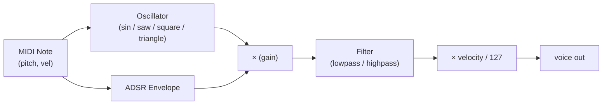
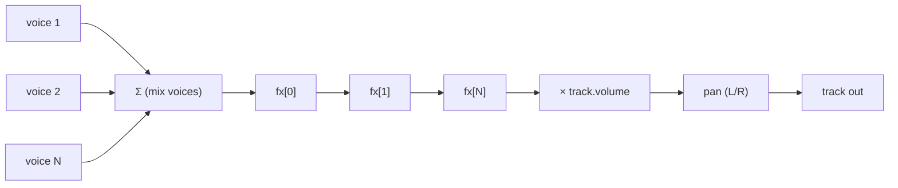
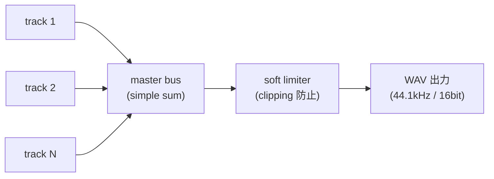
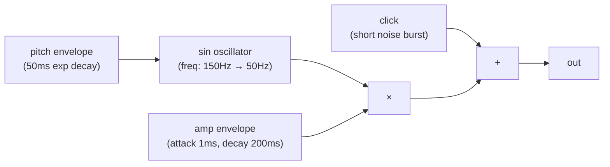
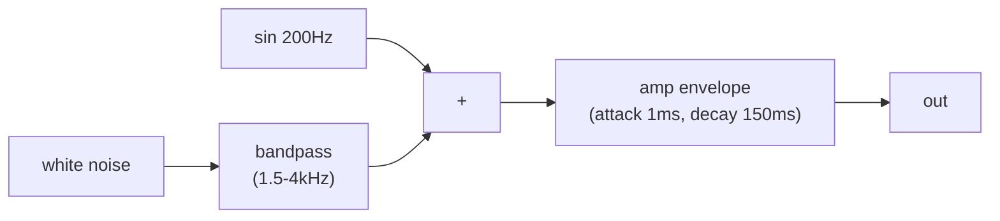

# Codetta — 内蔵音源仕様

> サンプル不要・全 DSP 合成の軽量音源。 サイバー感 / 電子音 / チップチューン系を主戦場とし、
> 生楽器の精密エミュレーションは狙わない (それは Kontakt 等のサンプラーの領域)。

## 設計方針

1. **全合成 (No samples)** — 配布サイズ最小化、 ライセンス問題回避
2. **軽量** — 1 トラック ≤ 1ms / バッファ で計算できる範囲
3. **LLM フレンドリーなパラメータ命名** — `cutoff_hz` / `attack_sec` 等、 単位を名前に含める
4. **デフォルト値で「それなりに鳴る」** — 全パラメータ省略で意味のある音が出る
5. **Phase 0 は最小セット** — 拡張は需要を見てから

## シンセエンジンの全体像

### 1 ボイスの信号フロー



### トラック全体の信号フロー



### 楽曲全体

各トラック出力をミックスバスで合算 → 必要なら最終リミッタ → WAV 書き出し。



## 設定値

| 項目 | 値 | 備考 |
|---|---|---|
| サンプルレート | 44100 Hz | 標準。 48000Hz / 96000Hz は Phase 1+ で検討 |
| ビット深度 | 16-bit signed PCM | 標準。 24-bit は Phase 1+ |
| チャンネル | Stereo (2ch) | パン処理を簡略化のため常に stereo |
| ポリフォニー (1 トラック) | 16 voices | 上限超過時は古い voice を steal |
| マスター soft limiter | tanh 系 | clipping 防止のみ、 マスタリング目的ではない |

## オシレータ

### `sin`

純音 (倍音なし)。 サブベース / パッド / FM の素材に。

$$ y(t) = \sin(2\pi f t) $$

**params:** (なし)

### `saw` / `saw_lead`

ノコギリ波。 リード / ベース / パッド向け。 倍音豊富。

$$ y(t) = 2 \left( \frac{t f \bmod 1}{1} \right) - 1 $$

**エイリアシング対策:** Phase 0 では PolyBLEP (Polynomial Band-Limited Step) を使用。
fundsp 採用なら `saw_hz()` がデフォルトで対応。

### `square` / `square_bass`

矩形波。 8bit 風 / チップチューン / ベース。 デューティ比可変。

$$ y(t) = \begin{cases} +1 & \text{if } (t f \bmod 1) < \text{pw} \\ -1 & \text{otherwise} \end{cases} $$

**params:**
| 名前 | 型 | 範囲 | デフォルト | 説明 |
|---|---|---|---|---|
| `pulse_width` | float | 0.1 - 0.9 | 0.5 | デューティ比 (0.5 = 矩形、 0.1 = 細パルス) |

### `triangle`

三角波。 柔らかい音、 笛系。

$$ y(t) = 2 \left| 2 \left( (t f \bmod 1) - 0.5 \right) \right| - 1 $$

### `saw_pad`

`saw` 3 つを detune して重ねたもの。 厚みあるパッド。

| 名前 | 型 | 範囲 | デフォルト | 説明 |
|---|---|---|---|---|
| `detune_cents` | float | 0 - 50 | 10 | 各 saw のずれ (1 セント = 1/100 半音) |

## ADSR エンベロープ

```mermaid
flowchart LR
    A[Attack<br/>0 → 1] --> D[Decay<br/>1 → sustain]
    D --> S[Sustain<br/>(note 持続中)]
    S --> R[Release<br/>sustain → 0]
```

**params (全 instrument 共通):**

| 名前 | 型 | 範囲 | デフォルト | 説明 |
|---|---|---|---|---|
| `attack` | float | 0 - 10 | 0.01 | 立ち上がり時間 (秒) |
| `decay` | float | 0 - 10 | 0.1 | sustain への到達時間 (秒) |
| `sustain` | float | 0 - 1 | 0.7 | 持続レベル (0-1) |
| `release` | float | 0 - 10 | 0.2 | リリース時間 (秒) |

**曲線:** 全て指数 (人間の聴感に合わせる)。 リニアは Phase 1+ でオプション追加。

## フィルタ

### `lowpass` / `highpass`

State Variable Filter (SVF) を採用。 cutoff と Q を独立に制御可。

| 名前 | 型 | 範囲 | デフォルト | 説明 |
|---|---|---|---|---|
| `cutoff` (Hz) | float | 20 - 20000 | 1000 | カットオフ周波数 |
| `q` | float | 0.5 - 10 | 1.0 | レゾナンス (高いほど狭帯域強調) |

**Phase 0 では filter envelope なし**。 Phase 1 で `filter_env_amount` / `filter_env_attack` 等を追加。

## エフェクト

### `lowpass` / `highpass` (track fx)

オシレータ直後のフィルタとは別に、 トラックエフェクトとしても利用可能。 実装は同じ SVF。

### `delay`

ディレイライン + フィードバック。

| 名前 | 型 | 範囲 | デフォルト | 説明 |
|---|---|---|---|---|
| `time` | string \| float | "1/16" - "1" or 0.01 - 2.0 | "1/8" | ディレイ時間。 BPM 同期 ("1/4" 等) or 秒 |
| `feedback` | float | 0 - 0.95 | 0.3 | フィードバック量 (0.95 超は発振防止のため clamp) |
| `mix` | float | 0 - 1 | 0.25 | ドライ / ウェット比 |

### `reverb`

Schroeder reverb (4 comb + 2 allpass) を基本実装。

| 名前 | 型 | 範囲 | デフォルト | 説明 |
|---|---|---|---|---|
| `size` | float | 0 - 1 | 0.5 | 空間の広さ (リバーブ長) |
| `damp` | float | 0 - 1 | 0.5 | 高域減衰 (1 で完全減衰) |
| `mix` | float | 0 - 1 | 0.2 | ドライ / ウェット比 |

### `distortion`

ソフトクリッピング (tanh)。

| 名前 | 型 | 範囲 | デフォルト | 説明 |
|---|---|---|---|---|
| `amount` | float | 0 - 1 | 0.3 | 歪み量 (入力ゲイン) |
| `tone` | float | 0 - 1 | 0.5 | tone (内蔵 lowpass cutoff: 0=暗、 1=明) |

## ドラム音源 (`drum_kit`)

サンプルではなく全合成。 各ドラムは固定の合成レシピ + `kit` で味付け変更。

### `kick` (バスドラム)



| `kit` | バリエーション |
|---|---|
| `808` | freq 80Hz→40Hz, decay 400ms, click 弱め |
| `909` | freq 200Hz→60Hz, decay 200ms, click 強め |
| `chip` | 単純な square 1 周期 + noise (8bit 風) |

### `snare` (スネア)



| `kit` | バリエーション |
|---|---|
| `808` | sin 主体、 noise 控えめ、 decay 長め |
| `909` | noise 強め、 decay 短め、 punch あり |
| `chip` | 短い noise + square click |

### `hh_closed` / `hh_open` (ハイハット)


| 要素 | `hh_closed` | `hh_open` |
|---|---|---|
| decay | 50ms | 500ms |

### `clap` / `crash` / `ride` / `tom_*`

各要素のレシピは Phase 0 実装時に詳細決定。 基本パターン:

- `clap`: noise burst × 4 (短い間隔で重ねる)
- `crash`: noise + bandpass (4-10kHz) + long decay (2s)
- `ride`: noise + bandpass (5-8kHz) + medium decay (1s) + 周期的アクセント
- `tom_*`: sin sweep + noise + amp envelope (周波数で lo/mid/hi)

## サイバー感プリセット集

ddc / DCG / サイバー系 BGM に使える即興プリセット。 設計ドキュメントとしての参考、 実装時にライブラリ化。

### "cyber_lead" (主旋律)

```json
{
  "instrument": {
    "type": "saw_lead",
    "params": { "attack": 0.005, "decay": 0.05, "sustain": 0.8, "release": 0.15, "filter_cutoff": 1500, "filter_q": 3.0 }
  },
  "fx": [
    { "type": "delay", "time": "1/8", "feedback": 0.35, "mix": 0.3 },
    { "type": "reverb", "size": 0.4, "mix": 0.2 }
  ]
}
```

### "sub_bass" (重低音)

```json
{
  "instrument": {
    "type": "sin",
    "params": { "attack": 0.005, "decay": 0.1, "sustain": 0.95, "release": 0.05 }
  },
  "fx": [
    { "type": "lowpass", "cutoff": 150, "q": 0.7 }
  ]
}
```

### "cyber_arp" (アルペジオ)

```json
{
  "instrument": {
    "type": "square",
    "params": { "attack": 0.001, "decay": 0.05, "sustain": 0.0, "release": 0.05, "pulse_width": 0.3 }
  },
  "fx": [
    { "type": "delay", "time": "1/16", "feedback": 0.5, "mix": 0.4 },
    { "type": "reverb", "size": 0.6, "mix": 0.3 }
  ]
}
```

### "wide_pad" (背景パッド)

```json
{
  "instrument": {
    "type": "saw_pad",
    "params": { "attack": 0.5, "decay": 0.3, "sustain": 0.6, "release": 1.0, "detune_cents": 15 }
  },
  "fx": [
    { "type": "lowpass", "cutoff": 2000, "q": 0.7 },
    { "type": "reverb", "size": 0.9, "damp": 0.6, "mix": 0.5 }
  ]
}
```

## パフォーマンス考慮

### Phase 0 目標

- 3 分の曲 (5 track × 平均 100 notes) をオフラインで 18 秒以内にレンダリング = リアルタイム 10x
- メモリ使用 < 100MB

### 設計上の工夫

- **lock-free** — オーディオ処理スレッドで mutex 取らない (オフラインでは不要、 GUI Phase 3 で必要)
- **ブロック処理** — サンプル単位ではなくバッファ単位 (例: 256 sample / block) で処理
- **SIMD** (Phase 2+) — `wide` crate 等で voice ループを SIMD 化
- **早期終了** — release 完了後の voice は計算スキップ

## `fundsp` 採用判断

`fundsp` は宣言的 DSP DAG ライブラリ。 採用すれば実装が短く書けるが、 抽象化のオーバーヘッドと API 学習コストがある。

### 採用メリット

- 信号フローを Rust の演算子 (`>>`, `*`, `+`) で表現
- 主要オシレータ / フィルタ / エフェクトが揃ってる
- 実装行数を 1/3 〜 1/5 に短縮可能 (見込み)

例:

```rust
let synth = saw_hz(440.0) * adsr_live(0.01, 0.1, 0.5, 0.3) >> lowpass_hz(800.0, 1.0);
```

### 採用デメリット

- 抽象化レイヤーが厚い (デバッグしづらい可能性)
- カスタムオシレータ (PolyBLEP saw 等) の置き換えが面倒な場合あり
- crate のバージョン進化が速く、 破壊的変更追従コスト

### 判断方法 (Phase 0 実装初日)

1. `sin` + ADSR + lowpass で 1 ボイス出して WAV 書き出すプロトタイプを `fundsp` で作る
2. 自前実装の同等プロトタイプも作る
3. コード量 / 可読性 / 性能 / デバッグしやすさを比較
4. **判断**: 概ね同等なら `fundsp` を採用 (実装が速いため)。 明確な不利があれば自前

## オープンクエスチョン

- [ ] `fundsp` 採用可否 → Phase 0 実装初日にプロトタイプ比較で決定
- [ ] サンプルレート: 44100Hz 固定か、 48000Hz もサポートか → 当面 44100Hz
- [ ] ステレオパンの法則: linear / -3dB / -4.5dB → -3dB を採用 (中庸)
- [ ] mid/side 処理: Phase 0 で必要か → 不要、 Phase 2+
- [ ] マスター soft limiter のしきい値 → -0.5dB
