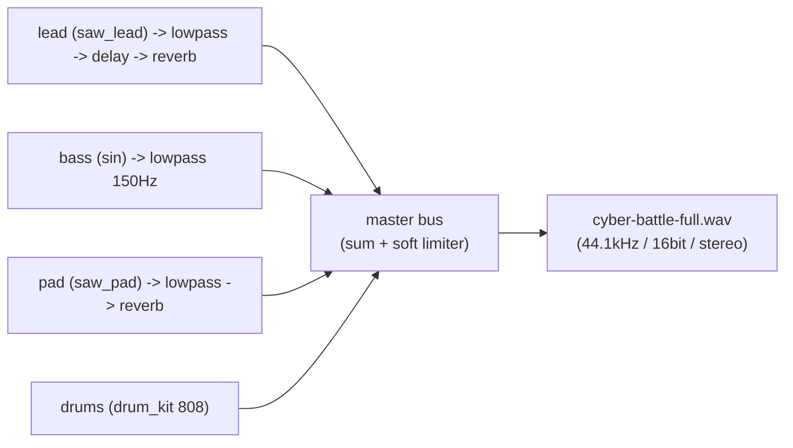

# Codetta — サンプル `.codetta` 集

> [docs/examples/](../examples/) に置いた実例ファイルの読み方 / 鳴らし方 / 構造解説。
> LLM が「Codetta でこんな曲を書いてみて」 と頼まれたときの**出発点テンプレ**として使う。

## 配置方針

| ディレクトリ | 用途 |
|---|---|
| [`docs/examples/`](../examples/) | **設計ドキュメントの一部として参照する canonical 実例** (このファイルが索引)。 各プリセットが「単体で `validate` + `render` 通る最小構成」 + フル尺 demo |
| [`examples/`](../../examples/) | リポトップの quick-start 用 (`smoke-sin.codetta`, `cyber-battle.codetta` 等)。 開発中の scratch を置く場所でもある |

両者ともファイル形式は同じ (拡張子 `.codetta` の JSON)。

## 一覧

| ファイル | パート | 長さ | 用途 |
|---|---|---|---|
| [`cyber-lead.codetta`](../examples/cyber-lead.codetta) | 主旋律 (saw_lead) | 8 拍 + tail (BPM 140) | サイバー系リード単体の耳テスト |
| [`sub-bass.codetta`](../examples/sub-bass.codetta) | 低音 (sin) | 8 拍 + tail (BPM 140) | sin + lowpass 150Hz のサブベース耳テスト |
| [`cyber-arp.codetta`](../examples/cyber-arp.codetta) | アルペジオ (square) | 8 拍 + tail (BPM 140) | 16 分刻みアルペジオ、 delay 1/16 で広がる |
| [`wide-pad.codetta`](../examples/wide-pad.codetta) | 背景パッド (saw_pad) | 16 拍 + tail (BPM 100) | コード進行 Am-F-G-Em、 detune + reverb の厚み |
| [`cyber-battle-full.codetta`](../examples/cyber-battle-full.codetta) | drum + bass + lead + pad の 4 トラック | 32 拍 (8 小節, BPM 130) | フル尺 demo。 Am-F-G-E の cyber battle ループ |

## レンダリング手順

事前: `cargo build -p codetta-cli` で `target/debug/codetta` を用意。

```bash
# 単体プリセットを鳴らす
./target/debug/codetta render docs/examples/cyber-lead.codetta -o /tmp/cyber-lead.wav

# フル尺 demo
./target/debug/codetta render docs/examples/cyber-battle-full.codetta -o /tmp/cyber-battle-full.wav

# 全部一気に
for f in docs/examples/*.codetta; do
  name=$(basename "$f" .codetta)
  ./target/debug/codetta render "$f" -o "/tmp/codetta-$name.wav"
done
```

検証:

```bash
./target/debug/codetta validate docs/examples/cyber-battle-full.codetta
# → [OK] ... is valid / {"ok":true}
```

## プリセットの設計意図

### cyber_lead — 主旋律 (saw_lead)

```jsonc
{
  "instrument": { "type": "saw_lead", "params": { "attack": 0.005, "decay": 0.05, "sustain": 0.8, "release": 0.15 } },
  "fx": [
    { "type": "lowpass", "cutoff": 1500, "q": 3.0 },
    { "type": "delay", "time": "1/8", "feedback": 0.35, "mix": 0.3 },
    { "type": "reverb", "size": 0.4, "mix": 0.2 }
  ]
}
```

- **役割**: ddc バトル / アクション BGM の主旋律。 倍音豊富な saw を lowpass で軽く絞り、 delay 1/8 + 短めの reverb でサイバー感を出す
- **覚えどころ**: `filter_cutoff` を fx 側に持たせている (instrument 内蔵フィルタは Phase 0 では未実装)
- **キー A minor pentatonic** (A C D E G) の上行 → 下行 + sustain note。 8 拍で 1 ループになるので backing と組合せやすい

### sub_bass — 低音 (sin)

```jsonc
{
  "instrument": { "type": "sin", "params": { "attack": 0.005, "decay": 0.1, "sustain": 0.95, "release": 0.05 } },
  "fx": [ { "type": "lowpass", "cutoff": 150, "q": 0.7 } ]
}
```

- **役割**: 純音 sin + 急峻 lowpass で純度の高いサブベース。 ヘッドホン視聴で「ぶーん」 と地響き、 スピーカーでは鳴らない (それでよい — サブベースは現代の cyber 系で「感じる」 帯域)
- **覚えどころ**: A2 (110Hz) / F2 (87Hz) / G2 (98Hz) / E2 (82Hz) の進行。 lowpass cutoff 150Hz で基音だけ通す
- **アタック** は 5ms (クリックノイズ抑制) と **release** 50ms (note 切り替わりで濁らせない) のバランス

### cyber_arp — アルペジオ (square)

```jsonc
{
  "instrument": { "type": "square", "params": { "attack": 0.001, "decay": 0.05, "sustain": 0.0, "release": 0.05, "pulse_width": 0.3 } },
  "fx": [
    { "type": "delay", "time": "1/16", "feedback": 0.5, "mix": 0.4 },
    { "type": "reverb", "size": 0.6, "mix": 0.3 }
  ]
}
```

- **役割**: 16 分刻みの上下動アルペジオ。 chip 風 square + delay 1/16 / feedback 0.5 で「キラキラ感」 を演出
- **覚えどころ**: ADSR の `sustain: 0.0` でブツ切り (decay 50ms で消える)。 これにアルペジオの粒立ちが出る
- **pulse_width 0.3** で痩せた音色 → 高域を細くしてアルペジオを目立たせる
- 4 つのコード (Am / Dm / G / Em) ぶん 32 個のノートを並べる

### wide_pad — 背景パッド (saw_pad)

```jsonc
{
  "instrument": { "type": "saw_pad", "params": { "attack": 0.5, "decay": 0.3, "sustain": 0.6, "release": 1.0, "detune_cents": 15 } },
  "fx": [
    { "type": "lowpass", "cutoff": 2000, "q": 0.7 },
    { "type": "reverb", "size": 0.9, "damp": 0.6, "mix": 0.5 }
  ]
}
```

- **役割**: コード進行を支える背景パッド。 saw_pad の 3 本 detune × reverb 0.9 で空間を埋める
- **覚えどころ**: `attack 0.5` でゆっくり立ち上がる (フェードイン)。 release 1.0 で次のコードに半オーバーラップ
- **コード進行**: Am → F → G → Em (1 コード = 4 拍 sustain)。 トライアド 3 音を同時 note で書く

## フル尺 demo (cyber-battle-full)

### コード進行 / 構造

```
Bar  | 1 2 | 3 4 | 5 6 | 7 8 |
Chord| Am  | F   | G   | E   |
```

- **BPM** 130, 4/4, 8 小節 = 32 拍 / 約 14.8 秒 (release tail 込みで 16.7 秒)
- 4 トラック並走:
  - `drums` — 808 kit。 4 つ打ち + hh 16 分 + 各小節末に hh_open。 32 拍目で crash 落とし
  - `bass` — sin sub bass。 各コードのルート音 (A2 / F2 / G2 / E2) を sustain
  - `lead` — saw_lead。 ペンタトニック + コード進行に沿った旋律
  - `pad` — saw_pad。 コード (トライアド) を 8 拍ずつ sustain
- 各トラックに [プリセットの設計意図](#プリセットの設計意図) と同じ fx チェーンを基準として乗せている (param 微調整あり)

### signal flow (1 小節抜粋)



### 触り方の例

LLM や人間が「ここを変えてみたい」 と思うパラメータ:

| 試したいこと | どこを触る |
|---|---|
| 主旋律をオクターブ下げる | `lead` の notes を `edit-notes` で `transpose -12` |
| もっと激しく | BPM 130 → 160、 drum の hh velocity を底上げ |
| ダーク化 | `pad` の lowpass cutoff 2200 → 800 / reverb size 0.85 → 0.95 |
| chip 風に総差し替え | `lead` を `square (pulse_width 0.5)` 、 drum を `kit chip` |
| アルペジオ追加 | `cyber-arp.codetta` の `arp` track をマージ |

CLI 操作例:

```bash
# lead を 1 オクターブ上げる
./target/debug/codetta edit-notes docs/examples/cyber-battle-full.codetta \
  --track lead --ops-json '[{"op":"transpose","semitones":12}]'

# drum を 909 に差し替え
./target/debug/codetta set-instrument docs/examples/cyber-battle-full.codetta \
  --track drums --type drum_kit --params-json '{"kit":"909"}'
```

## sound.md のプリセット定義との差分

[05-sound.md「サイバー感プリセット集」](05-sound.md#サイバー感プリセット集) では、 `saw_lead` の `params` に `filter_cutoff` / `filter_q` を直接書く形でプリセットが定義されている。 これは **将来の instrument 内蔵 filter (Phase 1+)** を想定した記法。

Phase 0 実装では:

| sound.md の表記 | docs/examples/ の対応 |
|---|---|
| `params.filter_cutoff` / `params.filter_q` | fx チェーンに `{ "type": "lowpass", "cutoff": ..., "q": ... }` を追加 |
| (注) instrument params に `filter_cutoff` を書いても validate は通るが、 実装では**無視される** | fx 側の lowpass が実際にかかる |

これは「サンプル `.codetta` は **今鳴る音** を優先する」 という方針。 Phase 1+ で instrument 内蔵 filter (+ envelope) を実装した際は、 sound.md のプリセット定義に合わせて `.codetta` も移行する。

## 追加候補 (Phase 1+ で検討)

- `chip-arp.codetta` — `kit chip` + square で 8bit 風アルペジオ (ddc の SE 想定)
- `wide-pad-modulated.codetta` — pad に `chorus` / `phaser` 等が入ったあとに作る
- ジャンル別テンプレ集 — `lofi-loop.codetta`, `ambient-cinematic.codetta` 等は Phase 2 (ddc dogfood) で実曲を量産しながら追加

## オープンクエスチョン

- [ ] Phase 1 で instrument 内蔵 filter (`filter_cutoff` / `filter_q` / filter envelope) を入れたら、 `cyber-lead.codetta` を fx lowpass → instrument params に書き戻すか? → 入った時点で migrate
- [ ] サンプルは「描画用にレンダ済 WAV」 を Phase 4 (公開) で `docs/examples/*.wav` として同梱するか? → README で MP3 圧縮版をリンクする方が GitHub 容量を圧迫しない見込み
