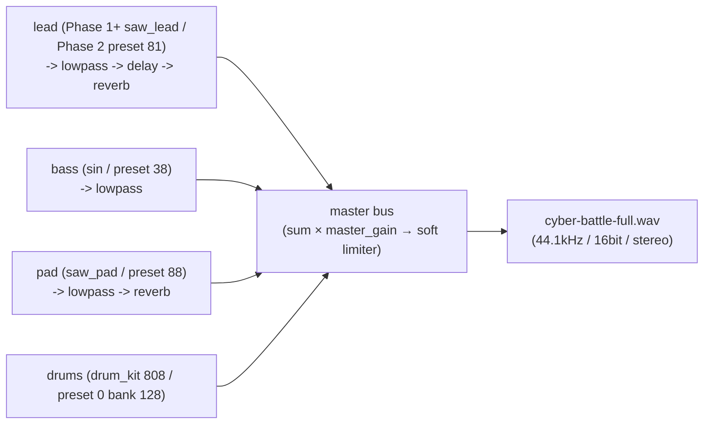

# Codetta — サンプル `.codetta` 集

> [docs/examples/](../examples/) に置いた実例ファイルの読み方 / 鳴らし方 / 構造解説。
> LLM が「Codetta でこんな曲を書いてみて」 と頼まれたときの**出発点テンプレ**として使う。

## doc と fixture の対応関係 (= Phase 1+ 時点)

本 doc は **schema 0.2 化 (= Phase 2) 完了後の到達状態** を spec として記述する。 現状 (Phase 1+) の fixture は **内蔵 synth (saw_lead / sin / square / saw_pad / drum_kit) ベース** で書かれている。 Phase 2 で:

- 既存 fixture (`docs/examples/*.codetta`) を SF2 版に書き換え (= 03-cli.md の migrate LUT に従って `saw_lead → preset 81`、 `sin → preset 38`、 `square → preset 80`、 `saw_pad → preset 88`、 `drum_kit → preset 0/bank 128` で機械置換)
- SF2 限定の新規 fixture (例: `cyber-battle-sf2-full.codetta`、 SF2 で生楽器寄せた `acoustic-feel-sf2.codetta` 等) を追加
- 内蔵 synth 言及および chip 系 drum kit (= revert 済) への言及を本 doc から削除する

なお Phase 1+ 時点の内蔵 synth fixture は **legacy 参照用に `docs/examples/legacy-0.1/` 配下へ退避する方針で確定** (= 内蔵 synth で得た音響デザイン値 (cutoff/q/delay 値) は Phase 2 以降の SF2 fx 再調整時に参照したい)。

それまでは「Phase 1+ 現役 fixture (内蔵 synth)」 + 「Phase 2 完了後の対応 SF2 preset」 を併記する形で運用。

## 配置方針

| ディレクトリ | 用途 |
|---|---|
| [`docs/examples/`](../examples/) | **設計ドキュメントの一部として参照する canonical 実例** (このファイルが索引)。 各プリセットが「単体で `validate` + `render` 通る最小構成」 + フル尺 demo |
| [`examples/`](../../examples/) | リポトップの quick-start / scratch 用。 現状 `smoke-sin.codetta` (= sin 単音スモークテスト) と `cyber-battle.codetta` (= 8 拍 3 track の旧版 demo) を置いている |

両者ともファイル形式は同じ (拡張子 `.codetta` の JSON)。

**名前衝突注意**: リポトップの `examples/cyber-battle.codetta` (8 拍 / 3 track / 簡易版) と `docs/examples/cyber-battle-full.codetta` (32 拍 / 4 track / 完成版) は別物。 Phase 2 fixture 整理時に top 側を `cyber-battle-smoke.codetta` 等にリネームする案を OQ に挙げている。

## 一覧 (Phase 1+ 現役 fixture)

| ファイル | パート (Phase 1+ 内蔵 synth) | Phase 2 後の SF2 GM preset | 長さ | 用途 |
|---|---|---|---|---|
| [`cyber-lead.codetta`](../examples/cyber-lead.codetta) | `saw_lead` | preset 81 (Saw Lead) / bank 0 | 8 拍 + tail (BPM 140) | サイバー系リード単体の耳テスト |
| [`sub-bass.codetta`](../examples/sub-bass.codetta) | `sin` | preset 38 (Synth Bass 1) / bank 0 | 8 拍 + tail (BPM 140) | サブベース耳テスト (LP 150Hz で基音帯) |
| [`cyber-arp.codetta`](../examples/cyber-arp.codetta) | `square` (pulse_width 0.3) | preset 80 (Square Lead) / bank 0 | 8 拍 + tail (BPM 140) | 16 分刻みアルペジオ、 delay 1/16 で広がる |
| [`wide-pad.codetta`](../examples/wide-pad.codetta) | `saw_pad` (detune 15c) | preset 88 (New Age Pad) / bank 0 | 16 拍 + tail (BPM 100) | コード進行 Am-F-G-Em、 detune + reverb の厚み |
| [`cyber-battle-full.codetta`](../examples/cyber-battle-full.codetta) | drum_kit 808 + sin + saw_lead + saw_pad | preset 0/bank 128 + 38 + 81 + 88 | 32 拍 (8 小節, BPM 130) | フル尺 demo。 Am-F-G-E の cyber battle ループ |

Phase 2 完了時に上記 5 fixture を SF2 版で機械置換 + 必要に応じて手動 micro-adjust (= preset 別の peak 差を `metadata.master_gain` で吸収、 dogfooding 推奨値 2.0)。

## レンダリング手順

事前: `cargo build -p codetta-cli` で `target/debug/codetta` を用意。

```bash
# 単体プリセットを鳴らす
./target/debug/codetta render docs/examples/cyber-lead.codetta -o /tmp/cyber-lead.wav

# フル尺 demo
./target/debug/codetta render docs/examples/cyber-battle-full.codetta -o /tmp/cyber-battle-full.wav

# 全部一気に
for f in docs/examples/*.codetta; do
  name=$(basename "$f" .codetta)
  ./target/debug/codetta render "$f" -o "/tmp/codetta-$name.wav"
done
```

検証:

```bash
./target/debug/codetta validate docs/examples/cyber-battle-full.codetta
# → [OK] ... is valid / {"ok":true}
```

Phase 2 で SF2 fixture に置き換わったあとは、 `$CODETTA_SOUNDFONT_DIR` (= 既定 `~/Music/sf2/`) に `GeneralUser-GS-v1.471.sf2` が存在することが前提となる (= `validate` が `SOUNDFONT_FILE_NOT_FOUND` を返したら DL 案内)。

## プリセットの設計意図 (Phase 1+ 内蔵 synth 版)

Phase 1+ fixture の解説。 Phase 2 で SF2 化した時は各プリセット最下行の「SF2 化後」 行を参照。

### cyber_lead — 主旋律 (saw_lead)

```jsonc
{
  "instrument": { "type": "saw_lead", "params": { "attack": 0.005, "decay": 0.05, "sustain": 0.8, "release": 0.15 } },
  "fx": [
    { "type": "lowpass", "cutoff": 1500, "q": 3.0 },
    { "type": "delay", "time": "1/8", "feedback": 0.35, "mix": 0.3 },
    { "type": "reverb", "size": 0.4, "mix": 0.2 }
  ]
}
```

- **役割**: ddc バトル / アクション BGM の主旋律。 倍音豊富な saw を lowpass で軽く絞り、 delay 1/8 + 短めの reverb でサイバー感を出す
- **覚えどころ**: `filter_cutoff` を fx 側に持たせている (instrument 内蔵フィルタは未実装方針)
- **キー A minor pentatonic** (A C D E G) の上行 → 下行 + sustain note。 8 拍で 1 ループになるので backing と組合せやすい
- **SF2 化後**: `{ type: "soundfont", params: { file: "GeneralUser-GS-v1.471.sf2", preset: 81, bank: 0 } }` (= GM Saw Lead)。 ADSR は SF2 内蔵、 fx チェーン (lowpass / delay / reverb) は同じものを乗せる

### sub_bass — 低音 (sin)

```jsonc
{
  "instrument": { "type": "sin", "params": { "attack": 0.005, "decay": 0.1, "sustain": 0.95, "release": 0.05 } },
  "fx": [ { "type": "lowpass", "cutoff": 150, "q": 0.7 } ]
}
```

- **役割**: 純音 sin + 急峻 lowpass で純度の高いサブベース。 ヘッドホン視聴で「ぶーん」 と地響き、 スピーカーでは鳴らない (それでよい — サブベースは現代の cyber 系で「感じる」 帯域)
- **覚えどころ**: A2 (110Hz) / F2 (87Hz) / G2 (98Hz) / E2 (82Hz) の進行。 lowpass cutoff 150Hz で基音だけ通す
- **アタック** は 5ms (クリックノイズ抑制) と **release** 50ms (note 切り替わりで濁らせない) のバランス
- **SF2 化後**: `{ type: "soundfont", params: { ..., preset: 38, bank: 0 } }` (= GM Synth Bass 1) が migrate LUT の機械置換先。 ただし Synth Bass 1 はエレベ寄りキャラなので **「純音 sub bass」 のフィーリングはそのままでは出にくい**。 Phase 2 で実 dogfood し、 違和感あれば preset 39 (Synth Bass 2) や別系統に振り直し可。 lowpass cutoff も 150Hz のままだとアタックが死ぬので、 dogfood で値を再調整する

### cyber_arp — アルペジオ (square)

```jsonc
{
  "instrument": { "type": "square", "params": { "attack": 0.001, "decay": 0.05, "sustain": 0.0, "release": 0.05, "pulse_width": 0.3 } },
  "fx": [
    { "type": "delay", "time": "1/16", "feedback": 0.5, "mix": 0.4 },
    { "type": "reverb", "size": 0.6, "mix": 0.3 }
  ]
}
```

- **役割**: 16 分刻みの上下動アルペジオ。 square + delay 1/16 / feedback 0.5 で「キラキラ感」 を演出
- **覚えどころ**: ADSR の `sustain: 0.0` でブツ切り (decay 50ms で消える)。 これにアルペジオの粒立ちが出る
- **pulse_width 0.3** で痩せた音色 → 高域を細くしてアルペジオを目立たせる
- 4 つのコード (Am / Dm / G / Em) ぶん 32 個のノートを並べる
- **SF2 化後**: `{ type: "soundfont", params: { ..., preset: 80, bank: 0 } }` (= GM Square Lead)。 pulse_width / ADSR は SF2 内蔵、 fx チェーンは同じ

### wide_pad — 背景パッド (saw_pad)

```jsonc
{
  "instrument": { "type": "saw_pad", "params": { "attack": 0.5, "decay": 0.3, "sustain": 0.6, "release": 1.0, "detune_cents": 15 } },
  "fx": [
    { "type": "lowpass", "cutoff": 2000, "q": 0.7 },
    { "type": "reverb", "size": 0.9, "damp": 0.6, "mix": 0.5 }
  ]
}
```

- **役割**: コード進行を支える背景パッド。 saw_pad の 3 本 detune × reverb 0.9 で空間を埋める
- **覚えどころ**: `attack 0.5` でゆっくり立ち上がる (フェードイン)。 release 1.0 で次のコードに半オーバーラップ
- **コード進行**: Am → F → G → Em (1 コード = 4 拍 sustain)。 トライアド 3 音を同時 note で書く
- **SF2 化後**: `{ type: "soundfont", params: { ..., preset: 88, bank: 0 } }` (= GM New Age Pad) が migrate LUT の機械置換先。 detune は SF2 内蔵、 fx チェーン (lowpass + reverb) は流用。 attack の遅さは SF2 のエンベロープ依存なので、 `attack 0.5` 相当の立ち上がりを求めるなら **preset 89 (Warm Pad)** や **preset 95 (Sweep Pad)** 等、 アタックの遅さで定評のある別 preset 候補を Phase 2 dogfood で比較する

## フル尺 demo (cyber-battle-full)

### コード進行 / 構造

```
Bar  | 1 2 | 3 4 | 5 6 | 7 8 |
Chord| Am  | F   | G   | E   |
```

- **BPM** 130, 4/4, 8 小節 = 32 拍 / 約 14.8 秒 (release tail 込みで 16.7 秒)
- 4 トラック並走 (Phase 1+ 内蔵 synth 版):
  - `drums` — 808 kit。 4 つ打ち + hh 16 分 + 各小節末に hh_open。 32 拍目で crash 落とし
  - `bass` — sin sub bass。 各コードのルート音 (A2 / F2 / G2 / E2) を 1 拍ごとに re-trigger (= 完全 sustain ではなくグルーヴのため小休符あり)
  - `lead` — saw_lead。 ペンタトニック + コード進行に沿った旋律
  - `pad` — saw_pad。 コード (トライアド) を 8 拍ずつ sustain
- 各トラックは [プリセットの設計意図](#プリセットの設計意図-phase-1-内蔵-synth-版) で示した fx チェーン構成 (= スロット数 / type の並び) を踏襲しつつ、 フル尺コンテキストでは値を個別に再調整している (例: lead は lowpass cutoff 1500 → 1800 / q 3.0 → 2.5、 pad は cutoff 2000 → 2200 / reverb size 0.9 → 0.85 / mix 0.5 → 0.45 / attack 0.5 → 0.4)。 単体プリセット側の値は「耳テスト最小構成」、 フル尺側の値は「他 track と被らないように削った値」 という関係

### Phase 2 SF2 化後の構成

| track | Phase 1+ 内蔵 synth | Phase 2 SF2 preset (migrate LUT 機械置換先) | 備考 |
|---|---|---|---|
| `drums` | `drum_kit` (kit 808) | preset 0 / bank 128 (Standard Drum Kit) | `kick` / `snare` / `hh_closed` 等の要素名キーは Phase 2 で SF2 経路の MIDI 番号正規化を実装。 別 kit に振りたければ Phase 2 dogfood で別 preset (例: Jazz / Power) を `list-soundfont-presets` で探して差替え |
| `bass` | `sin` + lowpass 150Hz | preset 38 (Synth Bass 1) / bank 0 | エレベ寄りなので純音 sub bass 感が要るなら preset 39 (Synth Bass 2) 等で再評価。 lowpass 150Hz もそのままだとアタックが死ぬので Phase 2 dogfood で再調整 |
| `lead` | `saw_lead` + lowpass + delay + reverb | preset 81 (Saw Lead) / bank 0 | fx スロット構成は流用、 cutoff / delay / reverb の値は SF2 音色に合わせて Phase 2 dogfood で再調整 |
| `pad` | `saw_pad` (detune 15c) + lowpass + reverb | preset 88 (New Age Pad) / bank 0 | アタックの遅さを保つなら preset 89 (Warm Pad) / 95 (Sweep Pad) 候補。 fx 値は再調整前提 |
| `metadata.master_gain` | 未設定 (= 1.0) | 2.0 推奨 | SF2 peak が内蔵合成より低いため |

### signal flow (1 小節抜粋)



### 触り方の例

LLM や人間が「ここを変えてみたい」 と思うパラメータ:

| 試したいこと | どこを触る |
|---|---|
| 主旋律をオクターブ下げる | `lead` の notes を `edit-notes` で `transpose -12` |
| もっと激しく | BPM 130 → 160、 drum の hh velocity を底上げ |
| ダーク化 | `pad` の lowpass cutoff 2200 → 800 / reverb size 0.85 → 0.95 |
| 全体音圧を上げる | `metadata.master_gain` を 1.0 → 2.0 (SF2 版では default 推奨) |
| (Phase 2 SF2 後) lead を Square Lead に差替 | `set-instrument --track lead --type soundfont --params-json '{"file":"GeneralUser-GS-v1.471.sf2","preset":80,"bank":0}'` |
| (Phase 2 SF2 後) 全体を生楽器寄せに | preset 81 → 24 (Nylon Guitar)、 38 → 33 (Electric Bass)、 88 → 48 (String Ensemble) で acoustic-feel-sf2 化 (= GeneralUser GS で実在する preset) |
| アルペジオ追加 | `cyber-arp.codetta` の `arp` track をマージ |

CLI 操作例 (Phase 1+ 現役 fixture 向け):

```bash
# lead を 1 オクターブ上げる
./target/debug/codetta edit-notes docs/examples/cyber-battle-full.codetta \
  --track lead --ops-json '[{"op":"transpose","semitones":12}]'

# drum を 909 に差し替え (Phase 1+ のみ、 Phase 2 後は preset 切替)
./target/debug/codetta set-instrument docs/examples/cyber-battle-full.codetta \
  --track drums --type drum_kit --params-json '{"kit":"909"}'

# Phase 2 SF2 後: drum kit を切り替え (= 別の bank 128 preset、 GS 規約では 32 = Jazz Kit / 24 = Electronic 等。 実 SF2 の収録状況は `list-soundfont-presets` で確認してから使う)
./target/debug/codetta set-instrument docs/examples/cyber-battle-full.codetta \
  --track drums --type soundfont \
  --params-json '{"file":"GeneralUser-GS-v1.471.sf2","preset":32,"bank":128}'

# 全体音圧を上げる (= SF2 化後の dogfooding 推奨)
./target/debug/codetta set-master-gain docs/examples/cyber-battle-full.codetta --value 2.0
```

## 追加候補 (Phase 2+ で検討)

- **`cyber-battle-sf2-full.codetta`** — `cyber-battle-full.codetta` の SF2 版 (= migrate LUT 適用 + master_gain 2.0)
- **`acoustic-feel-sf2.codetta`** — SF2 で生楽器寄せた BGM 素材 (preset 24 Nylon Guitar + 33 Electric Bass + 48 String Ensemble)。 個人ゲーム開発向けのテンプレ
- **`lofi-loop.codetta`** / **`ambient-cinematic.codetta`** — ジャンル別テンプレ集は Phase 2-3 dogfood で実曲を量産しながら追加
- **`midi-roundtrip-demo`** (Phase 3) — `.codetta` → `.mid` → `.codetta` 往復で拡張属性 (`master_gain` / fx / SF2 preset) が保たれることを示す demo

## オープンクエスチョン

- [ ] サンプルは「描画用にレンダ済 WAV」 を Phase 4 (公開) で `docs/examples/*.wav` として同梱するか? → README で MP3 圧縮版をリンクする方が GitHub 容量を圧迫しない見込み
- [ ] Phase 3 MIDI 連携 demo (`midi-roundtrip-demo`) を `docs/examples/` 配下に置くか別 `docs/midi-demos/` を切るか → Phase 3 着手時に判断
- [ ] Phase 2 fixture 整理時に repo top `examples/cyber-battle.codetta` (= 8 拍 / 3 track の旧版) を `cyber-battle-smoke.codetta` 等にリネームして `docs/examples/cyber-battle-full.codetta` との名前衝突を解消するか → Phase 2 着手時に確定
- [ ] sub_bass / wide_pad の SF2 化で migrate LUT デフォルト (preset 38 / 88) のままで音色感が成立するか、 dogfood 結果を反映して LUT を別 preset (sub_bass→39 Synth Bass 2、 wide_pad→89 Warm Pad 等) に振り直すか → Phase 2 dogfood 結果で決定

決着済 (履歴):

- [x] Phase 2 fixture 整理で内蔵 synth 版を残すか → **残す方針** (`docs/examples/legacy-0.1/` 配下へ退避、 内蔵 synth で得た音響デザイン値を SF2 fx 再調整時の参照用として利用)

## 関連ドキュメント

- [00-vision.md](00-vision.md) — ビジョン / ターゲット / Phase 計画
- [01-architecture.md](01-architecture.md) — アーキテクチャ
- [02-project-format.md](02-project-format.md) — `.codetta` JSON スキーマ
- [03-cli.md](03-cli.md) — CLI subcommand 仕様 (migrate LUT)
- [04-mcp.md](04-mcp.md) — MCP tool 仕様
- [07-soundfont.md](07-soundfont.md) — SF2 統合の詳細仕様 (= メイン音源 doc)
- [08-midi.md](08-midi.md) — MIDI import/export (= Phase 3 ADR、 確定済)
- 09-distribution.md — 配布戦略 (Phase 4 で起こす)
