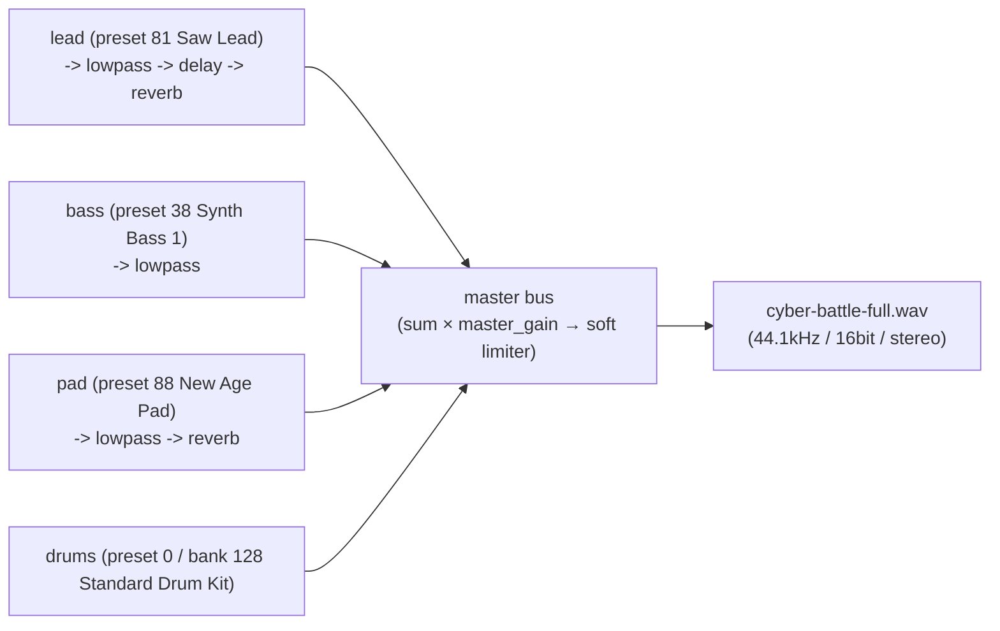

# Codetta — サンプル `.codetta` 集

> [docs/examples/](../examples/) に置いた実例ファイルの読み方 / 鳴らし方 / 構造解説。
> LLM が「Codetta でこんな曲を書いてみて」 と頼まれたときの**出発点テンプレ**として使う。

## doc と fixture の対応関係 (= Phase 2 完了済)

本 doc は **schema 0.2 (= SF2 一本化)** の現役 fixture を spec として記述する。 旧 0.1 (内蔵 synth ベース) fixture は `docs/examples/legacy-0.1/` 配下に退避済 (= migrate test の入力資産 + 内蔵 synth で得た音響デザイン値の参照用)。

| 配置 | 状態 | 用途 |
|---|---|---|
| `docs/examples/*.codetta` | 現役 (schema 0.2 / SF2 一本) | この doc の正本、 LLM 出発点テンプレ |
| `docs/examples/legacy-0.1/*.codetta` | 退避済 (schema 0.1 / 内蔵 synth) | migrate test の入力、 音響デザイン値の参照用 |

## 配置方針

| ディレクトリ | 用途 |
|---|---|
| [`docs/examples/`](../examples/) | **設計ドキュメントの一部として参照する canonical 実例** (このファイルが索引)。 各プリセットが「単体で `validate` + `render` 通る最小構成」 + フル尺 demo |
| [`docs/examples/legacy-0.1/`](../examples/legacy-0.1/) | schema 0.1 (内蔵 synth) で書かれた旧版。 `migrate` 入力資産として保持、 fx 値 (cutoff / q / delay) を SF2 fx 再調整時の参照点として残す |
| [`examples/`](../../examples/) | リポトップの quick-start / scratch 用。 `smoke-sin.codetta` (= preset 38 単音スモーク) と `cyber-battle.codetta` (= 8 拍 3 track の簡易版) を置いている |

両者ともファイル形式は同じ (拡張子 `.codetta` の JSON)。

**名前衝突注意**: リポトップの `examples/cyber-battle.codetta` (8 拍 / 3 track / 簡易版) と `docs/examples/cyber-battle-full.codetta` (32 拍 / 4 track / 完成版) は別物。 Phase 2 fixture 整理時のリネーム案は見送り (= 用途が違うので併存維持、 名前は据置)。

## 一覧 (SF2 版 / 現役)

| ファイル | パート | SF2 preset / bank | 長さ | 用途 |
|---|---|---|---|---|
| [`cyber-lead.codetta`](../examples/cyber-lead.codetta) | `lead` | preset 81 (Saw Lead) / bank 0 | 8 拍 + tail (BPM 140) | サイバー系リード単体の耳テスト |
| [`sub-bass.codetta`](../examples/sub-bass.codetta) | `bass` | preset 38 (Synth Bass 1) / bank 0 | 8 拍 + tail (BPM 140) | サブベース耳テスト (LP 150Hz で基音帯) |
| [`cyber-arp.codetta`](../examples/cyber-arp.codetta) | `arp` | preset 80 (Square Lead) / bank 0 | 8 拍 + tail (BPM 140) | 16 分刻みアルペジオ、 delay 1/16 で広がる |
| [`wide-pad.codetta`](../examples/wide-pad.codetta) | `pad` | preset 88 (New Age Pad) / bank 0 | 16 拍 + tail (BPM 100) | コード進行 Am-F-G-Em、 reverb の厚み |
| [`cyber-battle-full.codetta`](../examples/cyber-battle-full.codetta) | `drums` + `bass` + `lead` + `pad` | preset 0 / bank 128 + 38 + 81 + 88 | 32 拍 (8 小節, BPM 130) | フル尺 demo。 Am-F-G-E の cyber battle ループ |

全 fixture は `metadata.master_gain = 2.0` (= SF2 dogfooding 推奨値、 SF2 は内蔵合成より peak が小さい)。

## レンダリング手順

事前: `cargo build -p codetta-cli` で `target/debug/codetta` を用意。 `~/Music/sf2/GeneralUser-GS-v1.471.sf2` (= 既定 SF2 探索先) が存在することが前提 (validate が `SOUNDFONT_FILE_NOT_FOUND` を返したら DL 案内、 もしくは `$CODETTA_SOUNDFONT_DIR` を絶対 path で指定)。

```bash
# 単体プリセットを鳴らす
./target/debug/codetta render docs/examples/cyber-lead.codetta -o /tmp/cyber-lead.wav

# フル尺 demo
./target/debug/codetta render docs/examples/cyber-battle-full.codetta -o /tmp/cyber-battle-full.wav

# 全部一気に
for f in docs/examples/*.codetta; do
  name=$(basename "$f" .codetta)
  ./target/debug/codetta render "$f" -o "/tmp/codetta-$name.wav"
done
```

検証:

```bash
./target/debug/codetta validate docs/examples/cyber-battle-full.codetta
# → [OK] ... is valid / {"ok":true}
```

旧 0.1 fixture (legacy-0.1/) は直接 render / validate しても **SCHEMA_VERSION 0.2 では reject される** (= `UNKNOWN_VERSION`)。 動かしたい場合は `codetta migrate` で 0.2 に変換してから:

```bash
./target/debug/codetta migrate docs/examples/legacy-0.1/cyber-lead.codetta -o /tmp/cyber-lead-0.2.codetta
./target/debug/codetta render /tmp/cyber-lead-0.2.codetta -o /tmp/cyber-lead.wav
```

## プリセットの設計意図 (SF2 版)

各 fixture の選定意図と fx チェーン構成。 旧 0.1 版 (内蔵 synth) の音響デザイン値を `legacy-0.1/` の対応ファイルから参照可。

### cyber_lead — 主旋律 (preset 81: Saw Lead)

```jsonc
{
  "instrument": {
    "type": "soundfont",
    "params": { "file": "GeneralUser-GS-v1.471.sf2", "preset": 81, "bank": 0 }
  },
  "fx": [
    { "type": "lowpass", "cutoff": 1500, "q": 3.0 },
    { "type": "delay", "time": "1/8", "feedback": 0.35, "mix": 0.3 },
    { "type": "reverb", "size": 0.4, "mix": 0.2 }
  ]
}
```

- **役割**: ddc バトル / アクション BGM の主旋律。 GM Saw Lead を lowpass で軽く絞り、 delay 1/8 + 短めの reverb でサイバー感を出す
- **覚えどころ**: ADSR は SF2 内蔵 envelope に従う (= 旧 0.1 版で持っていた attack/decay/sustain/release params は SF2 化で破棄)。 サウンドキャラを変えたければ別 preset (例: 80 Square Lead) に差替
- **キー A minor pentatonic** (A C D E G) の上行 → 下行 + sustain note。 8 拍で 1 ループになるので backing と組合せやすい

### sub_bass — 低音 (preset 38: Synth Bass 1)

```jsonc
{
  "instrument": {
    "type": "soundfont",
    "params": { "file": "GeneralUser-GS-v1.471.sf2", "preset": 38, "bank": 0 }
  },
  "fx": [ { "type": "lowpass", "cutoff": 150, "q": 0.7 } ]
}
```

- **役割**: GM Synth Bass 1 + 急峻 lowpass でサブベース帯域に絞る
- **覚えどころ**: A2 (110Hz) / F2 (87Hz) / G2 (98Hz) / E2 (82Hz) の進行。 lowpass cutoff 150Hz で基音だけ通す
- **dogfooding 注意**: Synth Bass 1 はエレベ寄りキャラなので、 旧 0.1 版 (sin) の「純音 sub bass」 フィーリングとは別物。 別質感が欲しければ preset 39 (Synth Bass 2) など要試聴。 lowpass 150Hz もそのままだとアタックが死ぬので耳に合わせて再調整可

### cyber_arp — アルペジオ (preset 80: Square Lead)

```jsonc
{
  "instrument": {
    "type": "soundfont",
    "params": { "file": "GeneralUser-GS-v1.471.sf2", "preset": 80, "bank": 0 }
  },
  "fx": [
    { "type": "delay", "time": "1/16", "feedback": 0.5, "mix": 0.4 },
    { "type": "reverb", "size": 0.6, "mix": 0.3 }
  ]
}
```

- **役割**: 16 分刻みの上下動アルペジオ。 GM Square Lead + delay 1/16 / feedback 0.5 で「キラキラ感」 を演出
- **覚えどころ**: 4 つのコード (Am / Dm / G / Em) ぶん 32 個のノートを並べる
- **dogfooding 注意**: 旧 0.1 版で持っていた pulse_width 0.3 / ADSR sustain 0 は SF2 化で破棄。 SF2 内蔵 envelope は decay/sustain ともそれなりに残るので、 旧版の「ブツ切りアルペジオ」 感は別 preset (例: 80 Square Lead より短めの 84 Charang) で再現するか、 短い note dur で代替

### wide_pad — 背景パッド (preset 88: New Age Pad)

```jsonc
{
  "instrument": {
    "type": "soundfont",
    "params": { "file": "GeneralUser-GS-v1.471.sf2", "preset": 88, "bank": 0 }
  },
  "fx": [
    { "type": "lowpass", "cutoff": 2000, "q": 0.7 },
    { "type": "reverb", "size": 0.9, "damp": 0.6, "mix": 0.5 }
  ]
}
```

- **役割**: コード進行を支える背景パッド。 GM New Age Pad に lowpass で角を取り、 reverb 0.9 で空間を埋める
- **覚えどころ**: **コード進行**: Am → F → G → Em (1 コード = 4 拍 sustain)。 トライアド 3 音を同時 note で書く
- **dogfooding 注意**: 旧 0.1 版で持っていた attack 0.5 / detune 15c は SF2 内蔵 envelope に置換 (= 立ち上がりは preset 88 そのもの)。 アタックの遅さを保ちたいなら preset 89 (Warm Pad) / 95 (Sweep Pad) で耳テスト

## フル尺 demo (cyber-battle-full)

### コード進行 / 構造

```
Bar  | 1 2 | 3 4 | 5 6 | 7 8 |
Chord| Am  | F   | G   | E   |
```

- **BPM** 130, 4/4, 8 小節 = 32 拍 / 約 14.8 秒 (release tail 込みで 16.7 秒)
- 4 トラック並走 (SF2 版):
  - `drums` — preset 0 / bank 128 (Standard Drum Kit)。 `kick` / `snare` / `hh_closed` / `hh_open` / `crash` 等の要素名キーで書く (= SF2 経路で GM Drum MIDI 番号に正規化、 CDT-5)
  - `bass` — preset 38 (Synth Bass 1)。 各コードのルート音 (A2 / F2 / G2 / E2) を 1 拍ごとに re-trigger
  - `lead` — preset 81 (Saw Lead) + lowpass + delay + reverb。 ペンタトニック + コード進行に沿った旋律
  - `pad` — preset 88 (New Age Pad) + lowpass + reverb。 コード (トライアド) を 8 拍ずつ sustain

### 現状の構成

| track | SF2 preset / bank | fx | 備考 |
|---|---|---|---|
| `drums` | preset 0 / bank 128 (Standard Drum Kit) | — | 要素名キー (kick/snare 等) を SF2 経路で MIDI 番号に正規化 (CDT-5 実装)。 別 kit に切替たければ `list-soundfont-presets` で bank 128 配下を探して差替 (例: 8 Room, 16 Power, 24 Electronic, 32 Jazz) |
| `bass` | preset 38 (Synth Bass 1) / bank 0 | lowpass | エレベ寄り。 純音 sub bass 感が要るなら preset 39 (Synth Bass 2) 等で再評価 |
| `lead` | preset 81 (Saw Lead) / bank 0 | lowpass + delay + reverb | fx スロット構成は旧 0.1 版から流用 (cutoff/delay/reverb の値は SF2 音色に合わせて再調整可) |
| `pad` | preset 88 (New Age Pad) / bank 0 | lowpass + reverb | アタックの遅さを保つなら preset 89 (Warm Pad) / 95 (Sweep Pad) 候補 |

`metadata.master_gain = 2.0` (= SF2 dogfooding 推奨)。

### signal flow (1 小節抜粋)



### 触り方の例

LLM や人間が「ここを変えてみたい」 と思うパラメータ:

| 試したいこと | どこを触る |
|---|---|
| 主旋律をオクターブ下げる | `lead` の notes を `edit-notes` で `transpose -12` |
| もっと激しく | BPM 130 → 160、 drum の hh velocity を底上げ |
| ダーク化 | `pad` の lowpass cutoff 2000 → 800 / reverb size 0.9 → 0.95 |
| 全体音圧を上げる | `metadata.master_gain` を 2.0 → 3.0 |
| lead を Square Lead に差替 | `set-instrument --track lead --type soundfont --params-json '{"file":"GeneralUser-GS-v1.471.sf2","preset":80,"bank":0}'` |
| 全体を生楽器寄せに | preset 81 → 24 (Nylon Guitar)、 38 → 33 (Electric Bass)、 88 → 48 (String Ensemble) で acoustic-feel 化 |
| アルペジオ追加 | `cyber-arp.codetta` の `arp` track をマージ |
| drum kit 差替 | `set-instrument --track drums --type soundfont --params-json '{"file":"GeneralUser-GS-v1.471.sf2","preset":32,"bank":128}'` (= Jazz Kit) |

CLI 操作例:

```bash
# lead を 1 オクターブ上げる
./target/debug/codetta edit-notes docs/examples/cyber-battle-full.codetta \
  --track lead --ops-json '[{"op":"transpose","semitones":12}]'

# drum kit を Jazz に差し替え
./target/debug/codetta set-instrument docs/examples/cyber-battle-full.codetta \
  --track drums --type soundfont \
  --params-json '{"file":"GeneralUser-GS-v1.471.sf2","preset":32,"bank":128}'

# 全体音圧を更に上げる
./target/debug/codetta set-master-gain docs/examples/cyber-battle-full.codetta --value 3.0
```

## 追加候補 (Phase 3+ で検討)

- **`acoustic-feel.codetta`** — SF2 で生楽器寄せた BGM 素材 (preset 24 Nylon Guitar + 33 Electric Bass + 48 String Ensemble)。 個人ゲーム開発向けのテンプレ
- **`lofi-loop.codetta`** / **`ambient-cinematic.codetta`** — ジャンル別テンプレ集は Phase 2-3 dogfood で実曲を量産しながら追加
- **`midi-roundtrip-demo`** (Phase 3) — `.codetta` → `.mid` → `.codetta` 往復で拡張属性 (`master_gain` / fx / SF2 preset) が保たれることを示す demo

## オープンクエスチョン

- [ ] サンプルは「描画用にレンダ済 WAV」 を Phase 4 (公開) で `docs/examples/*.wav` として同梱するか? → README で MP3 圧縮版をリンクする方が GitHub 容量を圧迫しない見込み
- [ ] Phase 3 MIDI 連携 demo (`midi-roundtrip-demo`) を `docs/examples/` 配下に置くか別 `docs/midi-demos/` を切るか → Phase 3 着手時に判断
- [ ] sub_bass / wide_pad の SF2 化で migrate LUT デフォルト (preset 38 / 88) のままで音色感が成立するか、 dogfood 結果を反映して LUT を別 preset (sub_bass→39 Synth Bass 2、 wide_pad→89 Warm Pad 等) に振り直すか → 継続 dogfood で決定

決着済 (履歴):

- [x] Phase 2 fixture 整理で内蔵 synth 版を残すか → **残す方針** (`docs/examples/legacy-0.1/` 配下へ退避、 内蔵 synth で得た音響デザイン値を SF2 fx 再調整時の参照用として利用)
- [x] repo top `examples/cyber-battle.codetta` (= 8 拍 / 3 track の簡易版) を `cyber-battle-smoke.codetta` 等にリネームして `docs/examples/cyber-battle-full.codetta` との名前衝突を解消するか → **リネームせず併存維持** (= 用途が違うので別名同一性で問題なし)

## 関連ドキュメント

- [00-vision.md](00-vision.md) — ビジョン / ターゲット / Phase 計画
- [01-architecture.md](01-architecture.md) — アーキテクチャ
- [02-project-format.md](02-project-format.md) — `.codetta` JSON スキーマ
- [03-cli.md](03-cli.md) — CLI subcommand 仕様 (migrate LUT)
- [04-mcp.md](04-mcp.md) — MCP tool 仕様
- [07-soundfont.md](07-soundfont.md) — SF2 統合の詳細仕様 (= メイン音源 doc)
- [08-midi.md](08-midi.md) — MIDI import/export (= Phase 3 ADR、 確定済)
- 09-distribution.md — 配布戦略 (Phase 4 で起こす)
