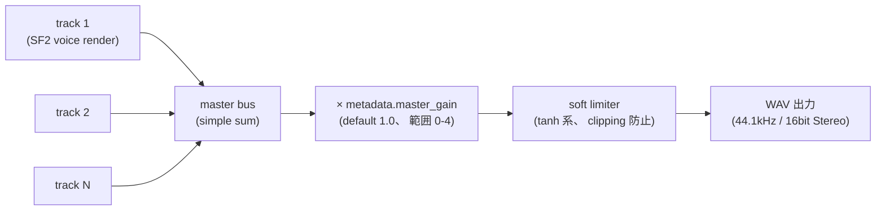

# Codetta — SoundFont (SF2) 統合 (= メイン音源)

> Codetta の音源は外付け SoundFont (SF2) で統一する。 内蔵 synth は持たない (= schema 0.2 で完全撤去済 / CDT-7)。
> 本 doc は Codetta の **音源層全般** を扱う正本 (旧 05-sound.md は schema 0.2 化方針確定で削除済)。

## doc と実装の対応関係 (= Phase 2 完了済)

本 doc は **schema 0.2 = SF2 一本化** の現状を spec として記述する。 主要状態:

| 項目 | 現状 |
|---|---|
| `SCHEMA_VERSION` | `"0.2"` |
| `SUPPORTED_VERSIONS` | `["0.2"]` (0.1 は `io::load` で `UnknownVersion` reject。 `codetta migrate` 経由のみ受付) |
| 内蔵 synth | ❌ 完全撤去 (CDT-7、 `synth/manual.rs` 削除済) |
| `Instrument::SoundFont` の render path | ✅ `synth::soundfont::render_soundfont_track` |
| `Arc<SoundFont>` キャッシュ (load 重複回避) | ✅ `load_soundfont` 戻り値が共有可 |
| `list-soundfont-presets` / `codetta://soundfonts/{name}` resource | ✅ |
| ドラム track での `pitch: "kick"` 等 (SF2 経路) | ✅ CDT-5 — `synth::soundfont::DRUM_KEY_MIDI_MAP` 正本で要素名キー / MIDI / ノート名のいずれも受付 |
| `migrate` (CDT-6) | ✅ 0.1 → 0.2 LUT 変換 (内蔵 synth → SF2 preset) |
| bundle 配布 SF2 (`file` 省略時 fallback) | ✅ コード側実装済 (CDT-12) — `file` 省略時に bundle SF2 を resolve。 SF2 バイナリ (約 30MB) の物理同梱は Release / Homebrew 配布物側 (CDT-13/14)、 同梱 version は v2.0.3 予定 (= 09-distribution.md)。 現状の default 名は dogfood と一致する `GeneralUser-GS-v1.471.sf2` |

## 立ち位置

旧方針 (= Phase 0 / Phase 1 当時) では「内蔵音源 (sin / saw / square / triangle / saw_pad / drum_kit) が主、 SF2 は生楽器補完用の optional 拡張」 だった。 dogfood の結果、

- 内蔵 synth voicing の音色感が、 GeneralUser GS の GM preset と比べて明確に弱い
- 生楽器 / ピアノ / ストリングス / ドラムの「ゲーム素材として通用する音」 は内蔵では到達コストが大きすぎる
- 「SF2 1 つ持っていれば melodic / drum / 生楽器すべて揃う」 の単純さが LLM 経由でも人間直接でも扱いやすい

ことが固まり、 **「音源は SF2 一本化、 内蔵 synth は撤去、 配布バイナリに 1 つの GM 互換 SF2 を bundle」** という方針に転換した (= 00-vision.md 参照)。

## スコープ

### 完走済 (= Phase 0 → Phase 1+)

| マイルストーン | 内容 | 状態 |
|---|---|---|
| Phase 1 PoC | `rustysynth = "1.3"` 依存追加、 `crates/codetta-core/src/synth/soundfont.rs` に最小 render 関数 (引数: SF2 path / preset / bank / midi key / vel / hold_sec / sample_rate)、 env-gated 単体テスト (`CODETTA_TEST_SF2`) | ✅ |
| Phase 2 song 内 render | `Instrument::SoundFont` の render path 統合 (`render_soundfont_track` を track 単位で呼ぶ)、 `KNOWN_INSTRUMENT_TYPES` に `"soundfont"` 追加 + params (file/preset/bank) 検証、 `instrument_catalog()` に SF2 entry 追加 (MCP server は CLI 経由なので noop で伝搬)、 `$CODETTA_SOUNDFONT_DIR` (default `$HOME/Music/sf2/`) で相対 path 解決、 解決後 path が見つからない場合 `SOUNDFONT_FILE_NOT_FOUND` validation error、 env-gated 統合テスト (多重 note の track render + render-level smoke) | ✅ |
| Phase 3 検索 / discovery | `list_soundfont_presets(file)` tool / `codetta://soundfonts/{name}` resource、 `Arc<SoundFont>` キャッシュ共有 (同一 SF2 を複数 track で参照する場合の load 重複回避) | ✅ |
| `metadata.master_gain` | 全 track 合算後 (soft_clip 直前) に乗算する post-mix gain (0.0-4.0、 default 1.0)、 dogfooding 推奨値 2.0 | ✅ |

### 未着手 (= 次マイルストーン以降)

| マイルストーン | 内容 | Phase |
|---|---|---|
| MIDI import / export | GM Program → SF2 preset マッピング、 ドラム channel 10 → bank 128、 拡張属性 (`master_gain` / fx / SF2 preset 詳細) の Text Meta Event 埋め込み or sidecar JSON 往復 | 3 |
| bundle SF2 物理同梱 | 配布アーカイブ (GitHub Release `.tar.gz` の `assets/`、 Homebrew `share/codetta/`) に `GeneralUser-GS-v2.0.3.sf2` を同梱 (= SF2 はリポジトリに git-track しない、 09-distribution.md 決着済)。 `file` 省略時 fallback の **コード側**は CDT-12 で実装済 | 4 (CDT-13/14) |
| GUI 連携 (リアルタイム再生 / preset プレビュー) | GUI 側で SF2 を load しっぱなしにし、 piano roll 操作で随時 audition できるよう設計 | 5 |

## Instrument スキーマ (= 02-project-format.md と同期)

```jsonc
{
  "type": "soundfont",
  "params": {
    "file": "GeneralUser-GS-v1.471.sf2",  // 絶対 or $CODETTA_SOUNDFONT_DIR (default ~/Music/sf2/) からの相対
    "preset": 0,                            // GM Program 番号 (0 = Acoustic Grand Piano)
    "bank": 0                               // GM bank (0 = melodic、 128 = drum kit、 省略時 0)
  }
}
```

`schema 0.2` では `instrument.type` は **`"soundfont"` のみ**。 他 type は Phase 2 化で reject される。

### Path 解決

- 絶対 path → そのまま
- 相対 path → `$CODETTA_SOUNDFONT_DIR` (default `$HOME/Music/sf2/`) 配下として解釈
- 未発見なら `SoundFontError::NotFound` → `SOUNDFONT_FILE_NOT_FOUND` validation error

`$CODETTA_WORKSPACE` (= `.codetta` 用) と同じ env pattern。 MCP server は環境変数を継承する。

### Bundle SF2 (`file` 省略時の暗黙 default)

`file` 省略時は bundle SF2 を暗黙 default として解決する (= CDT-12 実装済):

- `SoundFontParams::from_params` が `file` 欠落時に `DEFAULT_SF2` (現状 `GeneralUser-GS-v1.471.sf2`) を充てる
- `resolve_soundfont_path` が相対 path をユーザー指定 dir (`$CODETTA_SOUNDFONT_DIR`、 default `~/Music/sf2/`) → bundle SF2 dir (Release アーカイブの `assets/`、 Homebrew prefix の `share/codetta/`) の順で探し、 最初に存在するものを使う

SF2 バイナリ (約 30MB) 自体は **リポジトリに git-track せず**、 Release / Homebrew 配布物にのみ同梱する (= 09-distribution.md 決着済)。 同梱 version は v2.0.3 を予定するが、 default 名の v1.471 → v2.0.3 移行は Release タイミングで実施する (= CDT-13/14、 examples / tests / `DEFAULT_SF2` を一括更新)。

## Render path

既存 melodic は `Box<dyn Fn(f, h, adsr) -> Vec<f32>>` の **per-voice 独立 closure** だが、
rustysynth は **synthesizer instance が channel / voice state を保持** するので per-note 独立 render ができない。

→ SF2 トラックは **専用の render path** (`synth::soundfont::render_soundfont_track`、 もしくは load 共有版 `render_soundfont_track_with`):

1. track 開始時に SF2 を load して `Arc<SoundFont>` を共有 (= `load_soundfont`)
2. `Synthesizer` を 1 つ生成 (`open_synth`)、 SynthesizerSettings の sample_rate に追従
3. note を時刻順 sort し、 `(sample_idx, on/off, key, vel)` の event 列に展開
4. `note_on` / `note_off` を発火しつつ、 イベント間を `synth.render(L_slice, R_slice)` で埋める
5. 末尾は `total_samples` まで render し切り (release tail 自然減衰)
6. 出力 stereo buffer に `track.volume * pan_gains` を per-channel 乗算して master へ加算

`render::render_to_buffer` 内の dispatch は `kind == "soundfont"` 一本 (= CDT-7 で内蔵 synth 分岐削除済)。 SF2 load 失敗時は track をスキップして `eprintln` 警告 (= validate で報告される責務)。

ポリフォニーは rustysynth デフォルト (64 voice)。 現実装は `SynthesizerSettings::new(sample_rate)` のみ呼び出しで default 64 をそのまま使用 (= `maximum_polyphony` の明示上書きなし)。 必要になれば設定値で調整。

### Arc<SoundFont> キャッシュ

同一 SF2 ファイルを複数 track で参照する場合、 ファイル load + parse を track ごとに重複させない。 `render::render_to_buffer` で SF2 path → `Arc<SoundFont>` の HashMap を持ち、 同じ path が出てきたら共有 (= load 重複回避)。 これは Phase 1+ で実装済 (= schema 0.2 化後も同じ実装が現役)。

ドラム track と melodic track が同じ SF2 を参照する典型ケース (= Standard Drum Kit + Synth Bass + Saw Lead が全て GeneralUser GS) で効く。

## ミックスバス + master_gain (= 01-architecture.md と同期)



SF2 は内蔵合成 (= sin/saw 等) より peak が小さく出る傾向があるため、 `metadata.master_gain` 推奨値は **2.0** (dogfooding 知見、 03-cli.md `set-master-gain` 節と同期)。

## GM preset カタログ (主要)

GeneralUser GS / GM 互換 SF2 で頻用する preset 一覧。 02 / 03 / 06 で参照する canonical 出典。

### melodic (bank 0)

| `preset` | 楽器 | 用途例 |
|---|---|---|
| 0 | Acoustic Grand Piano | バラード / アコースティック系の主役、 migrate 時の安全 fallback |
| 4 | Electric Piano 1 (Rhodes) | Lo-fi / R&B |
| 24 | Nylon Guitar | アコギ系の主役、 acoustic-feel テンプレ |
| 25 | Steel Guitar | Folk / アコギ系 |
| 33 | Electric Bass (finger) | ロック / ポップス系のベース、 acoustic-feel テンプレ |
| 38 | Synth Bass 1 | EDM / シンセ系のベース、 migrate `sin → ...` 標準 |
| 39 | Synth Bass 2 | sub bass 用途で 38 が物足りない時の候補 |
| 48 | String Ensemble 1 | パッド / 弦合奏、 acoustic-feel テンプレ |
| 56 | Trumpet | ブラスリード |
| 71 | Clarinet | triangle 系 fallback 候補 |
| 73 | Flute | メロディ補強、 migrate `triangle → ...` 標準 |
| 80 | Square Lead | チップチューン感のリード、 migrate `square / square_bass → ...` 標準 |
| 81 | Saw Lead | EDM / シンセリード、 migrate `saw / saw_lead → ...` 標準 |
| 88 | New Age Pad | アンビエント系パッド、 migrate `saw_pad → ...` 標準 |
| 89 | Warm Pad | アタックの遅いパッド (saw_pad attack 0.5 の代替候補) |
| 95 | Sweep Pad | スウィープ系パッド (saw_pad attack 0.5 の代替候補) |

### drum kit (bank 128)

| `preset` | kit | 備考 |
|---|---|---|
| 0 | Standard Drum Kit | migrate `drum_kit → ...` 標準。 `kick` / `snare` / `hh_closed` 等の要素名キーを GM Drum MIDI 番号で叩く |
| 8 | Room Kit | ルーム感のあるドラム |
| 16 | Power Kit | 80s ロック系のパワー感 |
| 24 | Electronic Kit | 電子ドラム (= 808 風の代替候補) |
| 25 | TR-808 (= GS 拡張) | 808 系。 ※ GS 規約上は 25 = TR-808 だが、 GeneralUser GS で実収録されているか / 収録名が「TR-808」 か は SF2 version で揺れる可能性、 `list-soundfont-presets` で要確認 |
| 32 | Jazz Kit | ジャズ系 |
| 40 | Brush Kit | ブラッシュ系 |
| 48 | Orchestra Kit | クラシック系 |

実 SF2 (GeneralUser GS v2.0.3) で全 preset が収録されているかは `codetta list-soundfont-presets <SF2_PATH>` で確認可。 LLM はこの tool 経由で「使えるか」 を確かめてから差替する想定。

### ドラム要素名キー → GM Drum MIDI 番号 (Phase 2 で実装)

ドラム track (= `bank: 128`) では LLM フレンドリーのため `pitch` に要素名キーを書ける。 Phase 2 で SF2 経路への正規化を `render` + `validate` 両方に実装する。

| キー | MIDI 番号 |
|---|---|
| `"kick"` | 36 |
| `"snare"` | 38 |
| `"clap"` | 39 |
| `"tom_lo"` | 41 |
| `"hh_closed"` | 42 |
| `"hh_open"` | 46 |
| `"tom_mid"` | 47 |
| `"crash"` | 49 |
| `"tom_hi"` | 50 |
| `"ride"` | 51 |

数値 / ノート名表記 (例: `"C2"`) との混在も可。

## License (= bundle SF2 の扱い)

**Codetta 本体** は Apache 2.0 (00-vision.md ライセンス方針)。

**bundle SF2 (= GeneralUser GS。 同梱 version は仮置きで `v2.0.3`、 Phase 4 で `v1.471` / `v2.0.3` を実機検証して確定する OQ あり)** は別ライセンスで同梱する。

- **GeneralUser GS License v2.0** (Custom permissive)
  - 商用配布 ✅ / 改変 ✅ / 再配布 ✅
  - クレジット必須 ❌ (= 任意)
  - コピーレフト ❌
  - 唯一の制約: 自サイトに掲載する場合は上流 DL URL 直リンク禁止 (= ローカルコピーを再配布する形式は問題なし、 Codetta は bundle 方式なので適合)
- 公式上流: <https://www.schristiancollins.com/generaluser.php>
- GitHub mirror: <https://github.com/mrbumpy409/GeneralUser-GS>
- ライセンス全文: <https://raw.githubusercontent.com/mrbumpy409/GeneralUser-GS/main/documentation/LICENSE.txt>

配布アーカイブのレイアウト (= GitHub Release `.tar.gz` / Homebrew、 09-distribution.md 参照):

- `LICENSE` — Apache 2.0 (Codetta 本体、 リポジトリ root にも commit 済)
- `LICENSE-GeneralUser-GS.txt` — GeneralUser GS License v2.0 (bundle SF2 の license、 ✅ CDT-12 でリポジトリ root に追加済)
- `assets/GeneralUser-GS.sf2` — bundle SF2 (約 30MB)。 **リポジトリには git-track せず**、 Release / Homebrew 配布物にのみ同梱する (CDT-13/14)

`rustysynth` の license は MIT (= Codetta の Apache 2.0 と互換)。

ユーザーが好きな SF2 を bundle 差替して再配布する派生も、 SF2 のライセンス次第で可能。 Codetta 側は SF2 を bundle 必須にせず、 「`file` 省略時の暗黙 default」 として扱う (= `$CODETTA_SOUNDFONT_DIR` 配下に好きな SF2 を置いて使う、 もしくは絶対 path で指定する、 のどちらも引き続き可)。

## Risks / 未解決

- **SF3 (OGG Vorbis 圧縮) 未対応**: rustysynth 1.3 では SF2 のみサポート。 GeneralUser GS は SF2 提供あり、 当面問題なし
- **sample rate 不一致**: 現状 44.1kHz 固定。 rustysynth は内部リサンプル (SF2 sample rate と SynthesizerSettings の rate を変えれば追従)、 48k / 96k は将来検討
- **メモリ使用量**: 大きい SF2 (~150MB の FluidR3_GM 等) を load した場合のヘッドルームは未測定。 同一 SF2 を複数 track で参照する場合は `Arc<SoundFont>` キャッシュで重複 load 回避済
- **音色切替の cost**: 同一 SF2 内で preset を切替えるのは `process_midi_message(channel, 0xC0, program, 0)` で軽量 (cf. SF2 load 自体は重い)
- **同時刻 note の event 順**: `start_sample` 同点なら off → on の順で sort (= レガート的に渡るが楽譜的には厳密でない)。 厳密性が要れば note `id` 等で決定論的順序を入れる

## 検証方法

### Phase 1 PoC

```bash
# 前提: ~/Music/sf2/GeneralUser-GS-v1.471.sf2 が存在
CODETTA_TEST_SF2="$HOME/Music/sf2/GeneralUser-GS-v1.471.sf2" \
  cargo test --workspace soundfont
```

期待: SF2 から MIDI key 60 (C4) を 1 秒 render して stereo buffer の長さと振幅が想定範囲。

### Phase 2 (song 内 render)

```bash
# CLI で SF2 track を含む song を作って render
codetta new sf2.codetta --bpm 100 --force
codetta add-track sf2.codetta --id piano --name Piano \
  --instrument soundfont \
  --params-json '{"file":"GeneralUser-GS-v1.471.sf2","preset":0}'
echo '[{"t":0,"pitch":"C4","dur":1},{"t":1,"pitch":"E4","dur":1},{"t":2,"pitch":"G4","dur":1}]' > notes.json
codetta set-notes sf2.codetta --track piano --notes-file notes.json
codetta validate sf2.codetta   # SOUNDFONT_FILE_NOT_FOUND が出なければ OK
codetta render sf2.codetta --output sf2.wav
```

期待: 3 ノートの piano arpeggio が `sf2.wav` に WAV として書き出される (~4 秒)。 file が見つからなければ `validate` で `SOUNDFONT_FILE_NOT_FOUND` が報告される。

### Phase 3 (preset discovery)

```bash
codetta list-soundfont-presets GeneralUser-GS-v1.471.sf2 | jq '.preset_count'
# → 235 程度 (GeneralUser GS v1.471 標準)

codetta list-soundfont-presets GeneralUser-GS-v1.471.sf2 | jq '.presets[] | select(.bank == 128)'
# → bank 128 配下の drum kit 一覧 (= 差替候補の探索)
```

## オープンクエスチョン

- [x] bundle SF2 配布手段 → **GitHub Release `.tar.gz` の `assets/` 同梱 + Homebrew `resource` DL** で決着 (= SF2 は git-track せず、 `include_bytes!` も却下。 09-distribution.md「bundle SF2 の配布戦略」)。 `file` 省略時 fallback のコード側は CDT-12 で実装済
- [x] bundle SF2 の version → **v2.0.3** に決定 (09-distribution.md L256)。 ただし CDT-12 実装段階では default 名を dogfood と一致する `v1.471` に据え置き、 v2.0.3 への移行は Release タイミング (CDT-13/14) で `DEFAULT_SF2` / examples / tests を一括更新する
- [ ] GUI (Phase 5) で SF2 を audio thread で持つときの lock-free 戦略 (= `Arc<SoundFont>` を audio thread に渡す + GUI thread から preset 切替 を `process_midi_message` で投げる構造) の詳細設計 → Phase 5 開始時に詰める
- [ ] ユーザーが SF2 を差替えた時のキャッシュ invalidation (= 同 path で内容変わった場合の検知) → 当面 PID lifetime キャッシュなので問題化したら検討

決着済 (履歴):

- [x] `rustysynth` 採用可否 → **採用** (MIT、 SF2 標準サポート、 軽量)
- [x] `Arc<SoundFont>` キャッシュ実装 → **完了** (Phase 1+)
- [x] `$CODETTA_SOUNDFONT_DIR` の default → **`$HOME/Music/sf2/`** (Phase 1+ で固定)
- [x] SF2 を bundle するか / 都度 download か → **bundle 同梱** (Phase 4)、 ユーザー差替 (= `file` 指定) も引き続き可
- [x] 内蔵 synth を残すか SF2 一本化するか → **SF2 一本化** (= schema 0.2 化で内蔵 synth 削除)
- [x] ドラムを内蔵 `drum_kit` で持つか SF2 GM Drum で解決するか → **SF2 GM Drum (bank 128)**、 ただし要素名キー (kick/snare 等) は LLM フレンドリーのため維持
- [x] drum 要素名キー Phase 2 実装の互換戦略 → **CDT-5 で実装、 CDT-7 で `drum_kit` を削除する 2 step で進める**。 SF2 経路の正本 LUT (`synth::soundfont::DRUM_KEY_MIDI_MAP`) を CDT-5 で導入、 内蔵 `drum_kit` 経路は CDT-7 で削除。 期間中は両経路共存だが、 LUT は SF2 側に正本化済 (= validate / render が同じ const を参照する)

## 関連ドキュメント

- [00-vision.md](00-vision.md) — ビジョン / SF2 一本化方針の根拠
- [01-architecture.md](01-architecture.md) — アーキテクチャ / ミックスバス信号フロー / `fundsp` 不採用判断
- [02-project-format.md](02-project-format.md) — `.codetta` JSON schema (Instrument 定義)
- [03-cli.md](03-cli.md) — CLI subcommand (`list-soundfont-presets` / `migrate` LUT)
- [04-mcp.md](04-mcp.md) — MCP tool (`list_soundfont_presets` / `migrate_song`)
- [06-examples.md](06-examples.md) — サンプル `.codetta` (Phase 2 SF2 化計画)
- [08-midi.md](08-midi.md) — MIDI import/export (= Phase 3 ADR、 確定済)
- 09-distribution.md — 配布戦略 (Phase 4 で起こす、 bundle SF2 配布手段の選定はここ)
